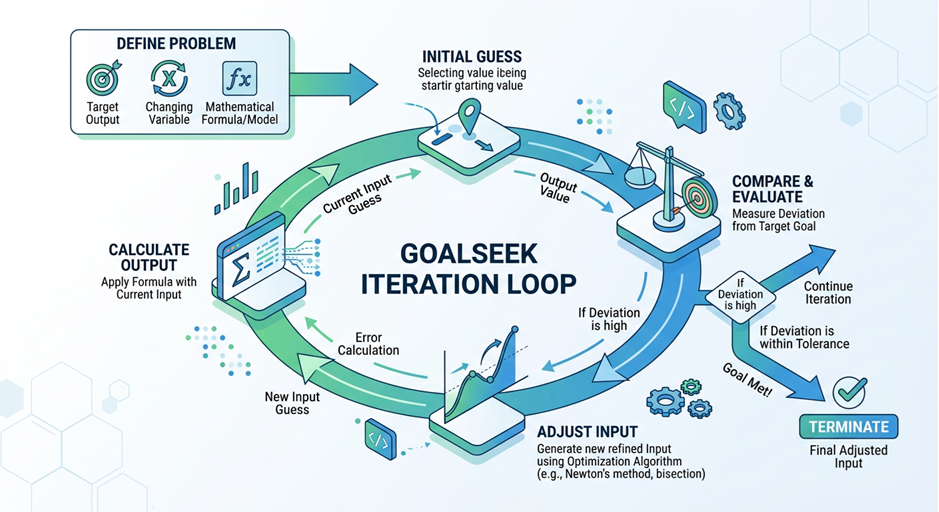

# Goalseek Project README

# Overview
`goalseek` is a local-first Python package designed for running disciplined, git-backed research loops with coding-agent providers. The project is inspired by [Karpathy's auto research project](https://github.com/karpathy/autoresearch)
It provides a structured environment for autonomous agents to propose changes, implement them, and verify results against defined metrics, while maintaining a complete audit trail via git and local artifacts.

The system is CLI-first but exposes its core functionality through a Python API, making it suitable for both interactive research and
automated pipelines. The system also has a React Next JS UI to see the lifecycle of an an experiment

### Goal Seek Visual

### Core Philosophy
The project centers on the concept of a "Research Loop"—an iterative process where an agent (like Claude or Gemini or Codex or OpenCode or Client) is given a goal and a codebase, and then systematically attempts to 
improve a specific metric. Every change is tracked, every verification is logged, and every regression is automatically rolled back using git.

### Kaggle Scenario (jump to scenario)
To Try out a full Kaggle scenario of doing experiment go through the [example here](kaggle_demo_step_by_step.md)

### System Architecture
You can look at the [system architecture details at this link](system_architecture.md)

### Documentation
The Docusaurus documentation site is published at [https://shambhu112.github.io/goalseek/](https://shambhu112.github.io/goalseek/).
