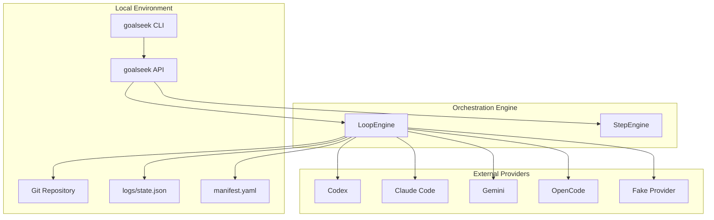
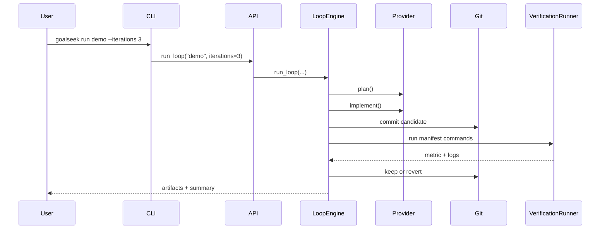

`goalseek` is organized around a thin public surface and a stateful orchestration core. The CLI and Python API delegate quickly into services that manage project scope, provider execution, verification, and artifact persistence.

## System context

## Core building blocks

| Component | Responsibility |
| --- | --- |
| `goalseek.cli.app` | Command-line entrypoint and command registration |
| `goalseek.api` | Public Python API for init, setup, baseline, loop, step, status, summary, and directions |
| `LoopEngine` | Runs baseline and multi-iteration research loops |
| `StepEngine` | Advances a project through individual loop phases |
| `ManifestService` | Validates manifest structure and scope rules |
| `ProjectService` | Resolves roots, loads config, scaffolds projects, and configures logging |
| `Repo` | Wraps git operations used by the loop |
| `VerificationRunner` | Executes verification commands and captures logs |
| `ProviderRegistry` | Maps provider names to concrete adapters |

## Data flow

## Key concepts

- **Research loop**: a fixed sequence of phases that turns one prompt into one testable candidate change.
- **Manifest**: the machine-readable contract for file scope, verification, and metrics.
- **Directions**: user-provided guidance that influences later iterations without changing code immediately.
- **Artifacts**: prompts, plans, logs, metrics, and results written under `runs/`.

## Persistence model

- `logs/state.json` stores current phase, retained metric, pending commit, and resumable loop state.
- `logs/results.jsonl` stores one append-only summary record per baseline or iteration.
- `runs/<iteration>/` stores detailed artifacts for inspection.

:::tip Why the local artifact trail matters
The package is easier to debug because every significant transition leaves a file behind. You can reason from the filesystem instead of from opaque service state.
:::
