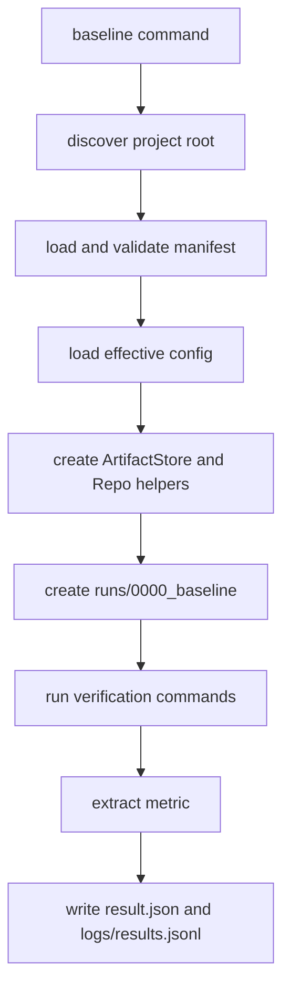

The baseline and iteration flows are where `goalseek` becomes useful. They turn a project directory into a measured loop with durable artifacts.

## High-level flow

1. `goalseek baseline` measures the project as-is.
2. `goalseek run --iterations N` performs one focused change per iteration.
3. Each iteration either keeps the candidate commit, reverts it, or skips it.

## Baseline flow

Baseline establishes the first retained metric without asking a provider to modify code.



### What baseline checks

- the project root resolves to a directory containing `manifest.yaml`
- the manifest is structurally valid
- the project is inside a git repository
- verification commands complete successfully
- metric extraction succeeds if verification passes

### What baseline writes

- `runs/0000_baseline/env.json`
- `runs/0000_baseline/verifier.log`
- `runs/0000_baseline/metrics.json`
- `runs/0000_baseline/result.json`
- `logs/results.jsonl`

## Iteration flow

Each iteration passes through the same ordered phases:

```text
READ_CONTEXT -> PLAN -> APPLY_CHANGE -> COMMIT -> VERIFY -> DECIDE -> LOG
```

### READ_CONTEXT

- Reads git history and diff summaries.
- Enumerates visible and writable files from the manifest.
- Loads recent results and active directions.
- Updates `logs/state.json`.

### PLAN

- Builds a planning prompt from context, project scope, recent outcomes, and directions.
- Calls the provider plan interface.
- Writes `prompt.md`, `plan.md`, and `provider_output.md`.

### APPLY_CHANGE

- Confirms the git tree is clean.
- Calls the provider implementation interface.
- Checks changed files against manifest scope.
- Treats out-of-scope edits as a failure condition.

### COMMIT

- Stages changed files.
- Creates a candidate commit with the plan title.

### VERIFY

- Runs verification commands from the manifest.
- Captures combined output in `verifier.log`.
- Extracts the scalar metric if verification succeeds.

### DECIDE

- Compares the candidate metric against the retained metric.
- Prefers better outcomes according to the metric direction.
- Uses `git revert` for rejected changes instead of rewriting history.

### LOG

- Writes final iteration artifacts and a result record.
- Appends to `logs/results.jsonl`.
- Advances the resumable state to the next iteration.

:::warning Scope enforcement is part of the product
The manifest is not documentation only. It is used to decide which files are visible, writable, generated, or hidden, and out-of-scope changes can be rolled back.
:::

## Useful inspection commands

```bash
cat ./demo/logs/state.json
tail -n 10 ./demo/logs/results.jsonl
ls ./demo/runs/0001
cat ./demo/runs/0001/result.json
```

## When things go wrong

- If verification fails, inspect `runs/<iteration>/verifier.log`.
- If the working tree is dirty, run `goalseek gittreeclean`.
- If the loop stalls, check the recent plans and provider output before widening the project scope or changing directions.
