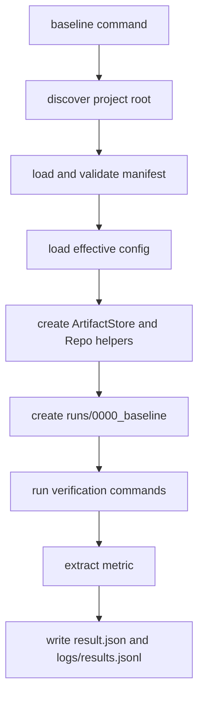

The baseline and iteration flows turn a project directory into a measured loop with durable artifacts. Baseline measures the current project. Iterations try one focused candidate change and keep, revert, or skip it.

## High-level flow

1. Create a project scaffold.
2. Add or import project files.
3. Run `goalseek setup` to inspect the project and scope.
4. Run `goalseek baseline` to measure the current project without changing code.
5. Run `goalseek run --iterations N` to plan, implement, verify, and judge candidate changes.

The loop is stateful. It can pause and resume through `logs/state.json`.

## Core files

| File | Role |
| --- | --- |
| `manifest.yaml` | Defines file scope, verification commands, and metric extraction. |
| `experiment.py` | Default writable implementation file. Usually trained or run by verification. |
| `program.md` | Read-only project instructions visible to providers during planning and implementation. |
| `validate_results.py` | Hidden verifier harness. It is run by `VERIFY`, not exposed as provider context. |
| `runs/` | Per-baseline and per-iteration artifacts. |
| `logs/results.jsonl` | Append-only result history. |
| `logs/state.json` | Resumable loop state. |

## Baseline flow

Baseline establishes the first retained metric without asking a provider to modify code.


```mermaid
flowchart TD
    A[baseline command] --> B[discover project root]
    B --> C[load and validate manifest]
    C --> D[load effective config]
    D --> E[create ArtifactStore and Repo helpers]
    E --> F[create runs/0000_baseline]
    F --> G[run verification commands]
    G --> H[extract metric]
    H --> I[write result.json and logs/results.jsonl]
```

Run it with:

```bash
uv run goalseek baseline ./demo
```

### Baseline steps

1. The CLI calls `goalseek.api.run_baseline()`.
2. `LoopEngine.run_baseline()` discovers the project root by finding `manifest.yaml`.
3. `ManifestService.validate()` loads and validates scope, verification commands, and metric config.
4. Effective config is loaded from defaults, user config, project config, and overrides.
5. Runtime logging is configured.
6. `ArtifactStore` and `Repo` helpers are created.
7. The project is checked for a git repository.
8. `runs/0000_baseline/` is created.
9. `env.json` captures OS, Python, provider, model, effective config, and command versions.
10. Verification commands from the manifest run in order.
11. Metric extraction runs if verification succeeds.
12. `result.json` and `logs/results.jsonl` are written.
13. `logs/state.json` is initialized after a successful baseline.

### What baseline checks

- the project root resolves to a directory containing `manifest.yaml`
- the manifest is structurally valid
- the project is inside a git repository
- verification commands complete successfully
- metric extraction succeeds if verification passes

### What baseline writes

- `runs/0000_baseline/env.json`
- `runs/0000_baseline/verifier.log`
- `runs/0000_baseline/metrics.json`
- `runs/0000_baseline/result.json`
- `logs/results.jsonl`

After a successful baseline, `logs/state.json` starts at:

```text
current_iteration = 1
current_phase = READ_CONTEXT
last_outcome = baseline
```

## Iteration flow

Each iteration passes through the same ordered phases:

```text
READ_CONTEXT -> PLAN -> APPLY_CHANGE -> COMMIT -> VERIFY -> DECIDE -> LOG
```

Run full iterations with:

```bash
uv run goalseek run ./demo --iterations 3
```

An iteration counts as complete only after `LOG` resets state back to `READ_CONTEXT` with an empty iteration payload.

### READ_CONTEXT

- Reads git history and diff summaries.
- Enumerates visible read-only and writable files from the manifest.
- Includes `program.md` when it is read-only.
- Excludes hidden files such as `validate_results.py`.
- Loads recent results and active directions.
- Updates `logs/state.json`.

### PLAN

- Builds a planning prompt from context, project scope, recent outcomes, and directions.
- Calls the provider plan interface.
- Writes `prompt.md`, `plan.md`, and `provider_output.md`.
- Gives the provider visible context such as `program.md`.
- Keeps hidden paths listed as off-limits.

### APPLY_CHANGE

- Confirms the git tree is clean.
- Calls the provider implementation interface.
- Checks changed files against manifest scope.
- Treats out-of-scope edits as a failure condition.
- Allows changes only in writable or generated scope.
- Jumps to `LOG` with `skipped_no_change` if no files changed.

### COMMIT

- Stages changed files.
- Creates a candidate commit with the plan title.
- Records parent commit and changed line count.

### VERIFY

- Runs verification commands from the manifest.
- Runs `validate_results.py` here when the manifest command references it.
- Captures combined output in `verifier.log`.
- Extracts the scalar metric if verification succeeds.
- Jumps to `LOG` with `skipped_verification_crash` if a verification command fails.

### DECIDE

- Compares the candidate metric against the retained metric.
- Prefers better outcomes according to the metric direction.
- Uses `git revert` for rejected changes instead of rewriting history.
- Applies `min_pass` and `max_pass` thresholds before comparing to retained best.
- Uses changed LOC as the tie-breaker when metrics are equal within epsilon.

### LOG

- Writes final iteration artifacts and a result record.
- Appends to `logs/results.jsonl`.
- Advances the resumable state to the next iteration.
- Rewrites `runs/latest/history.json`.

:::warning[Scope enforcement is part of the product]
The manifest is not documentation only. It is used to decide which files are visible, writable, generated, or hidden, and out-of-scope changes can be rolled back.
:::

## Common outcomes

| Outcome | Meaning |
| --- | --- |
| `kept` | Candidate met thresholds and beat the retained result, or tied with fewer changed lines. |
| `reverted_worse_metric` | Candidate verified but did not beat the retained result. |
| `reverted_threshold_failure` | Candidate failed configured metric thresholds. |
| `reverted_scope_violation` | Provider changed out-of-scope files. |
| `skipped_no_change` | Provider made no file changes. |
| `skipped_provider_failure` | Planning or implementation provider failed. |
| `skipped_verification_crash` | Verification failed before a usable metric was produced. |

## Useful inspection commands

```bash
cat ./demo/logs/state.json
tail -n 10 ./demo/logs/results.jsonl
ls ./demo/runs/0001
cat ./demo/runs/0001/result.json
```

## When things go wrong

- If verification fails, inspect `runs/<iteration>/verifier.log`.
- If the working tree is dirty, run `goalseek gittreeclean`.
- If the loop stalls, check the recent plans and provider output before widening the project scope or changing directions.
