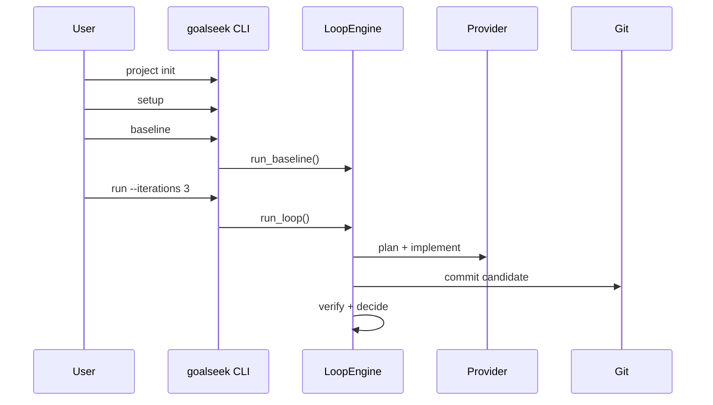

`goalseek` is a local-first Python package for running disciplined, git-backed research loops with coding-agent providers. It gives you a repeatable way to let an agent propose a change, apply it, verify it, and keep or revert it based on mechanical metrics.

## What it does

- Scaffolds isolated research projects with manifests, logs, and run artifacts.
- Drives a loop of planning, implementation, verification, and decision-making.
- Stores every baseline and iteration under `runs/` and `logs/`.
- Exposes both a CLI and a Python API for automation and local workflows.
- Supports `codex`, `claude_code`, `opencode`, `gemini`, and a `fake` provider for tests.

## Core philosophy

The package is built around a simple rule set:

- read project context before write operations
- make one focused change per iteration
- judge outcomes with objective verification
- preserve history with real git commits and explicit reverts

That combination is what makes the loop inspectable. The system is not trying to hide its reasoning behind a service boundary. It leaves plans, prompts, metrics, diffs, and result records on disk where you can inspect them.

## Typical workflow

1. Initialize a project scaffold.
2. Add research assets and validate the manifest.
3. Run setup once to prepare the workspace.
4. Run a baseline to capture the retained metric.
5. Run one or more iterations and inspect the resulting artifacts.

## Start here

- Use [Quickstart](/docs/getting-started/quickstart) to get a project running.
- Use [System Architecture](/docs/architecture/system-architecture) to understand the loop internals.
- Use [Kaggle Demo](/docs/guides/kaggle-demo) for the end-to-end example included in this repo.
