### System Context Diagram

This diagram illustrates how the `goalseek` orchestration layer bridges the user's local environment with external AI providers.

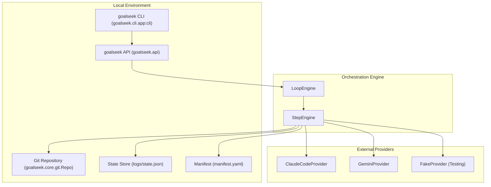
```mermaid
graph TD
    subgraph "Local Environment"
        CLI["goalseek CLI (goalseek.cli.app:cli)"]
        API["goalseek API (goalseek.api)"]
        Repo["Git Repository (goalseek.core.git.Repo)"]
        State["State Store (logs/state.json)"]
        Manifest["Manifest (manifest.yaml)"]
    end

    subgraph "Orchestration Engine"
        LoopEngine["LoopEngine"]
        StepEngine["StepEngine"]
    end

    subgraph "External Providers"
        Claude["ClaudeCodeProvider"]
        Gemini["GeminiProvider"]
        Fake["FakeProvider (Testing)"]
    end

    CLI --> API
    API --> LoopEngine
    LoopEngine --> StepEngine
    StepEngine --> Repo
    StepEngine --> State
    StepEngine --> Manifest
    StepEngine --> Claude
    StepEngine --> Gemini
    StepEngine --> Fake
```
Sources: [src/goalseek/cli/app.py:31-31](), [src/goalseek/api.py:1-23](), [README.md:120-125](), [README.md:97-106]()

### Key Concepts

| Concept | Description | Code Entity / File |
| :--- | :--- | :--- |
| **Research Loop** | A 7-phase cycle: Read, Plan, Apply, Commit, Verify, Decide, Log. | `goalseek.core.loop.LoopEngine` |
| **Manifest** | Configuration defining file permissions (read_only, writable, etc.) and metrics. | `manifest.yaml` |
| **Provider** | An adapter for a specific LLM or coding agent. | `goalseek.providers.base.ProviderAdapter` |
| **Baseline** | The initial execution to establish starting metrics. | `goalseek.api.run_baseline` |
| **Direction** | User-injected guidance for the next iteration. | `goalseek.api.add_direction` |
| **Artifacts** | Logs, plans, and results generated per iteration. | `runs/XXXX/` |

Sources: [README.md:97-107](), [README.md:120-161](), [src/goalseek/__init__.py:1-23]()

### High-Level Workflow

The `goalseek` workflow is designed to move from a static codebase to an optimized one through controlled iterations.

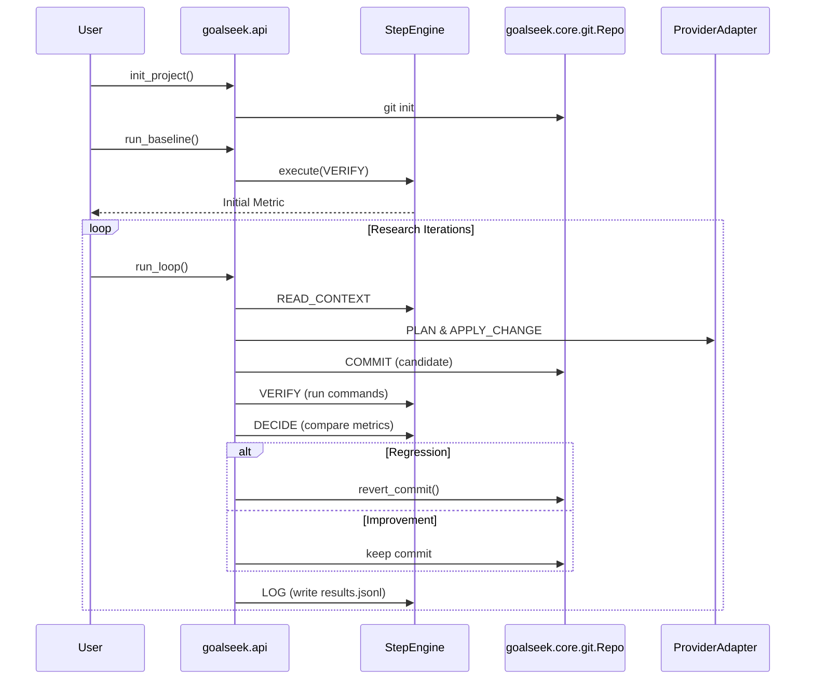
```mermaid
sequenceDiagram
    participant User
    participant API as goalseek.api
    participant Engine as StepEngine
    participant Git as goalseek.core.git.Repo
    participant Provider as ProviderAdapter

    User->>API: init_project()
    API->>Git: git init
    User->>API: run_baseline()
    API->>Engine: execute(VERIFY)
    Engine-->>User: Initial Metric
    
    loop Research Iterations
        User->>API: run_loop()
        API->>Engine: READ_CONTEXT
        API->>Provider: PLAN & APPLY_CHANGE
        API->>Git: COMMIT (candidate)
        API->>Engine: VERIFY (run commands)
        API->>Engine: DECIDE (compare metrics)
        alt Regression
            API->>Git: revert_commit()
        else Improvement
            API->>Git: keep commit
        end
        API->>Engine: LOG (write results.jsonl)
    end
```
Sources: [README.md:166-173](), [README.md:120-161](), [instructions_steps.md:61-70]()

### Subsystem Overview

#### 1. Orchestration and Execution
The `LoopEngine` manages the high-level flow of iterations, while the `StepEngine` handles the logic for individual phases [README.md:120-126](). This separation allows for running full autonomous loops or stepping through phases manually for debugging.
*   For details, see [The Research Loop and Phase Engine](#2.1).

#### 2. Configuration and Scope
The system uses a `manifest.yaml` to define the "sandbox" for the agent. Files are categorized into modes like `read_only`, `writable`, and `hidden` to prevent the agent from seeing or modifying sensitive data [README.md:97-106]().
*   For details, see [Project Structure and Directory Layout](#1.2) and [Manifest and Configuration](#2.3).

#### 3. Verification and Metrics
Success is determined by user-defined verification commands. The system extracts metrics from stdout, stderr, or JSON files and uses them to decide whether to keep or revert a change [README.md:149-160]().
*   For details, see [Verification and Metric Extraction](#2.5).

#### 4. Provider System
`goalseek` supports multiple backends through a provider protocol. This allows switching between different models (e.g., Claude, Gemini) or using a `FakeProvider` for local testing without incurring API costs [README.md:127-128](), [README.md:192-192]().
*   For details, see [Provider System](#4).

#### 5. Persistence and Logging
Every iteration is saved in a structured `runs/` directory. The overall state is maintained in `logs/state.json`, allowing the loop to be paused and resumed across sessions [README.md:120-125]().
*   For details, see [State Management and Persistence](#2.2) and [Logging and Observability](#6).

### Getting Started
To begin using `goalseek`, you typically initialize a project scaffold, configure your manifest, and run a baseline before starting the research loop [README.md:37-70]().
*   For a step-by-step guide, see [Getting Started](#1.1).

Sources: [README.md:1-195](), [instructions_steps.md:1-137](), [pyproject.toml:1-39]()

---

# Getting Started

This page provides a step-by-step technical guide for installing `goalseek`, initializing a new research project, and executing the automated research loop. `goalseek` is a local-first orchestration engine designed to run disciplined, git-backed experiments using coding-agent providers [README.md:1-5]().

## Installation

`goalseek` requires Python 3.11+ and `git` [README.md:7-11](). It is recommended to use `uv` for environment management.

### 1. Environment Setup
Clone the repository and install the package in editable mode with development dependencies:

```bash
uv venv
source .venv/bin/activate
uv pip install -e ".[dev]"
```
*Sources: [README.md:15-20](), [instructions_steps.md:9-14]()*

### 2. Verification
Verify the installation by accessing the CLI help:
```bash
uv run goalseek --help
```
*Sources: [README.md:31-35]()*

---

## Project Initialization

A `goalseek` project is a directory containing a `manifest.yaml`, configuration files, and the research code (e.g., `experiment.py`).

### Step 1: Scaffold a Project
Use the `project init` command to create the directory structure. You must specify a provider (e.g., `claude_code`) and a model [README.md:37-41]().

```bash
uv run goalseek project init demo --provider claude_code --model claude-haiku-4-5-20251001
```
*Sources: [README.md:37-41](), [instructions_steps.md:16-20]()*

### Step 2: Import Research Assets
For demonstration purposes, you can move the built-in test package into your project directory. This package includes a sample ML problem (irrigation prediction) [README.md:46-50]().

```bash
./move-testpackage.sh --overwrite ./demo
```
*Sources: [move-testpackage.sh:1-111](), [instructions_steps.md:21-24]()*

### Step 3: Validate Manifest
The `manifest.yaml` defines the project scope and metrics. Ensure the metric configuration matches your research goals [instructions_steps.md:25-35]().

```bash
uv run goalseek manifest validate ./demo
```
*Sources: [README.md:54-56](), [instructions_steps.md:36-39]()*

---

## The Research Lifecycle

The research lifecycle follows a strict progression: **Setup -> Baseline -> Loop**.

### 1. Setup
The `setup` command runs one-time initialization tasks defined in the manifest, such as downloading datasets or creating virtual environments [instructions_steps.md:44-49]().

```bash
uv run goalseek setup ./demo
```

### 2. Git Tree Cleaning
`goalseek` requires a clean git state because every iteration creates a candidate commit. Use `gittreeclean` to commit any local changes before starting [README.md:91-95]().

```bash
uv run goalseek gittreeclean --message "clean repo" ./demo
```
*Sources: [instructions_steps.md:53-58]()*

### 3. Baseline Execution
The `baseline` command executes the current state of the project without any agent intervention. This establishes the `retained_metric` that the loop will attempt to improve [README.md:60-64]().

```bash
uv run goalseek baseline ./demo
```
*Sources: [instructions_steps.md:59-65]()*

### 4. Running the Loop
Execute the research loop for a specific number of iterations. The engine will autonomously cycle through planning, applying changes, verifying results, and deciding whether to keep or revert commits [README.md:66-70]().

```bash
uv run goalseek run ./demo --iterations 3
```
*Sources: [instructions_steps.md:67-70]()*

---

## Data Flow and Logic

The following diagrams illustrate how the CLI and API interact with the underlying system state and code entities.

### CLI to API Delegation
This diagram shows how user commands bridge the Natural Language Space (CLI arguments) into the Code Entity Space (`goalseek.api`).

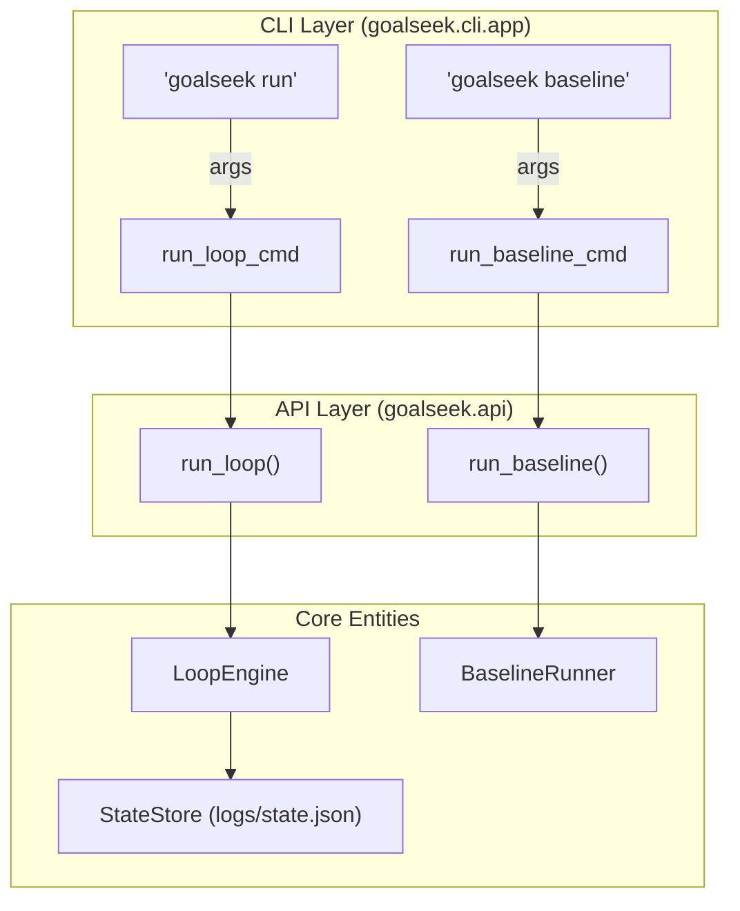
```mermaid
graph TD
    subgraph "CLI Layer (goalseek.cli.app)"
        A["'goalseek run'"] -- "args" --> B["run_loop_cmd"]
        C["'goalseek baseline'"] -- "args" --> D["run_baseline_cmd"]
    end

    subgraph "API Layer (goalseek.api)"
        B --> E["run_loop()"]
        D --> F["run_baseline()"]
    end

    subgraph "Core Entities"
        E --> G["LoopEngine"]
        F --> H["BaselineRunner"]
        G --> I["StateStore (logs/state.json)"]
    end
```
*Sources: [README.md:5-6](), [README.md:166-173](), [pyproject.toml:30-31]()*

### State and Artifact Persistence
This diagram maps the logical phases of the research loop to the physical files and state fields updated in the project directory.

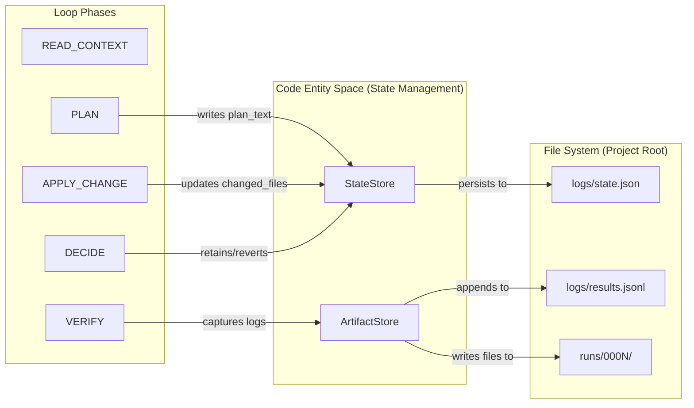
```mermaid
graph LR
    subgraph "Loop Phases"
        P1["READ_CONTEXT"]
        P2["PLAN"]
        P3["APPLY_CHANGE"]
        P4["VERIFY"]
        P5["DECIDE"]
    end

    subgraph "Code Entity Space (State Management)"
        SS["StateStore"]
        AS["ArtifactStore"]
    end

    subgraph "File System (Project Root)"
        SJ["logs/state.json"]
        RL["logs/results.jsonl"]
        RD["runs/000N/"]
    end

    P2 -- "writes plan_text" --> SS
    P3 -- "updates changed_files" --> SS
    P4 -- "captures logs" --> AS
    P5 -- "retains/reverts" --> SS

    SS -- "persists to" --> SJ
    AS -- "appends to" --> RL
    AS -- "writes files to" --> RD
```
*Sources: [README.md:118-162](), [instructions_steps.md:108-137]()*

---

## Python API Usage

For programmatic control, the `goalseek.api` module exposes the same functionality as the CLI [README.md:164-173]().

```python
from goalseek.api import init_project, run_setup, run_baseline, run_loop

# 1. Initialize
project_root = init_project("demo", provider="claude_code", model="claude-3-5-sonnet")

# 2. Prepare
run_setup(project_root)

# 3. Establish Baseline
run_baseline(project_root)

# 4. Execute 3 Iterations
run_loop(project_root, iterations=3)
```
*Sources: [README.md:166-173]()*

## Monitoring Progress

| Command | Purpose | Key Output |
| :--- | :--- | :--- |
| `goalseek status` | Current loop state | `current_iteration`, `current_phase`, `retained_metric` |
| `goalseek summary` | Historical results | Table of all iterations and their outcomes |
| `cat logs/state.json` | Detailed raw state | Full `iteration_data` for the active run |
| `tail logs/results.jsonl` | Result stream | Append-only log of completed iterations |

*Sources: [README.md:84-89](), [README.md:118-162](), [instructions_steps.md:112-120]()*

---

# Project Structure and Directory Layout

A `goalseek` project follows a standardized scaffold designed to separate immutable research context, mutable experiment code, and append-only execution artifacts. This structure ensures that the research loop can safely modify the codebase while maintaining a rigorous audit trail of every hypothesis, change, and verification result.

## Scaffold Generation

The project structure is generated via the `ProjectService.create_scaffold` method [src/goalseek/core/project_service.py:55-63](). When a user runs the initialization command, the system performs the following steps:

1.  **Directory Creation**: Creates the project root and subdirectories (`data`, `context`, `hidden`, `config`, `runs`, `logs`) [src/goalseek/core/project_service.py:73-81]().
2.  **Template Rendering**: Uses Jinja2 templates to populate core files like `manifest.yaml`, `experiment.py`, and `setup.py` [src/goalseek/core/project_service.py:88-99]().
3.  **Git Initialization**: Initializes a new Git repository at the project root and creates an initial commit to establish a clean baseline [src/goalseek/core/project_service.py:104-113]().

### Scaffold Components to Code Entities
The following diagram maps the logical components of a new project to the internal templates and logic used to generate them.

**Scaffold Generation Logic**
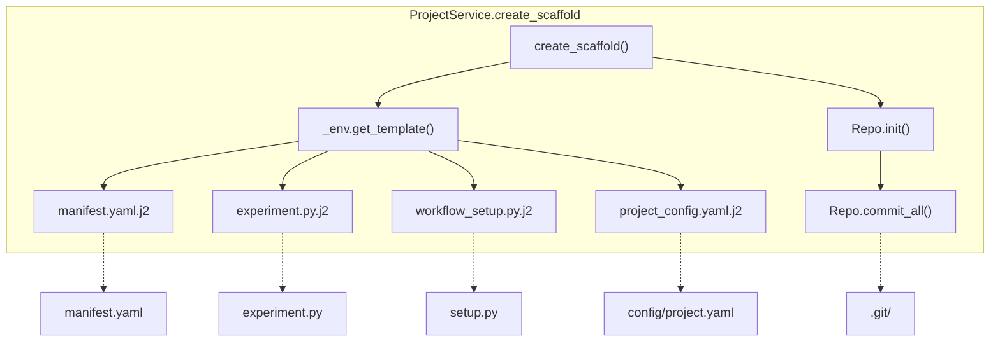
```mermaid
graph TD
    subgraph "ProjectService.create_scaffold"
        A["create_scaffold()"] --> B["_env.get_template()"]
        B --> C["manifest.yaml.j2"]
        B --> D["experiment.py.j2"]
        B --> E["workflow_setup.py.j2"]
        B --> F["project_config.yaml.j2"]
        
        A --> G["Repo.init()"]
        G --> H["Repo.commit_all()"]
    end

    C -.-> I["manifest.yaml"]
    D -.-> J["experiment.py"]
    E -.-> K["setup.py"]
    F -.-> L["config/project.yaml"]
    H -.-> M[".git/"]
```
**Sources:** [src/goalseek/core/project_service.py:25-114](), [src/goalseek/models/project.py:9-17]()

## Directory Layout Detail

The standard layout is defined by the `ProjectPaths` model [src/goalseek/models/project.py:9-17]().

| Path | Mode | Description |
| :--- | :--- | :--- |
| `manifest.yaml` | `read_only` | The project's "brain." Defines file permissions, verification commands, and metric extraction logic [src/goalseek/templates/manifest.yaml.j2:1-51](). |
| `experiment.py` | `writable` | The primary target for the research loop. Contains the code and parameters being optimized [src/goalseek/templates/experiment.py.j2:1-12](). |
| `setup.py` | `read_only` | A script run once during the `setup` phase to prepare the environment (e.g., downloading data) [src/goalseek/templates/workflow_setup.py.j2:1-10](). |
| `program.md` | `read_only` | High-level research instructions and hypotheses provided to the coding agent [src/goalseek/templates/program.md.j2:1-13](). |
| `config/` | `read_only` | Contains `project.yaml`, which defines provider settings (model, timeout) and loop behavior [src/goalseek/templates/project_config.yaml.j2:1-31](). |
| `data/` | `read_only` | Input datasets used for training or experimentation. |
| `context/` | `read_only` | Supporting documentation or reference materials for the agent. |
| `hidden/` | `hidden` | Files that exist on disk but are completely invisible to the LLM (e.g., ground-truth test labels) [src/goalseek/templates/manifest.yaml.j2:21-22](). |
| `runs/` | `generated` | Per-iteration artifacts including logs, metrics, and snapshots of `experiment.py`. |
| `logs/` | `generated` | System-level logs (`goalseek.log`), the state machine file (`state.json`), and the result history (`results.jsonl`) [src/goalseek/core/project_service.py:161-163](). |

**Sources:** [src/goalseek/models/project.py:9-17](), [src/goalseek/templates/manifest.yaml.j2:6-28]()

## Data Flow and Persistence

The `ProjectService` manages the discovery of these paths and the persistence of environment metadata.

### Path Discovery
The `discover_root` method [src/goalseek/core/project_service.py:30-40]() allows `goalseek` to be executed from any subdirectory within a project. It traverses upwards until it locates a `manifest.yaml` file, ensuring that all relative paths defined in the manifest remain valid.

### Environment Snapshots
During the setup phase, the system captures an `EnvironmentSnapshot` [src/goalseek/models/project.py:51-60](). This includes:
*   OS and Python versions.
*   The `EffectiveConfig` (merged global and project settings).
*   Versions of external tools like `git` and the configured provider CLI [src/goalseek/core/project_service.py:143-157]().

This snapshot is persisted to `logs/setup_snapshot.json` [src/goalseek/core/project_service.py:161-163](), providing a record of the exact environment in which the research was conducted.

### Project Entity Mapping
The following diagram illustrates how the `ProjectPaths` model interacts with the physical file system and the `ProjectService`.

**Directory Layout & Path Resolution**
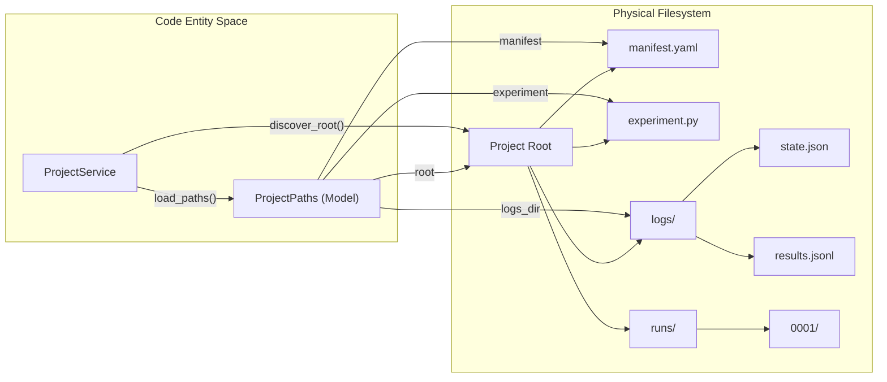
```mermaid
graph LR
    subgraph "Physical Filesystem"
        ROOT["Project Root"]
        ROOT --> MAN["manifest.yaml"]
        ROOT --> EXP["experiment.py"]
        ROOT --> LDIR["logs/"]
        LDIR --> SJSON["state.json"]
        LDIR --> RJONL["results.jsonl"]
        ROOT --> RDIR["runs/"]
        RDIR --> ITER["0001/"]
    end

    subgraph "Code Entity Space"
        PPS["ProjectPaths (Model)"]
        PPS -- "root" --> ROOT
        PPS -- "manifest" --> MAN
        PPS -- "experiment" --> EXP
        PPS -- "logs_dir" --> LDIR
        
        PS["ProjectService"]
        PS -- "load_paths()" --> PPS
        PS -- "discover_root()" --> ROOT
    end
```
**Sources:** [src/goalseek/core/project_service.py:42-53](), [src/goalseek/models/project.py:9-17]()

## Implementation Notes

*   **Atomic Dumps**: When persisting snapshots or state, `ProjectService` utilizes `dump_json_atomic` [src/goalseek/core/project_service.py:162]() to prevent file corruption during interrupted writes.
*   **Path Safety**: The `ensure_within_root` method [src/goalseek/core/project_service.py:116-118]() is used to validate that any file access requested by the manifest or providers stays within the project boundaries.
*   **Git Isolation**: Even if a project is initialized inside an existing Git repository, `goalseek` forces a new repository root at the project level [src/goalseek/core/project_service.py:108-111]() to ensure that `git revert` and `git commit` operations do not affect the parent repository.

**Sources:** [src/goalseek/core/project_service.py:30-175](), [src/goalseek/utils/json.py](), [src/goalseek/utils/paths.py]()

---

# Core Architecture

The `goalseek` architecture is built on a service-oriented design that separates the high-level research lifecycle from the low-level execution of coding tasks. It operates as a stateful loop engine that orchestrates interactions between large language models (LLMs), local file systems, and Git repositories to iteratively improve project metrics.

## High-Level System Overview

The system is divided into three primary layers:
1.  **API Layer**: The entry point for both the CLI and external Python scripts. It delegates requests to specialized services.
2.  **Core Services**: Domain-specific components that handle manifest validation, project scaffolding, state persistence, and context assembly.
3.  **Engine Layer**: The `LoopEngine` and `StepEngine` which drive the state machine through various research phases.

### Service-Oriented Delegation

The `goalseek.api` module acts as a facade, ensuring that operations like project initialization or loop execution are routed to the correct internal service.

| API Function | Delegated Service/Engine | Purpose |
| :--- | :--- | :--- |
| `init_project` | `ProjectService` | Creates the project structure and initializes Git. |
| `validate_manifest` | `ManifestService` | Validates `manifest.yaml` against the internal schema. |
| `run_loop` | `LoopEngine` | Executes multiple iterations of the research loop. |
| `run_step` | `StepEngine` | Executes a single phase of the current iteration. |
| `add_direction` | `DirectionService` | Injects user-provided guidance into the loop state. |

**Sources:** [src/goalseek/api.py:18-27](), [src/goalseek/api.py:30-31](), [src/goalseek/api.py:42-50](), [src/goalseek/api.py:53-54](), [src/goalseek/api.py:57-66]()

## Core Engine Orchestration

The system's behavior is defined by the transition between discrete phases. The `LoopEngine` manages these transitions, while the `StepEngine` provides a granular execution mode for debugging or manual intervention.

### The Research Loop Phase Machine

The following diagram illustrates how the `LoopEngine` maps logical research steps to internal method calls and state transitions.

**Diagram: Research Loop Phase Flow**
```mermaid
graph TD
    subgraph "LoopEngine Orchestration"
        START["Start Loop"] --> RC["READ_CONTEXT"]
        RC --> PLAN["PLAN"]
        PLAN --> APPLY["APPLY_CHANGE"]
        APPLY --> COMMIT["COMMIT"]
        COMMIT --> VERIFY["VERIFY"]
        VERIFY --> DECIDE["DECIDE"]
        DECIDE --> LOG["LOG"]
        LOG --> ITER_CHECK{More Iterations?}
        ITER_CHECK -- "Yes" --> RC
        ITER_CHECK -- "No" --> END["End Loop"]
    end

    RC -.-> "execute_phase()"
    PLAN -.-> "execute_phase()"
    
    subgraph "Code Entities"
        RC_M["_phase_read_context()"]
        PLAN_M["_phase_plan()"]
        APPLY_M["_phase_apply()"]
        COMMIT_M["_phase_commit()"]
        VERIFY_M["_phase_verify()"]
        DECIDE_M["_phase_decide()"]
        LOG_M["_phase_log()"]
    end

    RC --- RC_M
    PLAN --- PLAN_M
    APPLY --- APPLY_M
    COMMIT --- COMMIT_M
    VERIFY --- VERIFY_M
    DECIDE --- DECIDE_M
    LOG --- LOG_M
```
**Sources:** [src/goalseek/core/loop_engine.py:126-155](), [src/goalseek/core/step_engine.py:10-19]()

For a deep dive into how these phases transition and the difference between `run_loop` and `run_step`, see **[The Research Loop and Phase Engine](#2.1)**.

## Subsystem Integration

The `LoopEngine` integrates several specialized subsystems to complete a research cycle:

*   **State and Persistence**: The `StateStore` ensures that the loop can be paused and resumed by persisting `LoopState` to `logs/state.json`. The `ArtifactStore` manages the `results.jsonl` and individual iteration directories.
    *   For details, see **[State Management and Persistence](#2.2)**.
*   **Configuration and Manifest**: The `ManifestService` interprets the `manifest.yaml` file, defining what the agent is allowed to edit and how success is measured.
    *   For details, see **[Manifest and Configuration](#2.3)**.
*   **Context and Direction**: Before planning, the `ContextReader` gathers the project state, while the `DirectionService` allows users to steer the agent's behavior mid-run.
    *   For details, see **[Context Reading and Direction Service](#2.4)**.
*   **Verification and Metrics**: After a change is applied, the `VerificationRunner` executes commands (e.g., tests or benchmarks) and extracts `MetricResult` objects to determine if the change should be kept.
    *   For details, see **[Verification and Metric Extraction](#2.5)**.

### Data Flow Architecture

The diagram below shows how data flows from the project files through the engine to the LLM providers and back to the repository.

**Diagram: Data Flow and Entity Mapping**
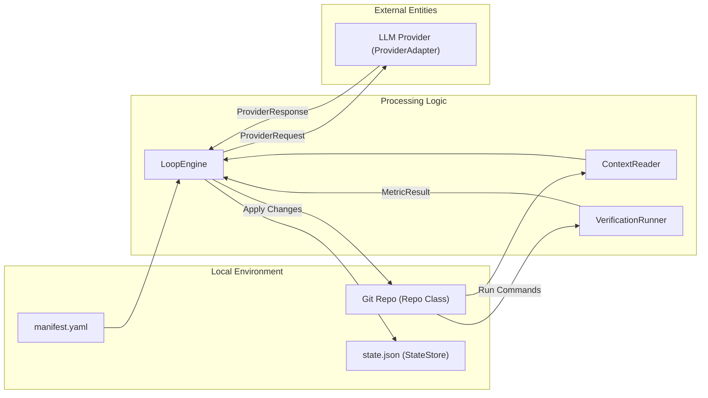
```mermaid
graph LR
    subgraph "Local Environment"
        MANIFEST["manifest.yaml"]
        REPO["Git Repo (Repo Class)"]
        STATE["state.json (StateStore)"]
    end

    subgraph "Processing Logic"
        ENGINE["LoopEngine"]
        READER["ContextReader"]
        VERIFIER["VerificationRunner"]
    end

    subgraph "External Entities"
        LLM["LLM Provider (ProviderAdapter)"]
    end

    MANIFEST --> ENGINE
    REPO --> READER
    READER --> ENGINE
    ENGINE -- "ProviderRequest" --> LLM
    LLM -- "ProviderResponse" --> ENGINE
    ENGINE -- "Apply Changes" --> REPO
    REPO -- "Run Commands" --> VERIFIER
    VERIFIER -- "MetricResult" --> ENGINE
    ENGINE --> STATE
```
**Sources:** [src/goalseek/core/loop_engine.py:35-41](), [src/goalseek/core/loop_engine.py:133-155](), [src/goalseek/api.py:69-84]()

---

# The Research Loop and Phase Engine

The Research Loop is the core orchestration mechanism of `goalseek`. It manages a stateful, iterative process where a coding agent attempts to improve a project's metrics through successive cycles of planning, implementation, and verification. The Phase Engine ensures that these cycles are executed in a robust, resumable, and transactional manner.

## Loop Orchestration

The system provides two primary modes of execution: `run_loop` for continuous automated iterations and `run_step` for granular, phase-by-phase execution. These are managed by the `LoopEngine` and `StepEngine` respectively.

### LoopEngine and StepEngine
- **`LoopEngine`**: The primary controller that implements the logic for each of the seven phases. It handles baseline establishment, phase transitions, and state mutation [src/goalseek/core/loop_engine.py:35-36]().
- **`StepEngine`**: A wrapper around `LoopEngine` designed for CLI interactions where the user wants to execute exactly one phase and stop. It loads the current state, executes one phase, and persists the updated state [src/goalseek/core/step_engine.py:10-20]().

### Execution Modes
| Mode | Entry Point | Behavior |
| :--- | :--- | :--- |
| **Continuous Loop** | `run_loop()` | Executes phases in sequence until the iteration limit is reached or a terminal state is hit. |
| **Single Step** | `run_step()` | Executes exactly one phase (e.g., transitions from `PLAN` to `APPLY_CHANGE`) and exits. |
| **Baseline** | `run_baseline()` | Executes a special non-modifying iteration to establish the initial metric [src/goalseek/core/loop_engine.py:43-124](). |

**Sources:** [src/goalseek/core/loop_engine.py:35-124](), [src/goalseek/core/step_engine.py:10-20](), [step_by_step_explaination.md:52-66]()

---

## The Seven-Phase Research Loop

Each iteration follows a strict sequence of phases defined in the `LoopPhase` enum [src/goalseek/models/state.py:17-24]().

### Phase Transition Diagram
The following diagram illustrates the flow of a single iteration and how the `LoopEngine` manages transitions between "Natural Language Space" (Planning) and "Code Entity Space" (Implementation/Verification).

**Diagram: Research Loop Phase Transitions**
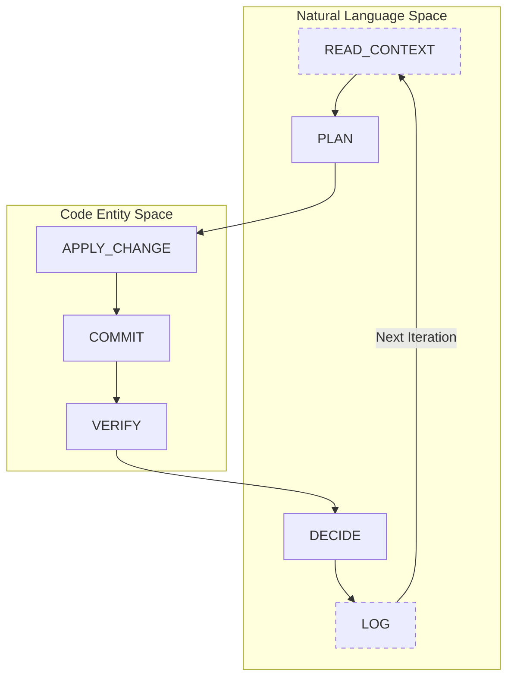
```mermaid
graph TD
    subgraph "Natural Language Space"
        READ_CONTEXT["READ_CONTEXT"] --> PLAN["PLAN"]
        DECIDE["DECIDE"] --> LOG["LOG"]
    end

    subgraph "Code Entity Space"
        PLAN --> APPLY_CHANGE["APPLY_CHANGE"]
        APPLY_CHANGE --> COMMIT["COMMIT"]
        COMMIT --> VERIFY["VERIFY"]
        VERIFY --> DECIDE
    end

    LOG --> |"Next Iteration"| READ_CONTEXT
    
    style READ_CONTEXT stroke-dasharray: 5 5
    style LOG stroke-dasharray: 5 5
```
**Sources:** [src/goalseek/models/state.py:17-24](), [src/goalseek/core/loop_engine.py:146-161]()

### Detailed Phase Descriptions

1.  **`READ_CONTEXT`**: The `ContextReader` gathers the current state of the project, including file contents (based on `manifest.yaml` scope), recent git logs, and active user directions [src/goalseek/core/loop_engine.py:146-147]().
2.  **`PLAN`**: The system constructs a planning prompt. The provider generates a natural language plan and identifies which files need modification [src/goalseek/core/loop_engine.py:148-149]().
3.  **`APPLY_CHANGE`**: The provider implements the plan. The engine enforces scope: only files marked as `writable` in the manifest can be modified [src/goalseek/core/loop_engine.py:150-151]().
4.  **`COMMIT`**: Changes are committed to a temporary "candidate" git commit. This creates a snapshot that can be easily reverted if verification fails [src/goalseek/core/loop_engine.py:152-153]().
5.  **`VERIFY`**: The `VerificationRunner` executes the commands defined in the manifest (e.g., tests, benchmarks) and captures logs and metrics [src/goalseek/core/loop_engine.py:154-155]().
6.  **`DECIDE`**: The engine compares the new metrics against the `retained_metric`. It decides whether to `KEEP`, `REVERT`, or `SKIP` the change [src/goalseek/core/loop_engine.py:156-157]().
7.  **`LOG`**: The results of the iteration are persisted to `logs/results.jsonl` and the iteration counter is incremented [src/goalseek/core/loop_engine.py:158-159]().

**Sources:** [src/goalseek/core/loop_engine.py:146-161](), [src/goalseek/models/state.py:17-24](), [step_by_step_explaination.md:174-210]()

---

## State Management and Transitions

The loop is designed to be interrupted and resumed. The `LoopState` object tracks the current phase and status.

### Loop State Model
The `LoopState` class [src/goalseek/models/state.py:53-65]() tracks:
- `current_phase`: The active phase in the loop.
- `status`: Whether the loop is `RUNNING`, `PAUSED`, `FAILED`, or `COMPLETED` [src/goalseek/models/state.py:9-14]().
- `retained_metric`: The best metric achieved so far, used for comparison in `DECIDE`.
- `iteration_data`: An `IterationPayload` containing artifacts like `plan_text`, `verification_log`, and `commit_hash` [src/goalseek/models/state.py:27-51]().

### Data Flow: State to Persistence
The following diagram shows how the `LoopEngine` interacts with the `StateStore` to bridge the internal execution state with the persistent file system.

**Diagram: State Persistence Flow**
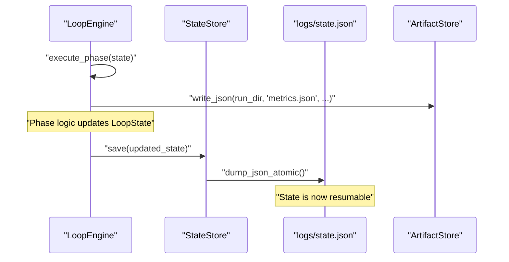
```mermaid
sequenceDiagram
    participant LE as "LoopEngine"
    participant SS as "StateStore"
    participant FS as "logs/state.json"
    participant AS as "ArtifactStore"

    LE->>LE: "execute_phase(state)"
    LE->>AS: "write_json(run_dir, 'metrics.json', ...)"
    Note over LE: "Phase logic updates LoopState"
    LE->>SS: "save(updated_state)"
    SS->>FS: "dump_json_atomic()"
    Note over FS: "State is now resumable"
```
**Sources:** [src/goalseek/core/loop_engine.py:126-161](), [src/goalseek/core/step_engine.py:14-19](), [src/goalseek/models/state.py:53-65]()

---

## Pause and Resume Logic

The loop pauses automatically after every phase when using `run_step`. In `run_loop` mode, the system can be interrupted (e.g., via Ctrl+C), and because the `StateStore` saves the state after every successful phase completion, it can resume exactly where it left off.

- **Resuming**: When `initialize_or_load_state` is called, it checks for an existing `logs/state.json`. If found, it populates the `LoopState` and continues from the `current_phase` [src/goalseek/core/loop_engine.py:16-17]().
- **Rollback Safety**: If a crash occurs during `APPLY_CHANGE`, the `Repo` wrapper and `revert_commit` logic ensure the project can be returned to a clean state before the next attempt [src/goalseek/gitops/rollback.py:16]().

**Sources:** [src/goalseek/core/step_engine.py:16-18](), [src/goalseek/core/loop_engine.py:139](), [step_by_step_explaination.md:24-25]()

---

# State Management and Persistence

This page describes the mechanisms `goalseek` uses to maintain the research loop's continuity and record experiment history. State management is divided between two primary concerns: the **volatile loop state** (tracking the current phase and iteration) and the **durable artifact store** (persisting logs, metrics, and results).

## State Persistence via StateStore

The `StateStore` class manages the lifecycle of the `LoopState` model. It ensures that the loop can be interrupted and resumed without losing progress by persisting the state to a JSON file.

### Implementation Details
- **File Location**: The state is stored in `logs/state.json` within the project root [src/goalseek/core/state_store.py:12-12]().
- **Atomic Writes**: To prevent corruption during crashes, the store uses `dump_json_atomic`, which writes to a temporary file before replacing the target [src/goalseek/utils/json.py:9-16]().
- **Initialization**: After a successful baseline, the state is initialized with `current_iteration=1` and `current_phase=READ_CONTEXT` [src/goalseek/core/state_store.py:32-41]().

### The LoopState Model
The `LoopState` Pydantic model contains the necessary metadata to reconstruct the loop's context [src/goalseek/models/state.py:53-65]():
- `status`: Current execution status (e.g., `READY`, `RUNNING`, `PAUSED`) [src/goalseek/models/state.py:9-14]().
- `current_phase`: The specific phase within the 7-phase loop [src/goalseek/models/state.py:17-24]().
- `retained_metric`: The best metric achieved so far, used for comparison in the `DECIDE` phase.
- `iteration_data`: An `IterationPayload` object containing transient data for the active iteration (e.g., current plan text, verification logs) [src/goalseek/models/state.py:27-51]().

**State Persistence Flow**
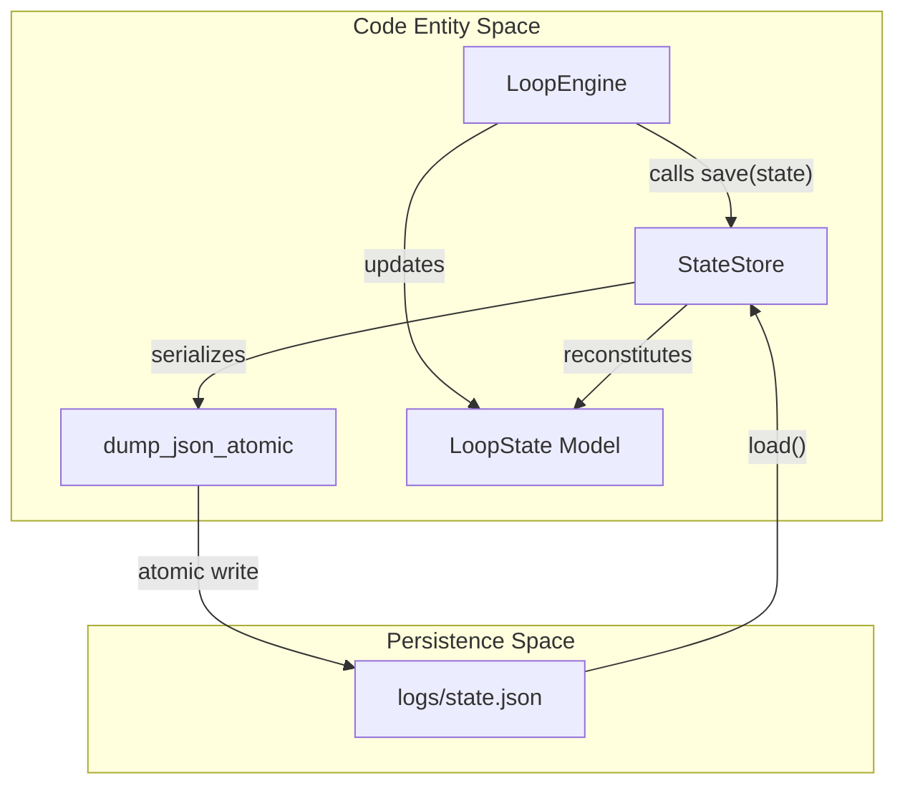
```mermaid
graph TD
    subgraph "Code Entity Space"
        LE["LoopEngine"]
        SS["StateStore"]
        JS["dump_json_atomic"]
        LS["LoopState Model"]
    end

    subgraph "Persistence Space"
        SJ["logs/state.json"]
    end

    LE -- "updates" --> LS
    LE -- "calls save(state)" --> SS
    SS -- "serializes" --> JS
    JS -- "atomic write" --> SJ
    SJ -- "load()" --> SS
    SS -- "reconstitutes" --> LS
```
Sources: [src/goalseek/core/state_store.py:9-42](), [src/goalseek/models/state.py:53-65](), [src/goalseek/utils/json.py:9-16]()

## Result Logging via ArtifactStore

The `ArtifactStore` is responsible for managing the physical file structure of the experiment and appending high-level results to a permanent log.

### Implementation and Data Flow
- **Result Appending**: Every completed iteration appends a `ResultRecord` to `logs/results.jsonl` using `append_jsonl` [src/goalseek/core/artifact_store.py:43-44](). This file provides a flat, machine-readable history of the entire experiment.
- **Directory Management**: It creates and manages the `runs/` directory, where each iteration gets a dedicated folder (e.g., `0000_baseline`, `0001`, `0002`) [src/goalseek/core/artifact_store.py:18-26]().
- **Direction Tracking**: User-injected directions are persisted to `logs/directions.jsonl` [src/goalseek/core/artifact_store.py:46-47]().

### ResultRecord Schema
The `ResultRecord` captures the outcome of an iteration for downstream analysis [src/goalseek/models/results.py:38-58]():
| Field | Description |
| :--- | :--- |
| `outcome` | Categorization of the result (e.g., `kept`, `reverted_worse_metric`) [src/goalseek/models/results.py:8-17](). |
| `metric_value` | The primary metric extracted during the `VERIFY` phase. |
| `commit_hash` | The Git hash of the candidate change. |
| `rollback_commit_hash` | The hash of the revert commit if the iteration failed. |
| `changed_loc` | Number of lines of code changed in this iteration. |

**Artifact and Result Persistence**
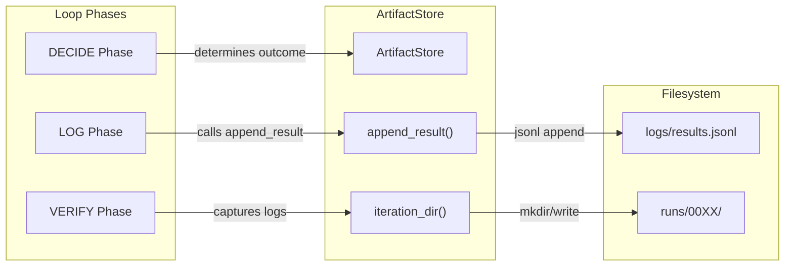
```mermaid
graph LR
    subgraph "Loop Phases"
        VERIFY["VERIFY Phase"]
        DECIDE["DECIDE Phase"]
        LOG["LOG Phase"]
    end

    subgraph "ArtifactStore"
        AS["ArtifactStore"]
        ID["iteration_dir()"]
        AR["append_result()"]
    end

    subgraph "Filesystem"
        RJ["logs/results.jsonl"]
        RD["runs/00XX/"]
    end

    VERIFY -- "captures logs" --> ID
    DECIDE -- "determines outcome" --> AS
    LOG -- "calls append_result" --> AR
    AR -- "jsonl append" --> RJ
    ID -- "mkdir/write" --> RD
```
Sources: [src/goalseek/core/artifact_store.py:10-48](), [src/goalseek/models/results.py:38-58](), [src/goalseek/utils/json.py:18-23]()

## Initialization and Resumption

The transition from a project baseline to the research loop is a critical state change.

### Post-Baseline Initialization
When the `baseline` command completes, the system calls `StateStore.initialize`. This sets the "high-water mark" for metrics [src/goalseek/core/state_store.py:24-42]():
1. **Metric Capture**: The baseline metric is saved as `retained_metric`.
2. **Phase Reset**: The loop is set to `READ_CONTEXT` for iteration 1.
3. **Provider Config**: The LLM provider and model specified in the config are locked into the state.

### Loop Resumption
Whenever `goalseek run` or `goalseek step` is executed, the `LoopEngine` attempts to `load()` the state [src/goalseek/core/state_store.py:14-18]():
- If `logs/state.json` is missing, the engine requires a baseline to be run first.
- If the state exists, the engine inspects `current_phase`. If the previous run crashed or was stopped, it resumes from exactly that phase using the data stored in `iteration_data` [src/goalseek/models/state.py:64-64]().

### JSON Utility Functions
The persistence layer relies on a set of robust JSON utilities in `goalseek.utils.json`:
- `dump_json_atomic(path, payload)`: Uses `NamedTemporaryFile` and `os.replace` for thread/process-safe writes [src/goalseek/utils/json.py:9-16]().
- `append_jsonl(path, payload)`: Standard line-delimited JSON appending [src/goalseek/utils/json.py:18-23]().
- `load_jsonl(path)`: Reads `.jsonl` files into a list of dictionaries, handling empty lines [src/goalseek/utils/json.py:32-42]().

Sources: [src/goalseek/core/state_store.py:14-42](), [src/goalseek/utils/json.py:1-43](), [src/goalseek/models/state.py:53-65]()

---

# Manifest and Configuration

This section describes the configuration systems that govern `goalseek` research projects. The system utilizes two distinct configuration layers: the **Project Manifest**, which defines the immutable rules of the experiment (files, metrics, and verification), and the **Effective Config**, which manages runtime environment settings (providers, logging, and loop behavior).

## Project Manifest (`manifest.yaml`)

The `manifest.yaml` file is the source of truth for a `goalseek` project. It defines the constraints under which the research loop operates, including which files the agent can see or modify and how success is measured.

### Schema and Models

The manifest is parsed into a `ProjectManifest` model [src/goalseek/models/manifest.py:88-103](). It consists of four primary sections:

1.  **Project Metadata**: Basic identification via `ManifestProject` [src/goalseek/models/manifest.py:79-82]().
2.  **File Rules**: A list of `FileRule` objects [src/goalseek/models/manifest.py:16-19]() that map file paths or glob patterns to a `FileMode`.
3.  **Verification**: A `VerificationSection` [src/goalseek/models/manifest.py:36-44]() containing one or more `VerificationCommand` entries. These commands are executed sequentially during the `VERIFY` phase.
4.  **Metric Configuration**: A `MetricConfig` [src/goalseek/models/manifest.py:69-77]() that defines the objective function (e.g., maximizing a score) and how to extract it.

### File Modes and ManifestScope

The `FileMode` enum [src/goalseek/models/manifest.py:9-13]() determines the agent's permissions for specific paths:

| Mode | Description |
| :--- | :--- |
| `READ_ONLY` | Visible to the agent but cannot be modified. |
| `WRITABLE` | Visible to the agent and eligible for modification during `APPLY_CHANGE`. |
| `GENERATED` | Files produced by verification commands (e.g., logs, weights). Ignored by the agent but tracked. |
| `HIDDEN` | Entirely invisible to the agent (e.g., ground truth labels, test sets). |

The `ManifestService` validates these rules to ensure no overlaps exist (e.g., a path cannot be both `WRITABLE` and `READ_ONLY`) [src/goalseek/core/manifest_service.py:108-132](). Upon successful validation, it produces a `ManifestScope` object [src/goalseek/core/manifest_service.py:20-27](), which provides helper methods like `is_writable(relpath)` [src/goalseek/core/manifest_service.py:28-29]() used by the `StepEngine` to enforce boundaries.

### Metric Extraction

The `MetricConfig` specifies a `MetricExtractor` [src/goalseek/models/manifest.py:52-57](). This allows `goalseek` to pull numerical results from various sources after verification:

*   **`json_file`**: Extracts a value from a JSON file using a `json_pointer` [src/goalseek/models/manifest.py:60-62]().
*   **`stdout_regex` / `stderr_regex`**: Extracts a value from command output using a named or positional regex group [src/goalseek/models/manifest.py:63-65]().

### Manifest Entity Relationship
The following diagram illustrates how the YAML manifest is transformed into internal code entities.

**Manifest Code Mapping**
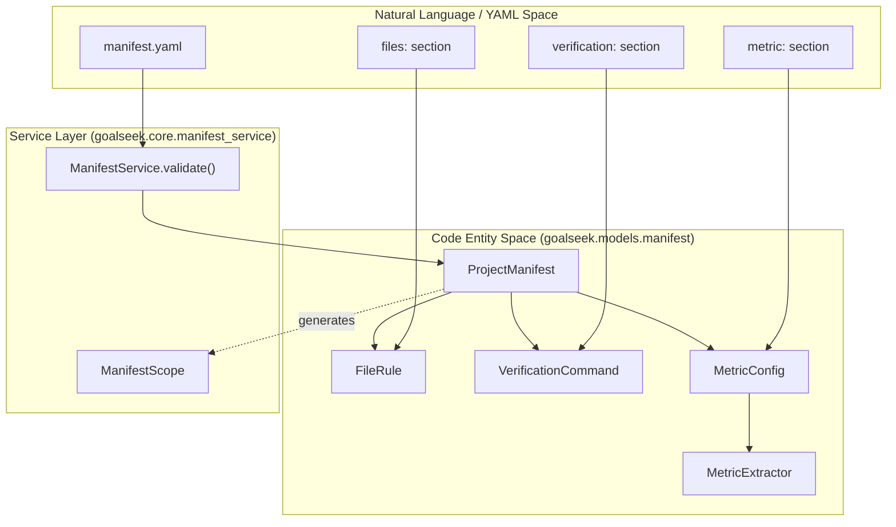
```mermaid
graph TD
    subgraph "Natural Language / YAML Space"
        Y_FILE["manifest.yaml"]
        Y_FILES["files: section"]
        Y_VERIFY["verification: section"]
        Y_METRIC["metric: section"]
    end

    subgraph "Code Entity Space (goalseek.models.manifest)"
        M_PM["ProjectManifest"]
        M_FR["FileRule"]
        M_VC["VerificationCommand"]
        M_MC["MetricConfig"]
        M_ME["MetricExtractor"]
    end

    subgraph "Service Layer (goalseek.core.manifest_service)"
        S_MS["ManifestService.validate()"]
        S_MSC["ManifestScope"]
    end

    Y_FILE --> S_MS
    S_MS --> M_PM
    M_PM --> M_FR
    M_PM --> M_VC
    M_PM --> M_MC
    M_MC --> M_ME
    
    M_PM -. "generates" .-> S_MSC
    Y_FILES --> M_FR
    Y_VERIFY --> M_VC
    Y_METRIC --> M_MC
```
Sources: [src/goalseek/models/manifest.py:1-103](), [src/goalseek/core/manifest_service.py:58-106](), [src/goalseek/templates/manifest.yaml.j2:1-51]()

---

## Effective Configuration (`EffectiveConfig`)

While the manifest defines *what* is being researched, the `EffectiveConfig` defines *how* the `goalseek` engine should behave. This includes LLM provider selection, logging levels, and loop retry logic.

### Configuration Hierarchy

`goalseek` uses a layered configuration system where settings are merged in the following order of precedence (highest to lowest):
1.  **CLI Overrides**: Arguments passed directly to commands (e.g., `--provider-model`).
2.  **Project Config**: A `config/goalseek.yaml` file within the project directory.
3.  **Global Config**: User-level configuration (e.g., `~/.config/goalseek/config.yaml`).
4.  **Defaults**: Hardcoded values in the Pydantic models.

### Key Configuration Sections

The `EffectiveConfig` model [src/goalseek/models/config.py:70-75]() organizes settings into four sub-models:

*   **`ProviderModes`**: Configures the LLM providers for the `hypothesis` (PLAN) and `implementation` (APPLY_CHANGE) steps [src/goalseek/models/config.py:20-23](). Each uses a `ProviderSelection` [src/goalseek/models/config.py:11-18]() specifying the `ProviderName` (e.g., `claude_code`, `codex`), model name, and timeout.
*   **`LoopConfig`**: Controls the `ResearchLoop`. `repair_attempts` defines how many times the agent can try to fix a verification failure before rolling back. `stagnation_window` defines how many iterations without improvement trigger a "stagnation" signal [src/goalseek/models/config.py:25-28]().
*   **`LoggingConfig`**: Manages runtime observability. It supports multiple `LoggingHandler` types, including `stdout`, `file`, and `cloudwatch` [src/goalseek/models/config.py:34-68]().
*   **`OutputConfig`**: Toggles UI features like `rich` terminal formatting [src/goalseek/models/config.py:30-31]().

### Configuration Data Flow
The following diagram shows how configuration flows from raw inputs into the `EffectiveConfig` used by the services.

**Config Resolution Flow**
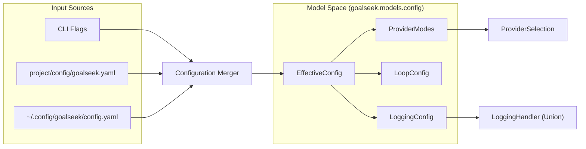
```mermaid
graph LR
    subgraph "Input Sources"
        C_CLI["CLI Flags"]
        C_PROJ["project/config/goalseek.yaml"]
        C_GLOB["~/.config/goalseek/config.yaml"]
    end

    subgraph "Model Space (goalseek.models.config)"
        EC["EffectiveConfig"]
        PM["ProviderModes"]
        LC["LoopConfig"]
        LOG["LoggingConfig"]
    end

    C_CLI & C_PROJ & C_GLOB --> MERGE["Configuration Merger"]
    MERGE --> EC
    EC --> PM
    EC --> LC
    EC --> LOG

    PM --> P_SEL["ProviderSelection"]
    LOG --> L_HAND["LoggingHandler (Union)"]
```
Sources: [src/goalseek/models/config.py:1-75]()

---

## Validation and Error Handling

The `ManifestService` is responsible for enforcing the integrity of the project definition before any execution occurs.

### Overlap Detection
The `_reject_overlaps` method [src/goalseek/core/manifest_service.py:108-132]() prevents conflicting file rules. For example:
*   A `WRITABLE` pattern like `src/*.py` cannot overlap with a `READ_ONLY` pattern like `src/constants.py`.
*   `HIDDEN` files are strictly protected from being included in any visible pattern.

### Path Safety
The service uses `manifest_path_is_safe` [src/goalseek/core/manifest_service.py:80-81]() to ensure that no patterns attempt to escape the project root (e.g., using `../../etc/passwd`).

### Common Validation Errors
If validation fails, the system raises a `ManifestValidationError` [src/goalseek/errors.py](), which includes a descriptive message about the specific violation (e.g., "manifest must declare a mechanical metric" [src/goalseek/core/manifest_service.py:91-92]()).

Sources: [src/goalseek/core/manifest_service.py:58-133](), [src/goalseek/models/manifest.py:1-103](), [src/goalseek/models/config.py:1-75]()

---

# Context Reading and Direction Service

The **Context Reading** and **Direction Service** subsystems are responsible for gathering all relevant information needed by the coding agent to make informed decisions during the `READ_CONTEXT` phase of the research loop. This includes the physical state of the codebase, historical performance metrics, recent version control history, and any manual steering provided by the user via "directions".

## ContextReader

The `ContextReader` class is the primary orchestrator for assembling a `ContextBundle`. It aggregates data from the filesystem, the `results.jsonl` artifact log, the git repository, and the `DirectionService`.

### Implementation Details
The `read` method [src/goalseek/core/context_reader.py:18-38]() performs the following steps:
1.  **File Discovery**: Uses `ManifestScope.expand_existing_visible_files()` to identify which files the agent is allowed to see [src/goalseek/core/context_reader.py:22]().
2.  **File Ingestion**: Iterates through these files to create `ContextFile` objects containing the relative path, SHA256 hash, file size, and full text content [src/goalseek/core/context_reader.py:23-30]().
3.  **Historical Results**: Loads the last 5 entries from `logs/results.jsonl` to provide the agent with a sense of recent performance trends [src/goalseek/core/context_reader.py:31-34]().
4.  **Git State**: Captures the last 20 log entries and a summary of the current diff [src/goalseek/core/context_reader.py:36-37]().
5.  **Active Directions**: Queries the `DirectionService` for any user-injected instructions that apply to the current iteration [src/goalseek/core/context_reader.py:35]().

### Context Assembly Data Flow

The following diagram illustrates how the `ContextReader` bridges the "Code Entity Space" (files and git) into a structured `ContextBundle` for the LLM.

**Title: Context Assembly Logic**
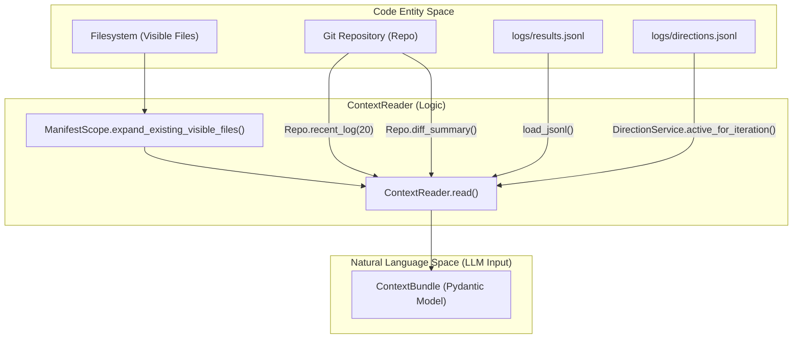
```mermaid
graph TD
    subgraph "Code Entity Space"
        A["Filesystem (Visible Files)"]
        B["Git Repository (Repo)"]
        C["logs/results.jsonl"]
        D["logs/directions.jsonl"]
    end

    subgraph "ContextReader (Logic)"
        CR["ContextReader.read()"]
        MS["ManifestScope.expand_existing_visible_files()"]
    end

    subgraph "Natural Language Space (LLM Input)"
        CB["ContextBundle (Pydantic Model)"]
    end

    A --> MS
    MS --> CR
    B -- "Repo.recent_log(20)" --> CR
    B -- "Repo.diff_summary()" --> CR
    C -- "load_jsonl()" --> CR
    D -- "DirectionService.active_for_iteration()" --> CR
    CR --> CB
```
**Sources:** [src/goalseek/core/context_reader.py:13-39](), [src/goalseek/models/project.py:27-33]()

---

## Direction Service

The `DirectionService` manages user-provided hints or constraints that "steer" the agent. These are stored as an append-only log in `logs/directions.jsonl` [src/goalseek/core/direction_service.py:23]().

### Steering the Agent
Directions allow users to intervene in the automated loop without modifying the manifest. For example, if an agent is stuck in a local optimum, a user can issue a command like `goalseek direct "Try focusing on the learning rate scheduler"` to influence the next `PLAN` phase.

### Key Functions
-   **`add`**: Records a new direction. It captures a timestamp, the message, the source (defaulting to "cli"), and the `applies_from_iteration` index [src/goalseek/core/direction_service.py:10-24]().
-   **`active_for_iteration`**: Filters the direction log. Only directions where `applies_from_iteration <= current_iteration` are returned [src/goalseek/core/direction_service.py:29-34](). This ensures that directions injected for future steps do not leak into the current context.

### Direction Persistence Model

The following diagram shows the relationship between the CLI, the persistence layer, and the iterative filtering.

**Title: Direction Service Lifecycle**
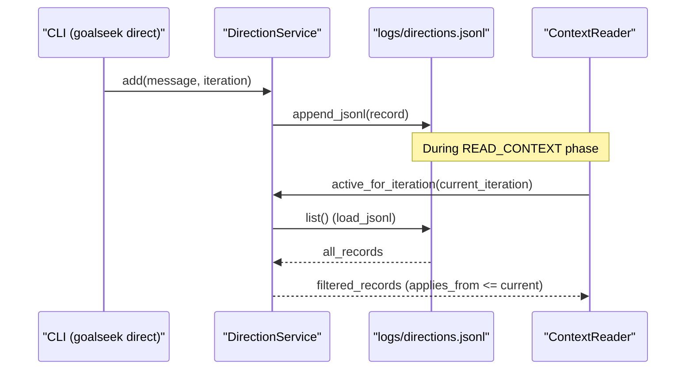
```mermaid
sequenceDiagram
    participant CLI as "CLI (goalseek direct)"
    participant DS as "DirectionService"
    participant JSONL as "logs/directions.jsonl"
    participant CR as "ContextReader"

    CLI->>DS: add(message, iteration)
    DS->>JSONL: append_jsonl(record)
    
    Note over CR, JSONL: During READ_CONTEXT phase
    CR->>DS: active_for_iteration(current_iteration)
    DS->>JSONL: list() (load_jsonl)
    JSONL-->>DS: all_records
    DS-->>CR: filtered_records (applies_from <= current)
```
**Sources:** [src/goalseek/core/direction_service.py:9-35](), [src/goalseek/core/context_reader.py:35]()

---

## Data Models

The context and direction data are structured using Pydantic models to ensure consistency when passed to the Provider subsystem for prompt construction.

### ContextBundle
Defined in [src/goalseek/models/project.py:27-33](), this model encapsulates the entire state visible to the agent at the start of an iteration.

| Field | Type | Description |
| :--- | :--- | :--- |
| `files` | `list[ContextFile]` | List of objects containing path, content, and metadata for visible files [src/goalseek/models/project.py:20-25](). |
| `latest_results` | `list[dict]` | The last 5 entries from `results.jsonl`. |
| `directions` | `list[dict]` | User instructions applicable to the current iteration. |
| `git_log` | `str` | Recent commit history from the repository. |
| `git_diff` | `str` | Summary of current uncommitted changes (if any). |

### Direction Record
A direction record is a dictionary containing:
- `timestamp`: ISO format UTC string [src/goalseek/core/direction_service.py:18]().
- `message`: The actual instruction text [src/goalseek/core/direction_service.py:19]().
- `source`: Origin of the direction (e.g., "cli") [src/goalseek/core/direction_service.py:20]().
- `applies_from_iteration`: The iteration counter at which this instruction becomes active [src/goalseek/core/direction_service.py:21]().

**Sources:** [src/goalseek/models/project.py:20-33](), [src/goalseek/core/direction_service.py:17-22]()

---

# Verification and Metric Extraction

The Verification and Metric Extraction subsystem is responsible for evaluating the changes made by a coding agent. It executes a sequence of commands defined in the project manifest, captures their output, and extracts a numerical metric used to determine if the iteration was successful.

## VerificationRunner

The `VerificationRunner` executes the verification suite as defined in the `manifest.yaml`. It processes commands sequentially and stops if any command returns a non-zero exit code.

### Execution Flow

1.  **Environment Injection**: The runner injects `GOALSEEK_RUN_DIR` and `GOALSEEK_PROJECT_ROOT` into the environment of every command [[src/goalseek/verification/runner.py:46-49]]().
2.  **Sequential Execution**: Commands are executed using `run_command` [[src/goalseek/verification/runner.py:42-51]](). If a command fails (exit code != 0), the sequence terminates immediately [[src/goalseek/verification/runner.py:70-72]]().
3.  **Log Aggregation**: The runner captures `stdout` and `stderr` for every command, prepending the command string (prefixed with `$ `) to create a `combined_log` [[src/goalseek/verification/runner.py:61-63]]().
4.  **Result Packaging**: The output is returned as a `VerificationRun` object containing individual `VerificationCommandResult` objects [[src/goalseek/verification/runner.py:73-77]]().

### Verification Data Flow
The following diagram illustrates the relationship between the `VerificationRunner`, the `VerificationCommand` model, and the resulting data structures.

Title: Verification Execution and Model Mapping
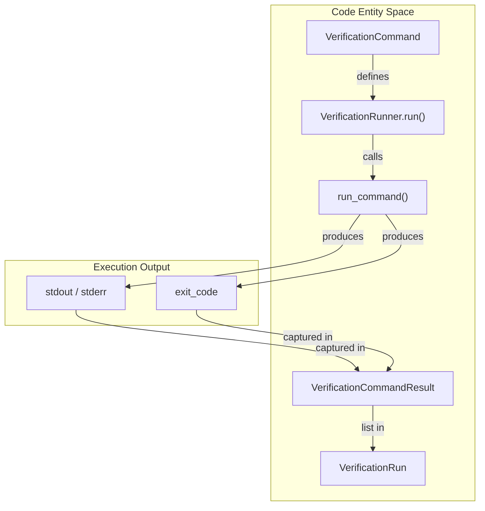
```mermaid
graph TD
    subgraph "Code Entity Space"
        A["VerificationRunner.run()"]
        B["VerificationCommand"]
        C["run_command()"]
        D["VerificationCommandResult"]
        E["VerificationRun"]
    end

    subgraph "Execution Output"
        F["stdout / stderr"]
        G["exit_code"]
    end

    B -- "defines" --> A
    A -- "calls" --> C
    C -- "produces" --> F
    C -- "produces" --> G
    F -- "captured in" --> D
    G -- "captured in" --> D
    D -- "list in" --> E
```
Sources: [[src/goalseek/verification/runner.py:25-77]](), [[src/goalseek/models/manifest.py:29-34]](), [[src/goalseek/models/results.py:20-27]]()

## Metric Extraction Strategies

Once verification commands complete, the `extract_metric` function parses the output to find the primary objective value [[src/goalseek/verification/metrics.py:12-16]](). The extraction strategy is governed by the `MetricExtractor` model [[src/goalseek/models/manifest.py:52-57]]().

| Strategy | Description | Key Fields |
| :--- | :--- | :--- |
| `json_file` | Reads a JSON file from disk and navigates to a value using a JSON pointer. | `path`, `json_pointer` |
| `stdout_regex` | Joins all command `stdout` and applies a regex with one capture group. | `regex` |
| `stderr_regex` | Joins all command `stderr` and applies a regex with one capture group. | `regex` |

### Implementation Details
*   **JSON Pointer**: The `_json_pointer` helper splits the pointer by `/` and traverses dictionaries or lists (using integer indices for lists) [[src/goalseek/verification/metrics.py:72-81]]().
*   **Regex Capture**: The regex must expose exactly one numeric capture group [[src/goalseek/verification/metrics.py:84-91]](). It is executed with `re.MULTILINE` [[src/goalseek/verification/metrics.py:85]]().

Sources: [[src/goalseek/verification/metrics.py:12-39]](), [[src/goalseek/models/manifest.py:46-67]]()

## Decision Logic

The `DECIDE` phase uses the extracted `MetricResult` to determine the fate of the current iteration.

### Comparison and Epsilon
The `compare` function determines if a candidate is "better", "equal", or "worse" than the previous best result [[src/goalseek/verification/metrics.py:42-53]]().
*   **Maximize**: Better if `current > previous + epsilon` [[src/goalseek/verification/metrics.py:44-45]]().
*   **Minimize**: Better if `current < previous - epsilon` [[src/goalseek/verification/metrics.py:49-50]]().
*   **Equal**: If the difference is within `epsilon`, the results are considered equal [[src/goalseek/verification/metrics.py:46-47]]().

### Thresholds and Tie-Breakers
*   **Thresholds**: Even if a metric improves, it must fall within `min_pass` and `max_pass` bounds defined in `MetricConfig` [[src/goalseek/verification/metrics.py:56-61]]().
*   **Tie-Breaker**: If the metric is "equal", `goalseek` prefers the candidate with fewer lines of code changed (`changed_loc`) [[src/goalseek/verification/metrics.py:64-70]]().

### Decision Matrix Logic
Title: Metric Decision Logic (DECIDE Phase)
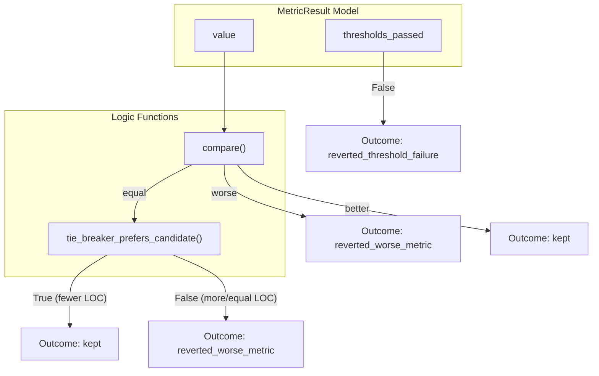
```mermaid
graph TD
    subgraph "MetricResult Model"
        V["value"]
        TP["thresholds_passed"]
    end

    subgraph "Logic Functions"
        CP["compare()"]
        TB["tie_breaker_prefers_candidate()"]
    end

    V --> CP
    TP -- "False" --> R1["Outcome: reverted_threshold_failure"]
    CP -- "worse" --> R2["Outcome: reverted_worse_metric"]
    CP -- "better" --> K1["Outcome: kept"]
    CP -- "equal" --> TB
    TB -- "True (fewer LOC)" --> K2["Outcome: kept"]
    TB -- "False (more/equal LOC)" --> R3["Outcome: reverted_worse_metric"]
```
Sources: [[src/goalseek/verification/metrics.py:42-70]](), [[src/goalseek/models/results.py:29-36]](), [[src/goalseek/models/manifest.py:69-77]]()

## MetricResult Model

The `MetricResult` dataclass stores the outcome of the extraction process and is persisted in the iteration's `result.json`.

| Field | Type | Description |
| :--- | :--- | :--- |
| `name` | `str` | Name of the metric (default: "score") [[src/goalseek/models/results.py:30]](). |
| `value` | `float` | The actual numeric value extracted [[src/goalseek/models/results.py:31]](). |
| `direction` | `str` | "maximize" or "minimize" [[src/goalseek/models/results.py:32]](). |
| `thresholds_passed`| `bool` | Whether the value satisfies `min_pass`/`max_pass` [[src/goalseek/models/results.py:33]](). |
| `extractor_type` | `str` | The strategy used (e.g., `json_file`) [[src/goalseek/models/results.py:35]](). |

Sources: [[src/goalseek/models/results.py:29-36]]()

---

# CLI Reference

The `goalseek` command-line interface (CLI) serves as the primary entry point for managing research loops, project lifecycles, and observability. Built using the `click` library, the CLI layer acts as a thin wrapper that orchestrates calls to the underlying Python API services and renders the results using `rich`-based terminal components.

## CLI Architecture and Delegation

The CLI is structured into several command groups and standalone commands defined in `src/goalseek/cli/app.py` [src/goalseek/cli/app.py:17-31](). Every command follows a standard pattern of delegation:
1. **Argument Parsing**: `click` decorators handle input validation and help text.
2. **API Invocation**: Commands call the `invoke` utility [src/goalseek/cli/common.py:150-173](), which executes the corresponding Python API function.
3. **Error Handling**: The `invoke` wrapper catches `GoalseekError` exceptions and translates them into user-friendly error messages and specific exit codes [src/goalseek/cli/common.py:170-172]().
4. **Rendering**: Results are passed to specialized render functions (e.g., `render_setup`, `render_baseline`) that output formatted tables and panels to the console [src/goalseek/cli/common.py:61-148]().

### Natural Language to Code Entity Mapping: CLI Execution Flow

The following diagram illustrates how a CLI command traverses from the terminal into the core logic.

"CLI Execution Flow"
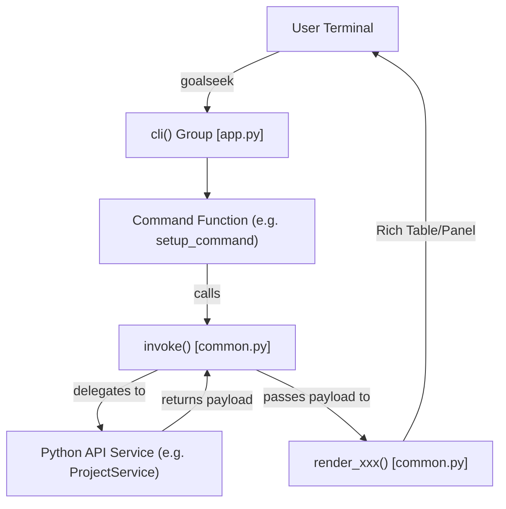
```mermaid
graph TD
    User["User Terminal"] -- "goalseek <command>" --> CLI["cli() Group [app.py]"]
    CLI --> CMD["Command Function (e.g. setup_command)"]
    CMD -- "calls" --> INV["invoke() [common.py]"]
    INV -- "delegates to" --> API["Python API Service (e.g. ProjectService)"]
    API -- "returns payload" --> INV
    INV -- "passes payload to" --> RENDER["render_xxx() [common.py]"]
    RENDER -- "Rich Table/Panel" --> User
```
Sources: [src/goalseek/cli/app.py:17-31](), [src/goalseek/cli/common.py:150-173]()

## Command Groups

The CLI is organized into three primary categories of functionality.

### Project and Manifest Commands
These commands handle the initial scaffolding and configuration validation of a research project.
- `goalseek project init`: Generates the standard directory structure and boilerplate files.
- `goalseek manifest validate`: Ensures the `manifest.yaml` adheres to the required schema and that verification commands are executable.

For details, see [Project and Manifest Commands](#3.1).

### Lifecycle Commands
These commands drive the actual research loop, from establishing a performance baseline to executing iterative improvements.
- `setup`: Initializes the project state and prepares the context inventory.
- `baseline`: Executes the initial verification to establish the metric to beat.
- `run` / `step`: Executes the research loop either continuously or in single-phase increments.
- `direct`: Allows the user to inject natural language guidance into the loop's planning phase.

For details, see [Lifecycle Commands](#3.2).

### Observability and Utility Commands
These commands provide insights into the current state of a project and help maintain the repository.
- `status`: Displays a high-level view of the current loop state and project configuration.
- `summary`: Aggregates results across all iterations, showing improvements and recommendations.
- `gittreeclean`: A utility to commit or clean the working tree to ensure a stable state for the loop.

For details, see [Observability and Utility Commands](#3.3).

## Command Mapping to Code Entities

This table maps the primary CLI commands to their implementation files and the rendering logic used to display their output.

| Command | Implementation File | Renderer Function |
| :--- | :--- | :--- |
| `project init` | `commands/project.py` | `render_project_init` |
| `setup` | `commands/setup.py` | `render_setup` |
| `baseline` | `commands/baseline.py` | `render_baseline` |
| `run` | `commands/run.py` | `render_run` |
| `step` | `commands/step.py` | `render_step` |
| `status` | `commands/status.py` | `render_status` |
| `summary` | `commands/summary.py` | `render_summary` |

Sources: [src/goalseek/cli/app.py:5-14](), [src/goalseek/cli/common.py:50-148]()

### Natural Language to Code Entity Mapping: CLI Command Structure

"CLI Command Structure"
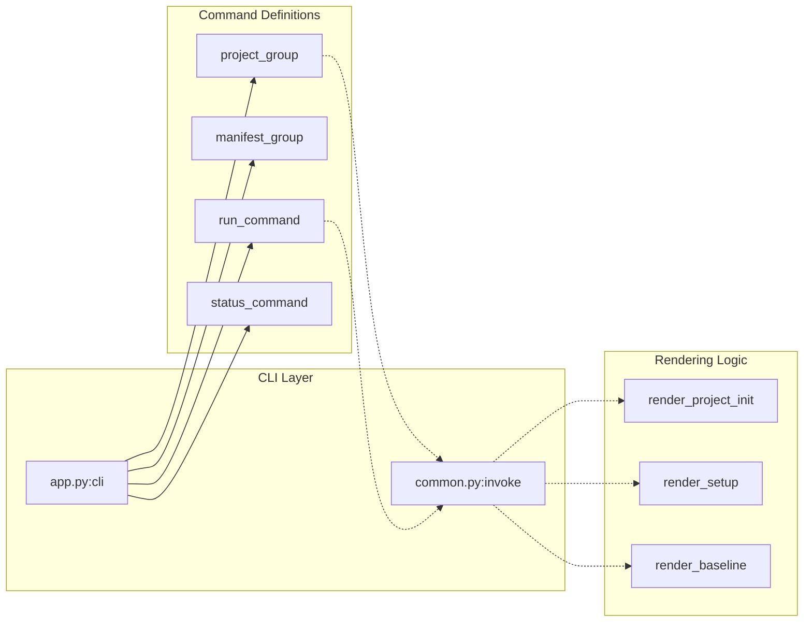
```mermaid
graph LR
    subgraph "CLI Layer"
        CLI_APP["app.py:cli"]
        COMMON["common.py:invoke"]
    end

    subgraph "Command Definitions"
        PROJ["project_group"]
        MANI["manifest_group"]
        RUN["run_command"]
        STAT["status_command"]
    end

    subgraph "Rendering Logic"
        R_PROJ["render_project_init"]
        R_SET["render_setup"]
        R_BASE["render_baseline"]
    end

    CLI_APP --> PROJ
    CLI_APP --> MANI
    CLI_APP --> RUN
    CLI_APP --> STAT

    PROJ -.-> COMMON
    RUN -.-> COMMON
    
    COMMON -.-> R_PROJ
    COMMON -.-> R_SET
    COMMON -.-> R_BASE
```
Sources: [src/goalseek/cli/app.py:17-31](), [src/goalseek/cli/common.py:150-173]()

---

# Project and Manifest Commands

This section documents the CLI command groups used for initializing a new research project and validating its configuration. These commands serve as the entry point for the `goalseek` lifecycle, ensuring that the project structure is sound and the `manifest.yaml` conforms to the required schema before any research iterations begin.

## Project Initialization

The `goalseek project init` command is responsible for generating the standard directory scaffold and initial configuration files required for a research project.

### Command Specification
- **Group**: `project` [src/goalseek/cli/commands/project.py:11-13]()
- **Command**: `init` [src/goalseek/cli/commands/project.py:16]()
- **Arguments**:
    - `NAME`: The name of the project directory to create. [src/goalseek/cli/commands/project.py:17]()
- **Options**:
    - `--path`: The parent directory where the project should be created (defaults to current working directory). [src/goalseek/cli/commands/project.py:18]()
    - `--provider`: Selection of the coding agent provider (e.g., `codex`, `claude_code`, `opencode`, `gemini`, `fake`). [src/goalseek/cli/commands/project.py:19]()
    - `--model`: The specific model identifier for the provider. [src/goalseek/cli/commands/project.py:20]()
    - `--no-git-init`: Flag to skip automatic `git init` within the new project. [src/goalseek/cli/commands/project.py:21]()

### Implementation Logic
When `init` is invoked, the CLI performs the following steps:
1. **Path Resolution**: It resolves the target `project_root` by combining the provided path and name. [src/goalseek/cli/commands/project.py:23-24]()
2. **Conflict Handling**: If the directory already exists, it prompts the user for confirmation to delete and overwrite. If denied, it exits with code 1. [src/goalseek/cli/commands/project.py:26-33]()
3. **API Delegation**: The CLI calls the `init_project` function from the API layer. [src/goalseek/cli/commands/project.py:35]()
4. **Rendering**: Upon success, it uses `render_project_init` to display the project root and recommended next steps (validation and setup). [src/goalseek/cli/common.py:50-59]()

### Project Init Data Flow
The following diagram illustrates how the CLI command delegates to the underlying API and handles user interaction.

**Project Init Flow**
```mermaid
sequenceDiagram
    participant U as User
    participant CLI as cli.commands.project:init_command
    participant API as api:init_project
    participant CM as cli.common:invoke

    U->>CLI: goalseek project init "my-experiment"
    alt Directory Exists
        CLI->>U: Confirm overwrite?
        U-->>CLI: Yes
    end
    CLI->>CM: invoke(init_project, name, path, ...)
    activate CM
    CM->>API: init_project(name, path, provider, model, ...)
    activate API
    Note over API: Create directories<br/>Generate manifest.yaml<br/>Git init (optional)
    API-->>CM: project_path
    deactivate API
    CM->>CLI: render_project_init(project_path)
    CLI->>U: Display "Project Created" Table
    deactivate CM
```
**Sources:** [src/goalseek/cli/commands/project.py:16-46](), [src/goalseek/cli/common.py:150-173](), [src/goalseek/cli/common.py:50-59]()

---

## Manifest Validation

The `goalseek manifest validate` command ensures that the `manifest.yaml` file in a project directory is syntactically correct and contains all mandatory fields required by the `ManifestService`.

### Command Specification
- **Group**: `manifest` [src/goalseek/cli/commands/manifest.py:9-11]()
- **Command**: `validate` [src/goalseek/cli/commands/manifest.py:14]()
- **Arguments**:
    - `PROJECT`: Path to the project directory containing the `manifest.yaml`. [src/goalseek/cli/commands/manifest.py:15]()

### Implementation Logic
The command acts as a thin wrapper around the `validate_manifest` API function:
1. **Invocation**: It uses the `invoke` utility to execute the validation logic. [src/goalseek/cli/commands/manifest.py:17-22]()
2. **Error Handling**: If validation fails (e.g., missing keys or invalid metric configuration), a `GoalseekError` (specifically `ManifestValidationError`) is caught by the `invoke` wrapper, which prints the error message in red and exits with the appropriate error code. [src/goalseek/cli/common.py:170-172]()
3. **Success**: If the manifest is valid, it displays a success message indicating the project is ready for the `setup` phase. [src/goalseek/cli/commands/manifest.py:21]()

### Code Entity Mapping
This diagram bridges the CLI command space to the API and Service entities that perform the actual validation.

**Manifest Validation Mapping**
```mermaid
graph TD
    subgraph "CLI Space"
        CMD["cli.commands.manifest:validate_command"]
        INV["cli.common:invoke"]
    end

    subgraph "API Space"
        V_API["api:validate_manifest"]
    end

    subgraph "Service Space"
        M_SVC["services.manifest:ManifestService"]
        M_VAL["services.manifest:ManifestValidator"]
    end

    CMD --> INV
    INV --> V_API
    V_API --> M_SVC
    M_SVC --> M_VAL
    
    style CMD stroke-width:2px
    style V_API stroke-width:2px
    style M_SVC stroke-width:2px
```
**Sources:** [src/goalseek/cli/commands/manifest.py:14-22](), [src/goalseek/api.py:5](), [src/goalseek/cli/common.py:150-173]()

---

## CLI Utilities and Rendering

The `goalseek.cli.common` module provides standardized UI components for these commands using the `rich` library.

### The `invoke` Wrapper
The `invoke` function is the standard execution pattern for CLI commands. It handles:
- Printing a start message (blue). [src/goalseek/cli/common.py:159-160]()
- Executing the API function and capturing the payload. [src/goalseek/cli/common.py:161]()
- Handling `GoalseekError` exceptions and converting them to `click.Exit` with the correct code. [src/goalseek/cli/common.py:170-172]()
- Dispatching the payload to a specific renderer (like `render_project_init`) or a generic KV table renderer. [src/goalseek/cli/common.py:165-168]()

### Key Renderers
| Function | Purpose | Key Fields Displayed |
| :--- | :--- | :--- |
| `render_project_init` | Post-init summary | Project root, Next steps (validate/setup) |
| `render_kv_table` | Generic result display | Key-value pairs in a blue-themed table |
| `render_generic` | Fallback renderer | Handles strings, dicts, or None payloads |

**Sources:** [src/goalseek/cli/common.py:29-59](), [src/goalseek/cli/common.py:150-173]()

---

# Lifecycle Commands

Lifecycle commands constitute the primary interface for executing and controlling the research loop in `goalseek`. These commands manage the transition of a project from initial configuration to execution, providing granular control over the iteration process.

## Overview

The lifecycle commands are implemented as Click commands that delegate execution to the `goalseek.api` layer. Each command follows a standardized execution pattern using the `invoke` utility, which handles logging, error translation, and terminal rendering.

### Execution Flow: CLI to API

The following diagram illustrates how CLI commands map to internal API calls and the subsequent rendering of results.

**CLI-to-API Command Mapping**
```mermaid
graph TD
    subgraph "CLI Layer"
        C_SETUP["setup_command"]
        C_BASELINE["baseline_command"]
        C_RUN["run_command"]
        C_STEP["step_command"]
        C_DIRECT["direct_command"]
    end

    subgraph "Common Infrastructure"
        INVOKE["invoke() [src/goalseek/cli/common.py]"]
        RENDER["Renderer Functions [src/goalseek/cli/common.py]"]
    end

    subgraph "API Layer [src/goalseek/api.py]"
        A_SETUP["run_setup()"]
        A_BASELINE["run_baseline()"]
        A_RUN["run_loop()"]
        A_STEP["run_step()"]
        A_DIRECT["add_direction()"]
    end

    C_SETUP -->|calls| INVOKE
    C_BASELINE -->|calls| INVOKE
    C_RUN -->|calls| INVOKE
    C_STEP -->|calls| INVOKE
    C_DIRECT -->|calls| INVOKE

    INVOKE --> A_SETUP
    INVOKE --> A_BASELINE
    INVOKE --> A_RUN
    INVOKE --> A_STEP
    INVOKE --> A_DIRECT

    A_SETUP -.->|returns payload| INVOKE
    A_BASELINE -.->|returns payload| INVOKE
    INVOKE --> RENDER
```
**Sources:** [src/goalseek/cli/commands/setup.py:9-18](), [src/goalseek/cli/commands/baseline.py:9-18](), [src/goalseek/cli/commands/run.py:9-32](), [src/goalseek/cli/commands/step.py:9-18](), [src/goalseek/cli/commands/direct.py:9-22](), [src/goalseek/cli/common.py:150-173]()

---

## Setup Command

The `setup` command prepares the project environment. It validates the project structure, initializes the context inventory, and verifies that the provider and manifest configurations are compatible.

*   **Command:** `goalseek setup <PROJECT_PATH>`
*   **API Mapping:** Calls `run_setup(project)` [src/goalseek/cli/commands/setup.py:13]().
*   **Terminal Output:** Rendered by `render_setup`. It displays a summary of the project configuration, including the selected provider, metric directions, and a count of the files identified in the context inventory [src/goalseek/cli/common.py:61-79]().

**Sources:** [src/goalseek/cli/commands/setup.py:9-18](), [src/goalseek/cli/common.py:61-79]()

---

## Baseline Command

The `baseline` command establishes the "iteration 0" state. It runs the verification commands on the current state of the codebase to capture initial metrics.

*   **Command:** `goalseek baseline <PROJECT_PATH>`
*   **API Mapping:** Calls `run_baseline(project)` [src/goalseek/cli/commands/baseline.py:13]().
*   **Terminal Output:** Rendered by `render_baseline`. Displays the run directory, the outcome (e.g., success/failure), the extracted baseline metric value, and the verification exit code [src/goalseek/cli/common.py:82-93]().

**Sources:** [src/goalseek/cli/commands/baseline.py:9-18](), [src/goalseek/cli/common.py:82-93]()

---

## Run and Step Commands

These commands drive the `LoopEngine`. While `run` executes multiple iterations or phases automatically, `step` provides a manual "debugger-like" advancement.

### Run Command
*   **Command:** `goalseek run <PROJECT_PATH> [--iterations N] [--time MINUTES]`
*   **Options:**
    *   `--iterations`: Limits the loop to N iterations [src/goalseek/cli/commands/run.py:11]().
    *   `--time`: Limits the loop to a specific duration in minutes [src/goalseek/cli/commands/run.py:12]().
*   **API Mapping:** Calls `run_loop(project, iterations, forever, time_limit_minutes)` [src/goalseek/cli/commands/run.py:24-32]().

### Step Command
*   **Command:** `goalseek step <PROJECT_PATH>`
*   **Behavior:** Advances the research loop by exactly one phase (e.g., from `PLAN` to `APPLY_CHANGE`) [src/goalseek/cli/commands/step.py:15]().
*   **API Mapping:** Calls `run_step(project)` [src/goalseek/cli/commands/step.py:13]().

**Lifecycle State Rendering**
```mermaid
sequenceDiagram
    participant CLI as CLI (run/step)
    participant API as API (run_loop/run_step)
    participant LE as LoopEngine
    participant SE as StepEngine

    CLI->>API: invoke(action)
    API->>LE: execute()
    LE->>SE: run_next_phase()
    SE-->>LE: Updated State
    LE-->>API: Payload (current_phase, outcome)
    API-->>CLI: payload
    CLI->>CLI: render_step(payload)
```
**Sources:** [src/goalseek/cli/commands/run.py:9-32](), [src/goalseek/cli/commands/step.py:9-18](), [src/goalseek/cli/common.py:100-109]()

---

## Direct Command

The `direct` command allows the user to inject natural language instructions into the research loop. These directions are persisted and included in the context provided to the coding provider during the `PLAN` phase of future iterations.

*   **Command:** `goalseek direct <PROJECT_PATH> --message "..." [--applies-from-iteration N]`
*   **Arguments:**
    *   `--message`: The instruction string for the agent [src/goalseek/cli/commands/direct.py:11]().
    *   `--applies-from-iteration`: Optional. Forces the direction to only be visible starting from a specific iteration number [src/goalseek/cli/commands/direct.py:12]().
*   **API Mapping:** Calls `add_direction(project, message, applies_from_iteration)` [src/goalseek/cli/commands/direct.py:15-18]().
*   **Terminal Output:** Rendered by `render_direction`. Displays a confirmation table with the timestamp and application constraints [src/goalseek/cli/common.py:112-120]().

**Sources:** [src/goalseek/cli/commands/direct.py:9-22](), [src/goalseek/cli/common.py:112-120]()

---

## Output Rendering Logic

The `goalseek.cli.common` module uses the `rich` library to provide formatted terminal output. The `invoke` function serves as the central error handler, catching `GoalseekError` exceptions and translating them into exit codes via `click.exceptions.Exit` [src/goalseek/cli/common.py:150-172]().

| Renderer | Purpose | Key Fields Displayed |
| :--- | :--- | :--- |
| `render_setup` | Summarizes environment | Provider, Model, Metrics, File Inventory [src/goalseek/cli/common.py:61-79]() |
| `render_baseline` | Reports initial state | Metric value, Verification outcome [src/goalseek/cli/common.py:82-93]() |
| `render_step` | Reports loop progress | Current Phase, Iteration, Rollback status [src/goalseek/cli/common.py:100-109]() |
| `render_direction` | Confirms injection | Message, Source, Target iteration [src/goalseek/cli/common.py:112-120]() |

**Sources:** [src/goalseek/cli/common.py:50-148](), [src/goalseek/cli/common.py:170-172]()

---

# Observability and Utility Commands

This page documents the CLI commands and underlying services used to monitor project state, aggregate research results, and maintain repository hygiene. These tools provide visibility into the research loop's progress and ensure the git working tree is in a valid state for automated operations.

## Overview of Commands

The observability suite consists of three primary commands that interface with the `goalseek.api` layer:

| Command | API Function | Primary Responsibility |
|:---|:---|:---|
| `status` | `get_status` | Renders the current state of the research loop and iteration history. |
| `summary` | `build_summary` | Aggregates performance metrics and provides heuristic recommendations. |
| `gittreeclean` | `clean_git_tree` | Forces a commit of uncommitted changes to ensure a clean slate for the engine. |

### Command Delegation Flow

The following diagram illustrates how CLI commands delegate to the core services through the API layer.

**Figure 1: Command Delegation Architecture**
```mermaid
graph TD
    subgraph "CLI Layer"
        C_STATUS["status.py"]
        C_SUMM["summary.py"]
        C_CLEAN["gittreeclean.py"]
    end

    subgraph "API Layer (api.py)"
        A_STATUS["get_status()"]
        A_SUMM["build_summary()"]
        A_CLEAN["clean_git_tree()"]
    end

    subgraph "Core Services"
        S_STATE["StateStore"]
        S_SUMM["SummaryService"]
        S_REPO["Repo"]
        S_DIR["DirectionService"]
    end

    C_STATUS --> A_STATUS
    C_SUMM --> A_SUMM
    C_CLEAN --> A_CLEAN

    A_STATUS --> S_STATE
    A_SUMM --> S_SUMM
    A_CLEAN --> S_REPO
    S_SUMM --> S_DIR
```
**Sources:** [src/goalseek/cli/commands/status.py:1-18](), [src/goalseek/cli/commands/summary.py:1-18](), [src/goalseek/cli/commands/gittreeclean.py:1-27](), [src/goalseek/core/summary_service.py:9-13]()

---

## Status Monitoring

The `status` command provides a real-time view of the project's progress. It is implemented in `src/goalseek/cli/commands/status.py` and invokes the `get_status` API [src/goalseek/cli/commands/status.py:9-18]().

### Loop State Table
The `render_status` utility (called via `invoke`) displays a table containing:
1.  **Project Metadata:** Root path and current configuration.
2.  **Loop State:** The current phase (e.g., `PLAN`, `VERIFY`), the current iteration number, and the `next_step` scheduled by the `StepEngine`.
3.  **Iteration History:** A summary of recent results loaded from `logs/results.jsonl`.

---

## Result Summarization

The `summary` command aggregates data across all iterations to evaluate the effectiveness of the research process. It relies on the `SummaryService` to process artifact logs.

### SummaryService Implementation
The `SummaryService.build` method performs the following data transformations:
*   **Result Categorization:** It loads `results.jsonl` and partitions entries into `baseline`, `kept`, `reverted`, and `skipped` [src/goalseek/core/summary_service.py:12-17]().
*   **Best Metric Tracking:** It iterates through the `baseline` and `kept` iterations to identify the `best_retained_metric` and its corresponding iteration index [src/goalseek/core/summary_service.py:18-23]().
*   **Stagnation Detection:** It calculates a "non-kept streak" using the `_non_kept_streak` helper, which counts consecutive failures or reverts since the last successful improvement [src/goalseek/core/summary_service.py:45-53]().

### Heuristic Recommendations
The service generates natural language recommendations based on the project state:
*   **Stagnation Trigger:** If `non_kept_streak >= 3`, it recommends broadening the next hypothesis [src/goalseek/core/summary_service.py:26-27]().
*   **Direction Integration:** It includes the latest message from the `DirectionService` to remind the user of active constraints [src/goalseek/core/summary_service.py:28-29]().

**Figure 2: Summary Data Flow**
```mermaid
graph LR
    subgraph "Filesystem"
        R_JSONL["logs/results.jsonl"]
        D_DIR["context/directions/"]
    end

    subgraph "SummaryService.build()"
        L_JSONL["load_jsonl"]
        L_DIR["DirectionService.list"]
        CALC["_non_kept_streak()"]
        AGG["Aggregate Best Metric"]
    end

    R_JSONL --> L_JSONL
    D_DIR --> L_DIR
    L_JSONL --> AGG
    L_JSONL --> CALC
    AGG --> PAYLOAD["Summary Dictionary"]
    CALC --> PAYLOAD
```
**Sources:** [src/goalseek/core/summary_service.py:9-42](), [src/goalseek/cli/commands/summary.py:9-18]()

---

## Git Tree Management

The `gittreeclean` command is a utility designed to handle "dirty" working trees. Since `goalseek` relies on git snapshots to manage rollbacks and candidate commits, uncommitted local changes can interfere with the research loop.

### Behavior
1.  **Detection:** It checks if the working tree has uncommitted changes using the `Repo` wrapper.
2.  **Commitment:** If changes are found, it performs a `git add .` and `git commit` with a default message: `"chore: clean working tree"` [src/goalseek/cli/commands/gittreeclean.py:16-19]().
3.  **Reporting:** It returns the commit hash of the new "clean" state or indicates that the tree was already clean [src/goalseek/cli/commands/gittreeclean.py:9-13]().

### Implementation Details
The command uses a custom success message generator `_success_message` to provide clear feedback to the user regarding whether a commit was actually created [src/goalseek/cli/commands/gittreeclean.py:9-13]().

**Sources:** [src/goalseek/cli/commands/gittreeclean.py:1-27](), [src/goalseek/api/__init__.py]() (implied by `clean_git_tree` import).

---

# Provider System

The **Provider System** is the abstraction layer that allows `goalseek` to interface with various coding-agent engines (LLMs or CLI-based agents). It decouples the core research loop logic from the specific implementation details of how code changes are generated and applied.

The system is designed around a two-phase interaction model:
1.  **PLAN**: The provider is asked to analyze the current context and propose a strategy to improve the target metrics.
2.  **APPLY_CHANGE** (Implement): The provider executes the proposed plan by modifying the source code within the project root.

## Architecture Overview

The Provider System acts as a bridge between the "Natural Language Space" (where goals and strategies are defined) and the "Code Entity Space" (where actual file modifications occur).

### Relationship Diagram

This diagram illustrates how the `LoopEngine` utilizes the `ProviderRegistry` to fetch a `ProviderAdapter`, which then transforms a `ProviderRequest` into a `ProviderResponse` affecting the filesystem.

```mermaid
graph TD
    subgraph "Natural Language Space"
        LE["LoopEngine"] -- "requests plan/impl" --> PR["ProviderRegistry"]
        PR -- "returns" --> PA["ProviderAdapter (Protocol)"]
        LE -- "ProviderRequest" --> PA
    end

    subgraph "Code Entity Space"
        PA -- "executes on" --> FS["Project Filesystem"]
        PA -- "returns" --> PRes["ProviderResponse"]
        FS -- "modified by" --> PA
    end

    subgraph "Registry Implementations"
        PA <|-- CCP["ClaudeCodeProvider"]
        PA <|-- CXP["CodexProvider"]
        PA <|-- GP["GeminiProvider"]
        PA <|-- FP["FakeProvider"]
    end
```
**Sources:** [src/goalseek/providers/base.py:43-51](), [src/goalseek/providers/registry.py:11-19]()

---

## Provider Protocol and Registry

The core of the system is the `ProviderAdapter` protocol. Any class implementing this protocol can be used as a coding engine. The `ProviderRegistry` serves as a central lookup table that maps configuration strings (e.g., `"claude_code"`) to these concrete implementations.

- **`ProviderRequest`**: A dataclass containing the full context for the LLM, including the `prompt_text`, `writable_paths` (scope enforcement), and `timeout_sec`.
- **`ProviderResponse`**: A dataclass capturing the output of the LLM, including the `raw_text` of the response and a list of `changed_files`.
- **`ProviderCapabilities`**: Defines what a specific provider supports, such as non-interactive execution or split prompts.

For details, see [Provider Protocol and Registry](#4.1).

**Sources:** [src/goalseek/providers/base.py:10-41](), [src/goalseek/providers/registry.py:21-26]()

---

## Built-in Providers

`goalseek` ships with several built-in providers tailored for different environments and testing scenarios:

| Provider | Description |
| :--- | :--- |
| `ClaudeCodeProvider` | Interfaces with the Anthropic `claude` CLI for agentic code editing. |
| `GeminiProvider` | Uses Google's Gemini models for planning and code generation. |
| `CodexProvider` | Optimized for OpenAI-style coding models. |
| `OpenCodeProvider` | Generic adapter for open-source LLM interfaces. |
| `FakeProvider` | A deterministic provider used for testing that "replays" predefined YAML scenarios. |

For details, see [Built-in Providers](#4.2).

**Sources:** [src/goalseek/providers/registry.py:13-19]()

---

## Prompt Construction

The effectiveness of the Provider System relies heavily on how information is presented to the LLM. The system dynamically constructs prompts during the `PLAN` and `APPLY_CHANGE` phases.

- **Context Integration**: Prompts include the project manifest, current file contents, and the history of recent results.
- **Direction Injection**: User-provided directions from the `DirectionService` are injected to guide the agent toward specific hypotheses.
- **Stagnation Detection**: If metrics haven't improved for several iterations, the prompt construction logic injects "stagnation warnings" to encourage the agent to try different approaches.

For details, see [Prompt Construction](#4.3).

---

## Provider Execution Flow

The following diagram maps the internal code entities involved when the `LoopEngine` invokes a provider to transition from a strategy to a code change.

```mermaid
sequenceDiagram
    participant LE as LoopEngine
    participant PS as PromptService
    participant PR as ProviderRegistry
    participant PA as ProviderAdapter
    participant FS as FileSystem

    LE->>PS: build_planning_prompt()
    PS-->>LE: prompt_text
    LE->>PR: get(provider_name)
    PR-->>LE: adapter
    LE->>PA: plan(ProviderRequest)
    PA-->>LE: ProviderResponse (plan.md)
    
    LE->>PS: build_implementation_prompt(plan)
    PS-->>LE: prompt_text
    LE->>PA: implement(ProviderRequest)
    PA->>FS: Apply Edits (Code Entity Space)
    PA-->>LE: ProviderResponse (changed_files)
```

**Sources:** [src/goalseek/providers/base.py:43-51](), [src/goalseek/providers/registry.py:11-26]()

---

# Provider Protocol and Registry

The Provider System in `goalseek` is designed as a pluggable abstraction layer that separates the research loop orchestration from the specific coding-agent or LLM being used. This page documents the `ProviderAdapter` protocol, the data structures used for communication, and the registry mechanism that manages provider instances.

## The ProviderAdapter Protocol

All coding-agent providers must implement the `ProviderAdapter` protocol. This ensures a consistent interface for the `StepEngine` to interact with diverse backends, ranging from CLI-based agents like Claude Code to direct API integrations.

### Protocol Definition

The protocol defines three primary methods and a name attribute:

| Method / Attribute | Purpose |
| :--- | :--- |
| `name` | A string identifier for the provider (e.g., "claude_code"). |
| `capabilities(config)` | Returns a `ProviderCapabilities` object describing what the provider supports given a specific configuration. |
| `plan(request)` | Invoked during the `PLAN` phase to generate a hypothesis or strategy. |
| `implement(request)` | Invoked during the `APPLY_CHANGE` phase to execute code modifications. |

[src/goalseek/providers/base.py:43-51]()

### Provider Capabilities

The `capabilities` method allows the system to validate if a provider is suitable for the current environment and configuration before attempting execution.

[src/goalseek/providers/base.py:10-16]()

- **`available`**: Whether the underlying tool (e.g., an executable) is installed and accessible.
- **`supports_non_interactive`**: Whether the provider can run without user intervention.
- **`supports_split_prompts`**: Whether the provider distinguishes between planning and implementation phases.

**Sources:**
- [src/goalseek/providers/base.py:10-16]()
- [src/goalseek/providers/base.py:43-51]()

## Data Transfer Objects

Communication between the `goalseek` core and providers is handled via two main dataclasses: `ProviderRequest` and `ProviderResponse`.

### ProviderRequest

The `ProviderRequest` encapsulates all context necessary for a provider to perform its task.

| Field | Description |
| :--- | :--- |
| `project_root` | Path to the project being modified. |
| `provider_name` | The name of the provider being invoked. |
| `model_name` | The specific LLM model requested (e.g., `claude-3-5-sonnet`). |
| `mode` | Typically "hypothesis" or "implementation". |
| `prompt_text` | The full rendered prompt containing context and instructions. |
| `writable_paths` | List of files/directories the provider is allowed to modify. |
| `generated_paths` | List of files the provider is allowed to create. |
| `non_interactive` | Boolean flag to suppress interactive prompts. |
| `timeout_sec` | Maximum execution time before the request is killed. |

[src/goalseek/providers/base.py:18-31]()

### ProviderResponse

The `ProviderResponse` captures the output and side effects of the provider's execution.

| Field | Description |
| :--- | :--- |
| `raw_text` | The full stdout/response text from the provider. |
| `exit_code` | The process exit code (0 for success). |
| `duration_sec` | Time taken for execution. |
| `changed_files` | A list of files actually modified by the provider. |
| `error` | Error message if the execution failed. |

[src/goalseek/providers/base.py:33-41]()

**Sources:**
- [src/goalseek/providers/base.py:18-41]()

## Provider Registry

The `ProviderRegistry` acts as a central lookup service. It maps the `ProviderName` literal defined in the configuration to concrete implementation classes.

### Implementation Mapping

The registry initializes the following mapping:

| Name | Class |
| :--- | :--- |
| `codex` | `CodexProvider` |
| `claude_code` | `ClaudeCodeProvider` |
| `opencode` | `OpenCodeProvider` |
| `gemini` | `GeminiProvider` |
| `fake` | `FakeProvider` |

[src/goalseek/providers/registry.py:11-19]()

The `get(name)` method retrieves the singleton instance of the provider or raises a `ConfigError` if the name is unrecognized. [src/goalseek/providers/registry.py:21-26]()

### Data Flow: From Config to Implementation

The following diagram illustrates how the `ProviderRegistry` bridges the configuration space to the executable code entities.

**Provider Resolution Flow**
```mermaid
graph TD
    subgraph "Natural Language / Config Space"
        CONF["EffectiveConfig (manifest.yaml)"]
        P_SEL["ProviderSelection (name: 'claude_code')"]
    end

    subgraph "Code Entity Space"
        REG["ProviderRegistry"]
        ADAPTER["ProviderAdapter (Protocol)"]
        CLAUDE["ClaudeCodeProvider"]
        CODEX["CodexProvider"]
        FAKE["FakeProvider"]
    end

    CONF -->|contains| P_SEL
    P_SEL -->|name string| REG
    REG -->|lookup| CLAUDE
    REG -.->|lookup| CODEX
    REG -.->|lookup| FAKE
    
    CLAUDE -- "implements" --> ADAPTER
    CODEX -- "implements" --> ADAPTER
    FAKE -- "implements" --> ADAPTER
```

**Sources:**
- [src/goalseek/providers/registry.py:11-26]()
- [src/goalseek/models/config.py:8-18]()
- [src/goalseek/providers/base.py:43-51]()

## Execution Lifecycle

The `StepEngine` coordinates the lifecycle of a provider request. It utilizes the registry to fetch the adapter and then executes the protocol methods based on the current loop phase.

**Provider Execution Interaction**
```mermaid
sequenceDiagram
    participant SE as "StepEngine"
    participant REG as "ProviderRegistry"
    participant ADAPT as "ProviderAdapter (Concrete)"
    
    SE->>REG: get(config.provider.name)
    REG-->>SE: return adapter instance
    
    SE->>ADAPT: capabilities(config)
    ADAPT-->>SE: ProviderCapabilities
    
    Note over SE, ADAPT: Phase: PLAN
    SE->>ADAPT: plan(ProviderRequest)
    ADAPT-->>SE: ProviderResponse
    
    Note over SE, ADAPT: Phase: APPLY_CHANGE
    SE->>ADAPT: implement(ProviderRequest)
    ADAPT-->>SE: ProviderResponse
```

**Sources:**
- [src/goalseek/providers/base.py:43-51]()
- [src/goalseek/providers/registry.py:11-26]()
- [src/goalseek/models/config.py:70-75]()

---

# Built-in Providers

This page documents the concrete implementations of the `ProviderAdapter` protocol within `goalseek`. These providers interface with various coding agents and LLM CLIs to perform the `PLAN` and `APPLY_CHANGE` phases of the research loop.

## ClaudeCodeProvider

The `ClaudeCodeProvider` [src/goalseek/providers/claude_code.py:16-16]() interfaces with the `claude` CLI. It is designed to handle both high-level planning and autonomous code editing by leveraging different permission modes.

### Execution Logic
The provider uses `_run_claude_cli` [src/goalseek/providers/claude_code.py:52-52]() to execute the CLI. It forces non-interactive behavior by setting specific environment variables:
- `CLAUDE_AUTO_APPROVE: "true"` [src/goalseek/providers/claude_code.py:20-20]()
- `CLAUDE_SKIP_CONFIRMATIONS: "true"` [src/goalseek/providers/claude_code.py:21-21]()

### Permission Modes
The provider distinguishes between planning and implementation via the `--permission-mode` flag:
- **Plan Phase**: Uses `permission_mode="default"` [src/goalseek/providers/claude_code.py:39-39](). In this mode, it typically outputs text without attempting to modify the filesystem.
- **Implement Phase**: Uses `permission_mode="acceptEdits"` [src/goalseek/providers/claude_code.py:48-48](). This allows the agent to autonomously apply changes to the project files.

### Plan Sanitization
To ensure the `plan.md` artifact remains clean, the provider includes a `_sanitize_plan_output` function [src/goalseek/providers/claude_code.py:98-98](). This uses regular expressions to remove internal CLI paths (e.g., `.claude/plans/...`) and collapse excessive whitespace [src/goalseek/providers/claude_code.py:99-100]().

**Claude CLI Integration Flow**
```mermaid
graph TD
    subgraph "Natural Language Space"
        P["Prompt Text"]
    end

    subgraph "Code Entity Space"
        CCP["ClaudeCodeProvider"]
        RCC["_run_claude_cli"]
        SPO["_sanitize_plan_output"]
        EXE["claude CLI executable"]
    end

    P --> CCP
    CCP -- "plan()" --> RCC
    CCP -- "implement()" --> RCC
    RCC -- "subprocess" --> EXE
    EXE -- "stdout" --> SPO
    SPO -- "ProviderResponse.raw_text" --> CCP
```
**Sources:** [src/goalseek/providers/claude_code.py:16-101]()

---

## Generic CLI Providers (Codex, Gemini, OpenCode)

`CodexProvider`, `GeminiProvider`, and `OpenCodeProvider` follow a standard pattern of wrapping their respective command-line interfaces. They all delegate their core execution logic to a shared helper function `_run_cli` [src/goalseek/codex.py:35-35]().

| Provider | Class Name | Default Executable |
| :--- | :--- | :--- |
| **Codex** | `CodexProvider` [src/goalseek/providers/codex.py:16-16]() | `codex` |
| **Gemini** | `GeminiProvider` [src/goalseek/providers/gemini.py:10-10]() | `gemini` |
| **OpenCode** | `OpenCodeProvider` [src/goalseek/providers/opencode.py:10-10]() | `opencode` |

### Shared Execution Logic (`_run_cli`)
1. **Resolution**: Checks if the executable exists via `shutil.which` [src/goalseek/providers/codex.py:20-20]().
2. **Invocation**: Executes the command as `[executable, prompt_text]` using the `run_command` utility [src/goalseek/providers/codex.py:55-60]().
3. **Capture**: Merges `stdout` and `stderr` into the `raw_text` field of the `ProviderResponse` [src/goalseek/providers/codex.py:68-68]().

**Sources:** [src/goalseek/providers/codex.py:1-73](), [src/goalseek/providers/gemini.py:1-26](), [src/goalseek/providers/opencode.py:1-26]()

---

## FakeProvider

The `FakeProvider` [src/goalseek/providers/fake.py:17-17]() is a deterministic provider used for testing and CI. Instead of calling an LLM, it reads a YAML configuration file to simulate specific research outcomes.

### Scenario Configuration
The provider looks for a configuration file at `config/fake_provider.yaml` within the project root [src/goalseek/providers/fake.py:86-86](). It selects a scenario based on the current loop iteration index [src/goalseek/providers/fake.py:91-92]().

### Simulated Actions
The `_apply_action` method [src/goalseek/providers/fake.py:95-95]() supports several "fake" implementation kinds:
- `set_metric`: Uses regex to find a `METRIC = ...` line in a file and replace its value [src/goalseek/providers/fake.py:97-108]().
- `write_file`: Creates or overwrites a file with specific content [src/goalseek/providers/fake.py:110-114]().
- `append_text`: Appends text to the end of an existing file [src/goalseek/providers/fake.py:115-121]().
- `fail`: Simulates a provider execution error [src/goalseek/providers/fake.py:63-69]().

**FakeProvider Data Flow**
```mermaid
graph TD
    subgraph "Natural Language Space"
        U["User Intent"]
    end

    subgraph "Code Entity Space"
        FP["FakeProvider"]
        FS["_scenario"]
        AA["_apply_action"]
        YML["fake_provider.yaml"]
        EXP["experiment.py"]
    end

    U -- "loop iteration" --> FP
    FP --> FS
    FS -- "read" --> YML
    FP -- "implement()" --> AA
    AA -- "regex replace METRIC" --> EXP
```

**Sources:** [src/goalseek/providers/fake.py:17-122]()

---

## Capabilities and Requirements

All built-in providers implement the `capabilities` method to report their features to the `ProviderRegistry`.

| Feature | Description | Code Reference |
| :--- | :--- | :--- |
| `available` | Whether the required CLI tool is found in the system PATH. | [src/goalseek/providers/base.py:17-17]() |
| `supports_split_prompts` | Whether the provider can handle separate `plan` and `implement` calls. | [src/goalseek/providers/base.py:19-19]() |
| `executable` | The resolved path to the CLI binary. | [src/goalseek/providers/base.py:20-20]() |

**Sources:** [src/goalseek/providers/base.py:15-21](), [src/goalseek/providers/claude_code.py:24-31]()

---

# Prompt Construction

The prompt construction system in `goalseek` is responsible for transforming the current project state, manifest constraints, and historical results into structured natural language instructions for the coding agent. This process occurs in two distinct stages: planning and implementation.

The system ensures that the provider (e.g., Claude, Gemini) operates within the boundaries defined in the `manifest.yaml` while remaining aware of previous successes, failures, and user-provided directions.

## Architecture Overview

Prompt construction is handled primarily by the `goalseek.providers.prompts` module, which consumes data aggregated by the `ContextReader`.

### Data Flow for Prompting

The following diagram illustrates how raw project data is transformed into a prompt.

**Prompt Construction Data Flow**
```mermaid
graph TD
    subgraph "Code Entity Space"
        A["ContextReader.read()"] --> B["ContextBundle"]
        C["ManifestScope"] --> D["build_planning_prompt()"]
        B --> D
        D --> E["Planning Prompt (Markdown)"]
        
        E --> F["ProviderAdapter.plan()"]
        F --> G["Plan Markdown"]
        
        G --> H["build_implementation_prompt()"]
        C --> H
        H --> I["Implementation Prompt"]
    end

    subgraph "Natural Language Space"
        I --> J["Coding Agent Execution"]
        J --> K["File System Changes"]
    end

    style A fill:none,stroke-dasharray: 5 5
    style J fill:none,stroke-dasharray: 5 5
```
Sources: [src/goalseek/core/context_reader.py:13-38](), [src/goalseek/providers/prompts.py:7-71]()

## Planning Prompt Construction

The `build_planning_prompt` function creates the initial instruction set for the `PLAN` phase. It is designed to provide the agent with a "situational awareness" of the project's current trajectory.

### Key Components of the Planning Prompt

| Component | Source | Description |
| :--- | :--- | :--- |
| **Project Identity** | `ManifestScope` | Includes the project name and current iteration number [src/goalseek/providers/prompts.py:18](). |
| **Scope Sections** | `ManifestScope` | Explicit lists of Readable, Writable, Generated, and Hidden patterns to enforce boundary awareness [src/goalseek/providers/prompts.py:20-30](). |
| **Recent Results** | `ContextBundle.latest_results` | A summary of the last 5 iterations, including their outcomes and metric values [src/goalseek/providers/prompts.py:9-12](), [src/goalseek/core/context_reader.py:34](). |
| **Active Directions** | `DirectionService` | User-injected instructions that apply to the current iteration [src/goalseek/core/direction_service.py:29-34](), [src/goalseek/providers/prompts.py:8](). |
| **Stagnation Note** | `stagnating` flag | A dynamic instruction injected if the loop detects repeated failures or lack of metric improvement [src/goalseek/providers/prompts.py:13-17](). |

### Stagnation Detection
The `stagnating` boolean influences the agent's behavior. If `True`, the prompt suggests a "more radical but still single-change move" [src/goalseek/providers/prompts.py:14](). Otherwise, it defaults to requesting the "smallest coherent change" [src/goalseek/providers/prompts.py:16]().

Sources: [src/goalseek/providers/prompts.py:7-45](), [src/goalseek/core/context_reader.py:31-38]()

## Implementation Prompt Construction

Once a plan is generated and approved, `build_implementation_prompt` prepares the instructions for the `APPLY_CHANGE` phase. This prompt is significantly more restrictive and focuses on execution constraints.

### Constraint Injection
The implementation prompt explicitly forbids several behaviors to ensure the agent remains within the `goalseek` sandbox:
*   **Modification Limits**: Only files matching `writable_patterns` can be edited [src/goalseek/providers/prompts.py:61]().
*   **Creation Limits**: New files are only permitted within `generated_patterns` [src/goalseek/providers/prompts.py:62]().
*   **Hidden Paths**: The agent is strictly forbidden from reading or modifying paths marked as hidden [src/goalseek/providers/prompts.py:63]().
*   **Direct Edits**: The agent is instructed to apply edits directly rather than returning patches for a human [src/goalseek/providers/prompts.py:66]().

**Implementation Mapping**
```mermaid
classDiagram
    class ManifestScope {
        +read_only_patterns: list
        +writable_patterns: list
        +generated_patterns: list
        +hidden_patterns: list
    }
    class build_implementation_prompt {
        +iteration: int
        +plan_markdown: str
    }
    class ProviderRequest {
        +prompt: str
        +system_prompt: str
    }

    ManifestScope --> build_implementation_prompt : provides constraints
    build_implementation_prompt --> ProviderRequest : generates prompt string
```
Sources: [src/goalseek/providers/prompts.py:48-71](), [src/goalseek/core/manifest_service.py:6]()

## Active Directions

The `DirectionService` allows users to steer the agent's research without modifying the manifest. These directions are stored in `logs/directions.jsonl` and filtered by the `applies_from_iteration` field.

When `ContextReader.read()` is called, it uses `DirectionService.active_for_iteration` to retrieve only the messages relevant to the current state [src/goalseek/core/direction_service.py:29-34](). These are then formatted as a bulleted list in the planning prompt [src/goalseek/providers/prompts.py:8]().

Sources: [src/goalseek/core/direction_service.py:9-35](), [src/goalseek/core/context_reader.py:35]()

---

# Git Operations

`goalseek` treats Git as a first-class citizen for managing the state of a research project. Rather than simply using it for version control, the system leverages Git to create a verifiable trail of experiments, enforce scope constraints, and provide a robust mechanism for rolling back unsuccessful iterations. Every change applied by a provider is captured as a "candidate commit," which is then either kept or reverted based on the outcome of the verification phase.

## Git as State Management

The `Repo` class in `[src/goalseek/gitops/repo.py:10-10]()` acts as the primary interface for all Git operations. `goalseek` uses Git to:
- **Ensure Reproducibility**: By recording the HEAD hash before and after changes.
- **Isolate Iterations**: Every iteration that modifies the codebase results in a new commit.
- **Automate Identity**: All automated commits use a fixed identity (`goalseek <goalseek@example.invalid>`) to distinguish agent actions from user actions `[src/goalseek/gitops/repo.py:101-107]()`.

### Git Operation Flow

The following diagram illustrates how Git operations are integrated into the core research loop phases:

**Research Loop Git Integration**
```mermaid
graph TD
    subgraph "Natural Language Space"
        A["'Improve accuracy'"]
        B["'Change rejected'"]
    end

    subgraph "Code Entity Space"
        direction TB
        C["Repo.ensure_clean()"]
        D["Repo.commit_all()"]
        E["revert_commit()"]
        F["Repo.head()"]
    end

    A --> C
    C -->|"APPLY_CHANGE"| D
    D -->|"DECIDE (Fail)"| E
    D -->|"DECIDE (Pass)"| F
    E --> B
```
Sources: `[src/goalseek/gitops/repo.py:26-29]()`, `[src/goalseek/gitops/repo.py:69-75]()`, `[src/goalseek/gitops/rollback.py:6-7]()`

## Repository Wrapper

The `Repo` class wraps the Git CLI to provide high-level methods tailored for the research loop. It handles initialization, status monitoring, and commit management. Key capabilities include:
- **Safety Checks**: `ensure_clean()` prevents starting an iteration if the working tree has uncommitted changes `[src/goalseek/gitops/repo.py:26-29]()`.
- **Change Analysis**: `working_tree_changed_files()` and `diff_summary()` provide the context used by providers to understand the current state `[src/goalseek/gitops/repo.py:45-57]()`.
- **Metrics**: `changed_loc_for_commit()` calculates the magnitude of a change (Lines of Code), which is used for scope enforcement `[src/goalseek/gitops/repo.py:87-98]()`.

For details on the implementation of these methods and the identity override logic, see **[Repo Wrapper](#5.1)**.

Sources: `[src/goalseek/gitops/repo.py:10-98]()`

## Rollbacks and History Model

`goalseek` employs an "additive" Git history model even for failures. When an iteration is rejected (e.g., due to a metric regression or a scope violation), the system does not perform a `git reset`. Instead, it uses `git revert` via the `revert_commit` utility `[src/goalseek/gitops/rollback.py:6-7]()`.

### Decision Logic and Git State

| Phase Outcome | Git Action | Resulting History |
| :--- | :--- | :--- |
| **Success** | `commit_all()` | `[Base] -> [Iteration Commit]` |
| **Failure/Regression** | `commit_all()` then `revert()` | `[Base] -> [Iteration Commit] -> [Revert Commit]` |
| **Scope Violation** | `commit_all()` then `revert()` | `[Base] -> [Iteration Commit] -> [Revert Commit]` |

This approach ensures that the Git log provides a complete audit trail of what was attempted, why it was reverted, and the exact code state of the failed attempt.

For details on when rollbacks are triggered and how scope enforcement uses Git diffs, see **[Rollback and Scope Enforcement](#5.2)**.

Sources: `[src/goalseek/gitops/repo.py:77-82]()`, `[src/goalseek/gitops/rollback.py:1-8]()`

## Code Entity Relationship

The following diagram maps the logical Git operations to the specific functions in the `gitops` package.

**Git Operations Mapping**
```mermaid
classDiagram
    class Repo {
        +init()
        +ensure_clean()
        +commit_all(message)
        +revert(commit_hash)
        +changed_loc_for_commit(hash)
    }

    class RollbackModule {
        +revert_commit(repo, hash)
    }

    Repo <-- RollbackModule : "calls repo.revert()"
    
    note for Repo "src/goalseek/gitops/repo.py"
    note for RollbackModule "src/goalseek/gitops/rollback.py"
```
Sources: `[src/goalseek/gitops/repo.py:10-10]()`, `[src/goalseek/gitops/rollback.py:6-7]()`

---

# Repo Wrapper

The `Repo` class serves as the primary interface between `goalseek` and the underlying Git version control system. It encapsulates shell commands into a type-safe API, ensuring that all automated changes, commits, and rollbacks are performed consistently across different research iterations.

## The Repo Class

The `Repo` class [src/goalseek/gitops/repo.py:10-118]() is initialized with a project root path and provides methods for repository introspection and state modification. It is designed to treat the project directory as a Git repository, which is a prerequisite for `goalseek` to track experimental changes and provide rollback capabilities.

### Automated Identity Override
A critical feature of the `Repo` wrapper is the enforcement of a specific Git identity for all operations initiated by the tool. This is implemented in the private `_run` method [src/goalseek/gitops/repo.py:100-117]().

Every command executed through this wrapper injects configuration overrides:
- **User Name**: `goalseek`
- **User Email**: `goalseek@example.invalid`

This ensures that automated commits are clearly distinguishable from manual user commits in the repository history and avoids issues in environments where a global Git user is not configured [src/goalseek/gitops/repo.py:101-108]().

### Implementation Logic: Git Command Execution
The following diagram illustrates how the `Repo` class bridges the high-level Python API to the low-level `git` CLI.

**Git Execution Data Flow**
```mermaid
graph TD
    subgraph "Code Entity Space"
        A["Repo.commit_all()"]
        B["Repo.revert()"]
        C["Repo.status_porcelain()"]
        D["Repo._run(args)"]
    end

    subgraph "Natural Language Space (System Execution)"
        E["subprocess.run()"]
        F["git -c user.name=goalseek ..."]
        G["Git Binary"]
    end

    A --> D
    B --> D
    C --> D
    D --> E
    E --> F
    F --> G
```
Sources: [src/goalseek/gitops/repo.py:69-82](), [src/goalseek/gitops/repo.py:100-117]()

## Core Functionality

### Repository Initialization and Status
- `is_repo()`: Checks if the directory is inside a Git work tree using `rev-parse --is-inside-work-tree` [src/goalseek/gitops/repo.py:17-21]().
- `init()`: Initializes a new Git repository in the root directory [src/goalseek/gitops/repo.py:23-24]().
- `ensure_clean()`: Verifies that there are no uncommitted changes before an agent applies new modifications, preventing state contamination [src/goalseek/gitops/repo.py:26-29]().
- `status_porcelain()`: Returns a list of changed files using the `--porcelain` flag for stable parsing [src/goalseek/gitops/repo.py:31-33]().

### State Management
- `head()`: Retrieves the current `HEAD` commit hash [src/goalseek/gitops/repo.py:35-39]().
- `commit(paths, message)`: Stages specific files and creates a commit [src/goalseek/gitops/repo.py:59-67]().
- `commit_all(message)`: Stages all changes (including untracked files) and creates a commit [src/goalseek/gitops/repo.py:69-75]().
- `revert(commit_hash)`: Performs a `git revert --no-edit`, creating a new commit that undoes the changes of the specified hash [src/goalseek/gitops/repo.py:77-82]().

### Inspection and Metrics
- `recent_log(count)`: Returns a summary of the most recent commits for context injection [src/goalseek/gitops/repo.py:41-43]().
- `diff_summary()`: Combines `status --short` and `diff --stat` to provide a human-readable overview of current changes [src/goalseek/gitops/repo.py:45-48]().
- `changed_loc_for_commit(commit_hash)`: Parses `show --numstat` to calculate the total Lines of Code (LOC) changed (additions + deletions) in a specific commit [src/goalseek/gitops/repo.py:87-98]().

## Data Mapping: Code to Git
The table below maps `Repo` methods to the specific Git commands they execute.

| Method | Git Command Equivalent | Purpose |
| :--- | :--- | :--- |
| `is_repo` | `git rev-parse --is-inside-work-tree` | Validation |
| `status_porcelain` | `git status --porcelain` | Machine-readable status |
| `head` | `git rev-parse HEAD` | State tracking |
| `commit_all` | `git add . && git commit -m ...` | Persistence |
| `revert` | `git revert --no-edit <hash>` | Rollback |
| `changed_loc_for_commit`| `git show --numstat --format= <hash>` | Metric extraction |

Sources: [src/goalseek/gitops/repo.py:17-98]()

## Error Handling
The wrapper translates Git process failures into internal `GoalseekError` types:
- `GitOperationError`: Raised when a Git command returns a non-zero exit code or when Git is not installed on the system [src/goalseek/gitops/repo.py:15-21](), [src/goalseek/gitops/repo.py:115-116]().
- `ProjectStateError`: Raised by `ensure_clean()` if the working tree is dirty when it should be pristine [src/goalseek/gitops/repo.py:28-29]().

**Entity Interaction Diagram**
```mermaid
sequenceDiagram
    participant LE as LoopEngine
    participant R as Repo
    participant G as Git Binary

    LE->>R: ensure_clean()
    R->>G: git status --porcelain
    G-->>R: (empty)
    R-->>LE: OK

    LE->>R: commit_all("Iteration 1")
    R->>G: git add .
    R->>G: git commit -m "Iteration 1"
    G-->>R: Success
    R->>G: git rev-parse HEAD
    G-->>R: 0xabc123
    R-->>LE: 0xabc123
```
Sources: [src/goalseek/gitops/repo.py:26-33](), [src/goalseek/gitops/repo.py:69-75]()

Sources:
- [src/goalseek/gitops/repo.py:1-118]()

---

# Rollback and Scope Enforcement

The `goalseek` research loop operates on a "trial and error" basis where every iteration's changes are treated as candidates. To maintain a stable project state and ensure that only improvements are permanently kept in the active branch, the system employs a robust rollback mechanism. This mechanism is triggered by scope violations, verification failures, or performance regressions relative to the current best-known metric.

## The Rollback Mechanism

Rollbacks in `goalseek` are implemented as git reverts. This ensures that the git history remains a linear, append-only record of both successful improvements and failed attempts. When an iteration is rejected, the system does not "hard reset" the branch; instead, it creates a new revert commit to undo the changes introduced by that iteration.

### revert_commit Function
The core logic for undoing a change is encapsulated in the `revert_commit` utility function [src/goalseek/gitops/rollback.py:6-7](). This function wraps the `Repo.revert` method [src/goalseek/gitops/repo.py:73-84](), which executes `git revert --no-edit <hash>`.

### Rollback Recording
When a rollback occurs, the resulting revert commit hash is stored in the `LoopState` as `rollback_commit_hash` [src/goalseek/models/state.py:60](). This hash is also recorded in the `ResultRecord` for that iteration [src/goalseek/models/results.py:40](), providing a clear audit trail of which commit was created to undo the iteration's work.

## Rollback Triggers

The system transitions to a rollback state during the `DECIDE` phase based on three primary criteria:

### 1. Scope Violation
Before verification even begins, the system checks if the changes made by the provider stay within the allowed boundaries defined in the `manifest.yaml`.
*   **Mechanism**: The `ManifestScope.is_within_scope` method [src/goalseek/core/manifest_service.py:32-37]() checks the files modified in the candidate commit against the `include` and `exclude` patterns.
*   **Enforcement**: If a violation is detected, the `LoopEngine` raises a `ScopeViolationError` [src/goalseek/core/loop_engine.py:228-230](). The iteration is marked with the outcome `rejected_scope_violation` [src/goalseek/core/loop_engine.py:293](), and a rollback is triggered.

### 2. Threshold Failure
If the `manifest.yaml` defines a `threshold` for the primary metric, the candidate must meet this minimum (or maximum) requirement.
*   **Mechanism**: The `thresholds_pass` function [src/goalseek/verification/metrics.py:101-111]() evaluates the extracted metric against the configured goal.
*   **Enforcement**: If the threshold is not met, the iteration is marked `rejected_threshold` [src/goalseek/core/loop_engine.py:298]() and rolled back.

### 3. Metric Regression
If the iteration passes scope and thresholds, its metric is compared against the `retained_metric` (the best metric achieved so far).
*   **Comparison**: The `compare` function [src/goalseek/verification/metrics.py:84-98]() determines if the new metric is better, worse, or equal based on the `improvement_direction` (e.g., `minimize` or `maximize`).
*   **Tie-breaking**: If metrics are equal, `tie_breaker_prefers_candidate` [src/goalseek/verification/metrics.py:114-123]() is used. By default, if metrics are identical, the system prefers the candidate with fewer Lines of Code (LoC) changed to favor simpler solutions.
*   **Enforcement**: If the candidate is worse than the current best, it is marked `rejected_worse` [src/goalseek/core/loop_engine.py:303]() and rolled back.

## Data Flow and Implementation

The following diagram illustrates how the `LoopEngine` coordinates with the `Repo` and `rollback` module to enforce state integrity.

### Decision and Rollback Logic Flow
```mermaid
graph TD
    subgraph "Phase: DECIDE"
        START["LoopEngine._phase_decide()"] --> SCOPE{"is_within_scope?"}
        SCOPE -- "No" --> SV["Outcome: rejected_scope_violation"]
        SCOPE -- "Yes" --> THRESH{"thresholds_pass?"}
        
        THRESH -- "No" --> RT["Outcome: rejected_threshold"]
        THRESH -- "Yes" --> COMP{"compare(candidate, retained)"}
        
        COMP -- "Better" --> KEEP["Outcome: accepted"]
        COMP -- "Worse" --> RW["Outcome: rejected_worse"]
    end

    SV --> RB["revert_commit(repo, candidate_hash)"]
    RT --> RB
    RW --> RB

    RB --> LOG["Record rollback_commit_hash in ResultRecord"]
    KEEP --> UPDATE["Update retained_metric in StateStore"]

    style SV stroke-dasharray: 5 5
    style RT stroke-dasharray: 5 5
    style RW stroke-dasharray: 5 5
```
**Sources:** [src/goalseek/core/loop_engine.py:270-335](), [src/goalseek/verification/metrics.py:84-123](), [src/goalseek/core/manifest_service.py:32-37]()

## Git History Model

The `goalseek` git history reflects the evolution of the project through successful and failed experiments.

| Iteration | Status | Git Action | Resulting History |
| :--- | :--- | :--- | :--- |
| **N** | `APPLY_CHANGE` | `git commit` | `Commit A` (Candidate) |
| **N** | `DECIDE` (Rejected) | `git revert` | `Commit B` (Revert of A) |
| **N+1** | `APPLY_CHANGE` | `git commit` | `Commit C` (Candidate) |
| **N+1** | `DECIDE` (Accepted) | None | (Commit C remains as HEAD) |

### Entity Mapping: Git Operations to Code
This diagram maps the logical git actions to the specific classes and functions responsible for them.

```mermaid
classDiagram
    class Repo {
        +commit_all(message)
        +revert(commit_hash)
        +head()
    }
    class RollbackModule {
        +revert_commit(repo, hash)
    }
    class LoopEngine {
        -_phase_commit()
        -_phase_decide()
    }
    class StateStore {
        +retained_metric
        +rollback_commit_hash
    }

    LoopEngine --> Repo : "Calls commit_all in COMMIT phase"
    LoopEngine --> RollbackModule : "Calls revert_commit if DECIDE fails"
    RollbackModule --> Repo : "Invokes repo.revert()"
    LoopEngine --> StateStore : "Persists rollback_commit_hash"
```
**Sources:** [src/goalseek/gitops/repo.py:53-84](), [src/goalseek/gitops/rollback.py:6-7](), [src/goalseek/core/loop_engine.py:255-268](), [src/goalseek/models/state.py:51-62]()

## Error Handling in Rollbacks

If a git operation fails during the rollback process (e.g., due to a lock file or unexpected repository state), the system raises a `GitOperationError` [src/goalseek/errors.py:31-33](). This error halts the research loop to prevent the system from operating on a corrupted or desynchronized workspace.

**Sources:**
*   `src/goalseek/core/loop_engine.py:228-230, 270-335`
*   `src/goalseek/gitops/repo.py:73-84`
*   `src/goalseek/gitops/rollback.py:1-8`
*   `src/goalseek/verification/metrics.py:84-123`
*   `src/goalseek/core/manifest_service.py:32-37`
*   `src/goalseek/models/state.py:51-62`
*   `src/goalseek/models/results.py:30-45`
*   `src/goalseek/errors.py:31-37`

---

# Logging and Observability

The `goalseek` observability system is split into two distinct categories: **Runtime Logging**, which tracks the internal health and execution flow of the package, and **Research Artifacts**, which capture the specific inputs, outputs, and results of each iteration in the research loop. This separation ensures that operational logs do not clutter the scientific record of an experiment.

### Runtime Logging Architecture

Runtime logging is managed by the `goalseek.runtime_logging` module. It configures the standard Python `logging` library for the `goalseek` package namespace [src/goalseek/runtime_logging.py:19-19](). The system supports multiple handler types and uses a signature-based idempotency guard to prevent redundant re-configurations when the research loop is initialized multiple times [src/goalseek/runtime_logging.py:23-36]().

#### Configuration Flow

The logging behavior is defined in the `LoggingConfig` section of the `EffectiveConfig` [src/goalseek/models/config.py:62-74](). Users can enable logging, set global levels, and define a list of handlers (Stdout, File, or CloudWatch).

**Natural Language Space to Code Entity Space: Logging Setup**

```mermaid
graph TD
    subgraph "Configuration Space"
        A["manifest.yaml / CLI Args"] --> B["EffectiveConfig.logging"]
        B --> C["LoggingConfig"]
    end

    subgraph "Code Entity Space"
        C --> D["configure_package_logging()"]
        D --> E["_build_handler()"]
        E --> F["StdoutLoggingHandler"]
        E --> G["FileLoggingHandler"]
        E --> H["CloudWatchLoggingHandler"]
    end

    D -- "Sets level for" --> I["logging.getLogger('goalseek')"]
```
Sources: [src/goalseek/models/config.py:62-74](), [src/goalseek/runtime_logging.py:23-53]()

#### Supported Handlers

| Handler Type | Class | Description |
| :--- | :--- | :--- |
| **Stdout** | `StdoutLoggingHandler` | Streams logs to `sys.stdout`. Default if no handlers are specified [src/goalseek/models/config.py:38-40](). |
| **File** | `FileLoggingHandler` | Writes logs to a local file. Paths are resolved relative to the project root [src/goalseek/runtime_logging.py:69-74](). |
| **CloudWatch** | `CloudWatchLoggingHandler` | Sends logs to AWS CloudWatch. Requires `goalseek[cloudwatch]` dependencies [src/goalseek/runtime_logging.py:75-85](). |

For implementation details on how handlers are constructed and how levels are coerced, see [Runtime Logging Configuration](#6.1).

### Research Artifacts and Results

While runtime logs track "how the system is running," Research Artifacts track "what the system is doing." These are stored in the project's `logs/` directory and are partitioned by iteration.

**Natural Language Space to Code Entity Space: Artifact Storage**

```mermaid
graph LR
    subgraph "Research Loop Phases"
        P1["PLAN"] --> P2["APPLY_CHANGE"]
        P2 --> P3["VERIFY"]
        P3 --> P4["LOG"]
    end

    subgraph "Artifact Filesystem"
        P1 --> F1["plan.md"]
        P2 --> F2["git_after.txt"]
        P3 --> F3["verifier.log"]
        P4 --> F4["results.jsonl"]
    end

    F4 -- "Aggregates" --> R["ResultRecord"]
```
Sources: [src/goalseek/runtime_logging.py:69-74](), [tests/unit/test_runtime_logging.py:12-35]()

#### Data Separation
- **Runtime Logs**: Controlled by `LoggingConfig`. Typically contains stack traces, provider API latency, and internal state transitions.
- **Iteration Artifacts**: Fixed set of files (e.g., `prompt.md`, `metrics.json`) written per loop iteration to provide a full audit trail of the coding agent's logic and the resulting performance changes.
- **Result Records**: An append-only `results.jsonl` file that serves as the primary data source for the `goalseek summary` command.

For a detailed list of every file generated during an iteration and the schema of the result records, see [Research Artifacts and Result Records](#6.2).

### Child Pages

*   **[Runtime Logging Configuration](#6.1)**: Details the `configure_package_logging` function, handler construction for stdout/file/CloudWatch, the signature-based idempotency guard, log level coercion, and the optional `goalseek[cloudwatch]` dependency.
*   **[Research Artifacts and Result Records](#6.2)**: Documents the files written per iteration (prompt.md, plan.md, provider_output.md, verifier.log, metrics.json, result.json, git_before.txt, git_after.txt, results_discussion.md), the `ResultRecord` schema, and the append-only `results.jsonl` log.

---

# Runtime Logging Configuration

The `goalseek` runtime logging subsystem provides a configurable mechanism for capturing internal system events, separate from the research artifacts generated during the loop. It supports multiple output sinks, including standard output, local files, and AWS CloudWatch.

## Overview

The logging system is centered around the `configure_package_logging` function in `src/goalseek/runtime_logging.py`. It uses a signature-based idempotency guard to ensure that the logger is only reconfigured when the configuration or the project context changes. This prevents redundant handler initialization during repetitive CLI or API calls.

### Logging Data Flow

The following diagram illustrates how configuration data flows from the `EffectiveConfig` model into the standard Python `logging` infrastructure.

**Diagram: Logging Configuration Flow**
```mermaid
graph TD
    subgraph "Configuration Space"
        EC["EffectiveConfig"] --> LC["LoggingConfig"]
        LC --> LH["LoggingHandler (Union)"]
    end

    subgraph "Code Entity Space"
        CPL["configure_package_logging()"]
        BH["_build_handler()"]
        BCW["_build_cloudwatch_handler()"]
        RL["_reset_logger()"]
    end

    subgraph "Python Runtime"
        PL["logging.getLogger('goalseek')"]
        SH["logging.StreamHandler"]
        FH["logging.FileHandler"]
        CWH["watchtower.CloudWatchLogHandler"]
    end

    EC -- "Passes config" --> CPL
    CPL -- "Checks _CONFIG_SIGNATURE" --> CPL
    CPL -- "Clears old handlers" --> RL
    RL -- "Removes from" --> PL
    CPL -- "Iterates handlers" --> BH
    BH -- "Instantiates" --> SH
    BH -- "Instantiates" --> FH
    BH -- "Calls" --> BCW
    BCW -- "Instantiates" --> CWH
    BH -- "Adds to" --> PL
```
Sources: [src/goalseek/runtime_logging.py:23-61](), [src/goalseek/models/config.py:62-75]()

## The Configuration Guard

To avoid leaking handlers or double-logging, `goalseek` maintains a global `_CONFIG_SIGNATURE` [src/goalseek/runtime_logging.py:20](). 

When `configure_package_logging` is called:
1. It generates a JSON signature of the `LoggingConfig` and the `project_root` [src/goalseek/runtime_logging.py:27-33]().
2. If the signature matches the existing `_CONFIG_SIGNATURE`, the function returns immediately [src/goalseek/runtime_logging.py:35-36]().
3. If it differs, `_reset_logger` is called to close and remove all existing handlers from the `goalseek` logger [src/goalseek/runtime_logging.py:38](), [src/goalseek/runtime_logging.py:117-121]().

Sources: [src/goalseek/runtime_logging.py:23-43]()

## Handler Construction

The system supports three primary handler types defined in `src/goalseek/models/config.py`. The `_build_handler` function acts as a factory to instantiate the appropriate Python `logging.Handler` subclass.

| Model Class | Type Discriminator | Implementation | Description |
| :--- | :--- | :--- | :--- |
| `StdoutLoggingHandler` | `stdout` | `logging.StreamHandler` | Directs logs to `sys.stdout` [src/goalseek/runtime_logging.py:67-68](). |
| `FileLoggingHandler` | `file` | `logging.FileHandler` | Directs logs to a file path, relative to `project_root` if not absolute [src/goalseek/runtime_logging.py:69-74](). |
| `CloudWatchLoggingHandler` | `cloudwatch` | `watchtower.CloudWatchLogHandler` | Streams logs to AWS CloudWatch Logs [src/goalseek/runtime_logging.py:75-76](). |

### CloudWatch Integration

The CloudWatch handler is optional and requires the `goalseek[cloudwatch]` dependency (providing `boto3` and `watchtower`). 

**Implementation Details:**
- **Dependency Check**: The function `_build_cloudwatch_handler` attempts to import `boto3` and `watchtower` at runtime. If missing, it raises a `ConfigError` [src/goalseek/runtime_logging.py:81-85]().
- **Variable Substitution**: The `stream_name` supports placeholders: `{project_name}`, `{project_root}`, and `{pid}` [src/goalseek/runtime_logging.py:88-92]().
- **AWS Client**: Uses `boto3.client("logs")` with an optional `region_name` [src/goalseek/runtime_logging.py:96-99]().

Sources: [src/goalseek/runtime_logging.py:80-106](), [src/goalseek/models/config.py:48-54]()

## Level Coercion and Formatting

The system standardizes log levels and formatting across all handlers.

- **Level Coercion**: The `_coerce_level` function maps string names (e.g., "INFO", "debug") to standard Python logging integers using `logging.getLevelNamesMapping()` [src/goalseek/runtime_logging.py:109-114]().
- **Hierarchy**:
    - The package-level logger (`goalseek`) is set to the level defined in `config.logging.level` [src/goalseek/runtime_logging.py:45]().
    - Individual handlers can override this level if `handler_config.level` is provided [src/goalseek/runtime_logging.py:51-53]().
- **Formatting**: A single `logging.Formatter` is applied to all handlers, using the `format` and `datefmt` strings from the configuration [src/goalseek/runtime_logging.py:46-50]().

**Diagram: Logging Entity Relationships**
```mermaid
classDiagram
    class EffectiveConfig {
        +LoggingConfig logging
    }
    class LoggingConfig {
        +bool enabled
        +str level
        +str format
        +List~LoggingHandler~ handlers
    }
    class LoggingHandler {
        <<enumeration>>
        StdoutLoggingHandler
        FileLoggingHandler
        CloudWatchLoggingHandler
    }
    
    EffectiveConfig *-- LoggingConfig
    LoggingConfig *-- LoggingHandler
    
    class RuntimeLogging {
        +configure_package_logging(config, root)
        -_build_handler(handler_config, root)
        -_coerce_level(value)
        -_reset_logger(logger)
    }

    RuntimeLogging ..> EffectiveConfig : consumes
```
Sources: [src/goalseek/models/config.py:34-75](), [src/goalseek/runtime_logging.py:23-53]()

---

# Research Artifacts and Result Records

The `goalseek` system maintains a rigorous record of every iteration within the research loop. This documentation details the artifacts generated per iteration, the schema used for recording outcomes, and the persistent append-only log that serves as the project's historical record.

## Artifact Storage Architecture

The `ArtifactStore` class is the central authority for managing the physical files generated during a research run. It organizes data into two primary directories: `runs/` for iteration-specific artifacts and `logs/` for aggregate project history [src/goalseek/core/artifact_store.py:10-16]().

### Directory Hierarchy
- **`runs/0000_baseline/`**: Contains the results of the initial setup and baseline measurement [src/goalseek/core/artifact_store.py:18-21]().
- **`runs/{iteration:04d}/`**: A dedicated folder for each iteration (e.g., `0001`, `0002`), containing prompts, plans, and logs specific to that attempt [src/goalseek/core/artifact_store.py:23-26]().
- **`logs/`**: Contains `results.jsonl` (the primary history) and `directions.jsonl` (the history of user-injected guidance) [src/goalseek/core/artifact_store.py:43-48]().

### Artifact Generation Flow
The following diagram illustrates how the `ArtifactStore` bridges the "Natural Language Space" (prompts/plans) and the "Code Entity Space" (commits/metrics) by persisting them into the file system.

**Artifact Generation and Persistence**
```mermaid
graph TD
    subgraph "Natural Language Space"
        P["prompt.md"]
        PL["plan.md"]
        RD["results_discussion.md"]
    end

    subgraph "Code Entity Space"
        AS["ArtifactStore"]
        RR["ResultRecord (Pydantic Model)"]
        MR["MetricResult"]
        VCR["VerificationCommandResult"]
    end

    subgraph "FileSystem (runs/{iter}/)"
        JSON["result.json"]
        MET["metrics.json"]
        VLOG["verifier.log"]
        GA["git_after.txt"]
    end

    AS -- "write_text()" --> P
    AS -- "write_text()" --> PL
    AS -- "write_json()" --> JSON
    AS -- "write_json()" --> MET
    RR -- "serialized to" --> JSON
    MR -- "contained in" --> MET
    VCR -- "logs written to" --> VLOG
```
Sources: [src/goalseek/core/artifact_store.py:28-36](), [src/goalseek/models/results.py:20-58]()

## Iteration Artifacts

Every iteration produces a standardized set of files within its `runs/{iteration}/` directory. These files allow for deep auditing of the provider's reasoning and the system's verification process.

| File | Description |
| :--- | :--- |
| `prompt.md` | The full text of the prompt sent to the LLM provider. |
| `plan.md` | The provider's generated plan for the iteration. |
| `provider_output.md` | The raw, unparsed response from the coding provider. |
| `verifier.log` | Combined stdout/stderr from all verification commands. |
| `metrics.json` | Serialized `MetricResult` objects containing extracted values and deltas. |
| `result.json` | A single `ResultRecord` representing the iteration's metadata and outcome. |
| `git_before.txt` | Git status/diff snapshot before the provider's changes. |
| `git_after.txt` | Git status/diff snapshot after the provider's changes. |
| `results_discussion.md` | The LLM's self-reflection or summary of the iteration results (if supported). |

Sources: [src/goalseek/core/artifact_store.py:28-41](), [src/goalseek/models/results.py:38-58]()

## ResultRecord Schema

The `ResultRecord` is the definitive data model for an iteration's outcome. It tracks the lineage of the code (commits), the provider used, the files touched, and the ultimate decision made by the `DECIDE` phase [src/goalseek/models/results.py:38-58]().

### Key Fields
- **`outcome`**: A literal string indicating what happened (e.g., `kept`, `reverted_worse_metric`, `skipped_no_change`) [src/goalseek/models/results.py:8-17]().
- **`commit_hash`**: The hash of the candidate commit created during the iteration [src/goalseek/models/results.py:42]().
- **`rollback_commit_hash`**: If the outcome was a revert, this stores the hash of the revert commit [src/goalseek/models/results.py:53]().
- **`metric_value`**: The primary metric value used for comparison [src/goalseek/models/results.py:56]().
- **`changed_loc`**: Lines of code changed, used for scope enforcement [src/goalseek/models/results.py:57]().

### Outcome Types
The system uses the `Outcome` literal to categorize results:
- `baseline`: The initial project state.
- `kept`: The change improved the metric and passed all thresholds.
- `reverted_*`: The change was rolled back due to a worse metric, threshold failure, or scope violation.
- `skipped_*`: The iteration could not complete due to provider failure or lack of changes.

Sources: [src/goalseek/models/results.py:8-17](), [src/goalseek/models/results.py:38-58]()

## The Results Log (results.jsonl)

The `results.jsonl` file in the `logs/` directory is an append-only record of every `ResultRecord` generated during the project's lifetime [src/goalseek/core/artifact_store.py:43-44](). This log is the source of truth for the `SummaryService`.

### Summary Generation
The `SummaryService` parses `results.jsonl` to calculate project progress, detect stagnation, and provide recommendations [src/goalseek/core/summary_service.py:9-10]().

**Summary Calculation Logic**
```mermaid
graph TD
    subgraph "Data Retrieval"
        JSONL["results.jsonl"]
        DS["DirectionService"]
    end

    subgraph "SummaryService.build()"
        LOAD["load_jsonl()"]
        FILT["Filter by Outcome"]
        STRK["_non_kept_streak()"]
        BEST["Find Best Metric"]
    end

    subgraph "Output (Summary Dict)"
        BM["baseline_metric"]
        BRM["best_retained_metric"]
        SI["stagnation_indicators"]
        REC["recommendations"]
    end

    JSONL --> LOAD
    DS -- "list()" --> LOAD
    LOAD --> FILT
    FILT --> STRK
    FILT --> BEST
    STRK --> SI
    BEST --> BRM
    BEST --> BM
    SI -- "if streak >= 3" --> REC
```
Sources: [src/goalseek/core/summary_service.py:10-42](), [src/goalseek/core/summary_service.py:45-53]()

### Stagnation Detection
The system monitors for "stagnation" by counting the number of consecutive iterations that did not result in a `kept` outcome [src/goalseek/core/summary_service.py:45-53](). If the `non_kept_streak` reaches a threshold (default 3), the `SummaryService` injects a recommendation to "Broaden the next single-change hypothesis" [src/goalseek/core/summary_service.py:26-27]().

Sources: [src/goalseek/core/summary_service.py:24-31](), [src/goalseek/core/summary_service.py:45-53]()

---

# Test Package (Demo Project)

The `test-package` directory serves as a self-contained, reference implementation of a machine learning research project. It provides a concrete example of how to structure data, code, and context for `goalseek` to optimize. The demo project focuses on predicting **Irrigation Need** (a multiclass classification problem) based on agricultural features from the Indian subcontinent.

## Project Structure and Components

The `test-package` is designed to be imported into a target directory using the `move-testpackage.sh` utility. Once imported, it follows the standard `goalseek` scaffold.

### Core Files
*   **`experiment.py`**: The primary research subject. It contains the machine learning pipeline, feature engineering, and training logic [[test-package/experiment.py:1-11]]().
*   **`validate_results.py`**: The verification harness. It evaluates the model saved by `experiment.py` against hidden data and produces a structured JSON report for the `goalseek` verifier [[test-package/validate_results.py:4-9]]().
*   **`setup.py`**: A one-time initialization script that prepares the data environment by splitting a master dataset [[test-package/setup.py:9-21]]().
*   **`program.md`**: The "living" document where the system records its current hypothesis and planned improvements for the next iteration [[test-package/program.md:1-5]]().

### Data and Context
*   **`data/`**: Contains `train.csv`, the visible training set for `experiment.py` [[test-package/experiment.py:28-28]]().
*   **`hidden/`**: Contains `master.csv` (source) and `test.csv` (the held-out evaluation set). Access to files in this directory is restricted via the `setup_prompt.md` to prevent data leakage during the research loop [[test-package/context/setup_prompt.md:1-2]]().
*   **`context/`**: Contains domain-specific documentation (`overview.md`, `data_dictionary.md`) that `goalseek` reads to understand the feature space and target variables [[test-package/context/data_dictionary.md:1-3]]().

## Data Flow and Execution

The following diagram illustrates the relationship between the demo project entities and the `goalseek` execution flow.

### Entity Relationship: Code to Research Space
"Natural Language Space" meets "Code Entity Space" through the manifest and documentation.

```mermaid
graph TD
    subgraph "Natural Language Space (Context)"
        A["overview.md"] -- "Defines Goal" --> B["Balanced Accuracy"]
        C["data_dictionary.md"] -- "Defines Features" --> D["Soil_Moisture, Rainfall_mm, etc."]
    end

    subgraph "Code Entity Space (Implementation)"
        E["experiment.py"] -- "Trains" --> F["LogisticRegression"]
        F -- "Saves" --> G["model.pkl"]
        H["validate_results.py"] -- "Loads" --> G
        H -- "Evaluates" --> I["test.csv"]
        I -- "Produces" --> J["results.json"]
    end

    B -.-> H
    D -.-> E
```
Sources: [test-package/context/overview.md:11-19](), [test-package/context/data_dictionary.md:31-45](), [test-package/experiment.py:29-29](), [test-package/validate_results.py:15-19]()

## Implementation Details

### Baseline Model (`experiment.py`)
The baseline implementation uses a `scikit-learn` `Pipeline` consisting of a `ColumnTransformer` and a `LogisticRegression` classifier [[test-package/experiment.py:69-88]]().
*   **Numeric Features**: Scaled via `StandardScaler`. Includes 11 columns such as `Soil_pH` and `Rainfall_mm` [[test-package/experiment.py:38-50]]().
*   **Categorical Features**: Encoded via `OneHotEncoder`. Includes 8 columns such as `Crop_Type` and `Region` [[test-package/experiment.py:52-61]]().
*   **Class Imbalance**: Addressed using `class_weight='balanced'` in the Logistic Regression model to account for the rare "High" irrigation need class [[test-package/experiment.py:82-87]]().

### Validation Harness (`validate_results.py`)
This script acts as the bridge between the research code and the `goalseek` metric extractor.
1.  **Retrain Guard**: If the model (`model.pkl`) is missing or `force_retrain` is true, it calls the `train()` function from `experiment.py` [[test-package/validate_results.py:154-160]]().
2.  **Evaluation**: It loads the held-out `test.csv` from the `hidden/` directory, which `experiment.py` is not permitted to see [[test-package/validate_results.py:164-169]]().
3.  **Reporting**: It calculates accuracy, per-class accuracy, and a confusion matrix, returning them as a structured dictionary [[test-package/validate_results.py:196-204]]().

### Data Preparation (`setup.py`)
The `setup.py` script performs a 70/30 split of the `master.csv` file. It ensures that the `test.csv` is placed in the `hidden/` folder to maintain evaluation integrity [[test-package/setup.py:12-17]]().

## Deployment Utility (`move-testpackage.sh`)

This bash script automates the process of copying the `test-package` into a fresh directory to start a new `goalseek` project.

| Feature | Description |
| :--- | :--- |
| **Idempotency** | Supports `--overwrite` to refresh the demo files [[move-testpackage.sh:14-15]](). |
| **Git Integration** | If the target is a git repo, it automatically stages and commits the imported files using the `goalseek@example.invalid` identity [[move-testpackage.sh:104-107]](). |
| **Safety Checks** | Prevents moving the package into itself or a sub-directory of itself [[move-testpackage.sh:61-71]](). |

### Logic Flow: Project Initialization
The diagram below shows how `move-testpackage.sh` transitions the demo files into a live `goalseek` project.

```mermaid
graph TD
    Start["move-testpackage.sh"] --> CheckDir["Target Directory Check"]
    CheckDir -- "Valid" --> Copy["cp -a test-package/* target/"]
    Copy --> GitCheck["Is target a Git Repo?"]
    GitCheck -- "Yes & Clean" --> AutoCommit["git commit -m 'project: import test package'"]
    AutoCommit --> Finish["Project Ready"]
    GitCheck -- "No or Dirty" --> Finish
```
Sources: [move-testpackage.sh:47-59](), [move-testpackage.sh:81-100](), [move-testpackage.sh:104-110]()

---

# Testing

The `goalseek` test suite is designed to ensure the reliability of the research loop orchestration, git state management, and provider integrations. The infrastructure leverages `pytest` and utilizes a "Fake Provider" mechanism to simulate LLM interactions, allowing for deterministic testing of complex multi-phase research loops without incurring API costs or latency.

### Test Infrastructure and Fixtures

The testing environment is centered around the `project_factory` fixture and helper utilities that prepare isolated project environments for each test case.

*   **Project Factory**: Defined in `tests/conftest.py`, the `project_factory` fixture [tests/conftest.py:10-16]() uses the `init_project` API [tests/conftest.py:13-13]() to scaffold a complete `goalseek` project structure in a temporary directory.
*   **Fake Provider Scenarios**: To test the `LoopEngine` and `StepEngine` without real LLM calls, the suite uses a `FakeProvider`. Tests inject behavior by writing YAML scenario files to `config/fake_provider.yaml` within the test project [tests/helpers.py:10-22]().
*   **Git Integration**: Tests frequently interact with the `Repo` wrapper to verify that `goalseek` correctly commits, reverts, and tracks changes during the research phases [tests/helpers.py:15-15]().

#### Testing Architecture

The following diagram illustrates how the test infrastructure simulates a project environment and injects provider behavior.

**Test Infrastructure Relationship**
```mermaid
graph TD
    subgraph "Test Execution Space"
        A["pytest"] --> B["project_factory (Fixture)"]
        B --> C["init_project()"]
        D["write_fake_provider()"] --> E["config/fake_provider.yaml"]
    end

    subgraph "Code Entity Space"
        C --> F["Project Root (tmp_path)"]
        F --> G["goalseek.gitops.repo.Repo"]
        E --> H["goalseek.providers.fake.FakeProvider"]
        H --> I["goalseek.core.loop.LoopEngine"]
    end

    I -- "Executes" --> G
    I -- "Requests Plan/Apply" --> H
```
Sources: [tests/conftest.py:10-16](), [tests/helpers.py:10-22](), [tests/helpers.py:15-15]()

### Unit Testing

Unit tests focus on individual components in isolation, ensuring that logic for configuration precedence, manifest validation, metric extraction, and git operations remains robust.

*   **Component Isolation**: Modules like `ManifestService` and `MetricResult` are tested for schema compliance and extraction accuracy.
*   **Git Operations**: The `Repo` wrapper is tested to ensure that automated commits use the correct identity (`goalseek@example.invalid`) and that rollbacks correctly restore the working tree.
*   **Provider Logic**: Specific provider adapters, such as `ClaudeCodeProvider`, are tested for prompt construction and output sanitization.

For detailed documentation on unit test modules and patterns, see **[Unit Tests (#8.1)]**.

### Integration Testing

Integration tests verify the end-to-end "Research Loop" by executing full project flows. These tests simulate real-world usage from project initialization through multiple iterations of improvement and verification.

*   **Project Flow**: Tests like `test_project_flow` verify that the `LoopEngine` can transition through all seven phases (READ_CONTEXT to LOG) and correctly decide whether to keep or revert a candidate based on metric comparisons.
*   **CLI Integration**: Tests ensure that the `click`-based CLI correctly delegates to the underlying API and handles exit codes appropriately.
*   **Scenario Simulation**: Using the `FakeProvider`, the suite simulates scenarios such as "Mixed Results" (where some iterations improve metrics and others fail) to verify the `DECIDE` phase logic.

For details on integration flows and YAML fixtures, see **[Integration Tests and Fixtures (#8.2)]**.

### Test Suite Structure

The test directory is organized to separate infrastructure helpers from actual test implementations.

| Path | Description |
| :--- | :--- |
| `tests/conftest.py` | Contains global `pytest` fixtures like `project_factory`. |
| `tests/helpers.py` | Utility functions for writing fake provider data and committing test assets. |
| `tests/fixtures/` | Directory containing YAML files for `FakeProvider` scenarios (e.g., `fake_provider_mixed.yaml`). |
| `tests/test_*.py` | Functional and unit test modules. |

**Component Mapping**
```mermaid
graph LR
    subgraph "Natural Language Space"
        "Project Scaffolding"
        "LLM Simulation"
        "State Verification"
    end

    subgraph "Code Entity Space"
        "Project Scaffolding" --- "goalseek.api.init_project"
        "LLM Simulation" --- "tests.helpers.write_fake_provider"
        "State Verification" --- "goalseek.gitops.repo.Repo"
    end
```
Sources: [tests/conftest.py:1-17](), [tests/helpers.py:1-22]()

---

# Unit Tests

The `goalseek` unit test suite focuses on verifying the correctness of individual components in isolation, including the core loop engine, manifest validation, metric comparison logic, git operations, and provider-specific adapters. These tests ensure that the foundational services behave predictably before they are integrated into the full research loop.

## Overview of Unit Test Modules

The unit tests are organized by the subsystem they target. They utilize `pytest` along with custom fixtures like `project_factory` to simulate project environments.

| Test Module | Primary Focus | Key Entities Tested |
|:---|:---|:---|
| `test_step_engine` | Incremental loop execution | `run_step`, `run_baseline` |
| `test_manifest_service` | Schema validation and scope | `ManifestService`, `ManifestScope` |
| `test_metrics` | Numeric comparison and thresholds | `compare`, `thresholds_pass` |
| `test_repo` | Git wrapper functionality | `Repo` |
| `test_runtime_logging` | Log handler initialization | `configure_package_logging` |
| `test_claude_code_provider` | External CLI integration | `ClaudeCodeProvider` |
| `test_config_precedence` | Configuration merging logic | `ProjectService.load_effective_config` |

Sources: [tests/unit/test_step_engine.py:1-17](), [tests/unit/test_manifest_service.py:1-51](), [tests/unit/test_metrics.py:1-26](), [tests/unit/test_repo.py:1-16](), [tests/unit/test_runtime_logging.py:1-61](), [tests/unit/test_claude_code_provider.py:1-130](), [tests/unit/test_config_precedence.py:1-77]()

## Core Component Testing

### Manifest Service and Scope
The `ManifestService` is responsible for ensuring the `manifest.yaml` is logically sound. Tests verify that the service correctly identifies overlapping file patterns (e.g., a file marked as both `read_only` and `hidden`) and enforces the presence of required fields like `metric`.

**Data Flow: Manifest Validation**
The following diagram shows how `ManifestService` processes a project root to produce a `ManifestScope`.

Title: Manifest Validation Logic
```mermaid
graph TD
    subgraph "Natural Language Space"
        "User Config"["User Manifest Definition"]
        "Error"["Validation Error"]
    end

    subgraph "Code Entity Space"
        "User Config" --> "ManifestService.validate"["ManifestService.validate(project_root)"]
        "ManifestService.validate" --> "PathCheck"["Check Overlaps / Path Safety"]
        "PathCheck" -- "Invalid" --> "ManifestValidationError"["raise ManifestValidationError"]
        "PathCheck" -- "Valid" --> "ManifestScope"["Return ManifestScope Object"]
        "ManifestValidationError" --> "Error"
    end
```
Sources: [tests/unit/test_manifest_service.py:8-51]()

### Metric Logic and Comparison
The `test_metrics.py` module validates the core decision-making math of the loop. It tests the `compare` function to ensure that "better" and "worse" are correctly assigned based on the `direction` (maximize vs minimize) and the `epsilon` (margin of error).

Key behaviors tested:
*   **Directionality**: Ensuring 2.0 is "better" than 1.0 when maximizing, but "worse" when minimizing [tests/unit/test_metrics.py:8-10]().
*   **Thresholds**: Verifying that `thresholds_pass` correctly honors `min_pass` and `max_pass` constraints [tests/unit/test_metrics.py:22-23]().
*   **Tie Breaking**: Testing `tie_breaker_prefers_candidate` to ensure stable decisions when metrics are equal [tests/unit/test_metrics.py:24-25]().

Sources: [tests/unit/test_metrics.py:7-26]()

## Provider and Infrastructure Testing

### Claude Code Provider
The `ClaudeCodeProvider` is tested by mocking the `run_command` utility. The tests ensure that the provider correctly translates a `ProviderRequest` into a specific CLI command for the `claude` binary.

**Mapping: Request to CLI Command**
This diagram bridges the high-level provider request to the low-level subprocess execution.

Title: Claude Provider Execution Mapping
```mermaid
graph LR
    subgraph "Natural Language Space"
        "Hypothesis"["Hypothesis Mode"]
        "Implement"["Implementation Mode"]
    end

    subgraph "Code Entity Space"
        "Hypothesis" --> "ProviderRequest"["ProviderRequest(mode='hypothesis')"]
        "Implement" --> "ProviderRequest_Imp"["ProviderRequest(mode='implementation')"]
        
        "ProviderRequest" --> "ClaudeCodeProvider.plan"["ClaudeCodeProvider.plan()"]
        "ProviderRequest_Imp" --> "ClaudeCodeProvider.implement"["ClaudeCodeProvider.implement()"]

        "ClaudeCodeProvider.plan" --> "cmd1"["--permission-mode default"]
        "ClaudeCodeProvider.implement" --> "cmd2"["--permission-mode acceptEdits"]
        
        "cmd1" --> "run_command"["run_command(env={'CLAUDE_AUTO_APPROVE': 'true'})"]
        "cmd2" --> "run_command"
    end
```
Sources: [tests/unit/test_claude_code_provider.py:25-63](), [tests/unit/test_claude_code_provider.py:91-129]()

The tests also verify that the provider cleans up the LLM output, such as stripping internal file path references (e.g., `.claude/plans/`) that might confuse subsequent processing steps [tests/unit/test_claude_code_provider.py:66-89]().

### Configuration Precedence
The `test_config_precedence.py` module ensures that the `ProjectService` correctly merges configuration layers. It verifies the following priority (highest to lowest):
1.  **CLI Overrides**: Injected during `load_effective_config` [tests/unit/test_config_precedence.py:35-37]().
2.  **Project Config**: Found in `<project>/config/project.yaml` [tests/unit/test_config_precedence.py:24-34]().
3.  **Global Config**: Found in `~/.config/goalseek/config.yaml` [tests/unit/test_config_precedence.py:11-22]().

Sources: [tests/unit/test_config_precedence.py:8-38]()

### Runtime Logging
The `test_runtime_logging.py` module validates that `configure_package_logging` correctly initializes handlers. It tests:
*   **Multi-handler output**: Verifying logs reach both `stdout` and a physical file [tests/unit/test_runtime_logging.py:12-35]().
*   **Dependency Guards**: Ensuring that selecting `cloudwatch` without the required optional dependencies (`boto3`, `watchtower`) raises a `ConfigError` [tests/unit/test_runtime_logging.py:37-61]().

Sources: [tests/unit/test_runtime_logging.py:12-61]()

## Git and State Persistence

### Repo Wrapper
The `Repo` unit tests verify that the wrapper can interface with the local git binary to perform staging, committing, and line-count analysis.
*   **`commit`**: Staging specific files and creating a commit [tests/unit/test_repo.py:13]().
*   **`changed_loc_for_commit`**: Calculating the number of lines changed in a specific hash [tests/unit/test_repo.py:15]().

Sources: [tests/unit/test_repo.py:8-16]()

### Step Engine State
The `test_step_engine.py` module uses `run_step` to verify that the `LoopEngine` correctly transitions between phases one at a time. It ensures that after a `PLAN` phase, the engine state correctly reflects `APPLY_CHANGE` as the next pending phase [tests/unit/test_step_engine.py:12-17]().

Sources: [tests/unit/test_step_engine.py:7-17]()

---

# Integration Tests and Fixtures

This page documents the integration testing infrastructure for `goalseek`. These tests validate the end-to-end research loop, CLI interactions, and state persistence by utilizing a `FakeProvider` driven by YAML-based scenarios.

## Integration Test Architecture

The integration suite focuses on the orchestration of services rather than individual logic units. It ensures that the `LoopEngine`, `Repo` wrapper, and `StateStore` interact correctly across multiple iterations.

### Core Test Flow

The following diagram illustrates the typical lifecycle of an integration test using the `project_factory` and `FakeProvider`.

**Figure 1: Integration Test Execution Flow**
```mermaid
sequenceDiagram
    participant T as Test Function
    participant PF as project_factory
    participant API as goalseek.api
    participant FP as FakeProvider
    participant R as Repo (Git)

    T->>PF: invoke(name="demo")
    PF->>API: init_project()
    API-->>T: project_root Path
    T->>T: write_fake_provider(project_root, scenario.yaml)
    T->>API: run_baseline(project_root)
    API->>R: commit("baseline")
    T->>API: run_loop(iterations=N)
    loop N times
        API->>FP: plan() / implement()
        FP-->>API: ProviderResponse (from YAML)
        API->>R: commit (candidate)
        API->>API: DECIDE (compare metrics)
        alt Worse Metric
            API->>R: revert_commit()
        else Better Metric
            API-->>API: Keep Commit
        end
    end
    T->>T: Assert results.jsonl contents
```
**Sources:** [tests/integration/test_project_flow.py:103-127](), [tests/helpers.py:10-15](), [tests/conftest.py:10-16]()

## Fixtures and Helpers

### project_factory
The `project_factory` is a `pytest` fixture that provides a clean, initialized `goalseek` project for every test case. It uses a temporary directory and calls `init_project` with the `fake` provider by default.

*   **Definition:** [tests/conftest.py:10-16]()
*   **Usage:** It returns a `Path` object pointing to the root of the newly scaffolded project.

### FakeProvider Scenarios
To simulate LLM behavior without incurring costs or latency, tests use YAML fixtures that define the "AI's" responses for specific iterations.

| Fixture File | Purpose | Key Contents |
|:---|:---|:---|
| `fake_provider_mixed.yaml` | Tests multi-iteration logic including improvements, regressions, and no-ops. | 3 iterations: `set_metric(5)`, `set_metric(1)`, and `no_op`. [tests/fixtures/fake_provider_mixed.yaml:1-31]() |
| `fake_provider_single_improve.yaml` | Simple success case for testing single steps or direction injection. | 1 iteration: `set_metric(3)`. [tests/fixtures/fake_provider_single_improve.yaml:1-11]() |

**Helper Functions:**
*   `write_fake_provider`: Copies a scenario file into the project's `config/fake_provider.yaml` and commits it to the repo. [tests/helpers.py:10-15]()
*   `write_fake_provider_data`: Programmatically generates a scenario from a dictionary and commits it. [tests/helpers.py:18-21]()

## Key Test Suites

### Project Lifecycle (`test_project_flow.py`)
This module validates the primary user journey from initialization to multi-iteration loops.

*   **Scaffold Validation:** Verifies that `run_setup` correctly inventories files and `run_baseline` creates the `0000_baseline` directory and `result.json`. [tests/integration/test_project_flow.py:23-46]()
*   **Loop Execution:** `test_three_iteration_run_with_revert_and_skip` uses `fake_provider_mixed.yaml` to confirm that the engine correctly identifies a "kept" iteration, a "reverted" iteration (due to worse metrics), and a "skipped" iteration (due to no file changes). [tests/integration/test_project_flow.py:103-127]()
*   **Direction Injection:** Tests the `add_direction` API during a paused loop (step mode), ensuring the engine resumes correctly and incorporates user feedback. [tests/integration/test_project_flow.py:128-147]()

### CLI and Environment (`test_project_init_cli.py`)
Focuses on the `click`-based interface and shell interactions.

*   **Safety Checks:** Ensures `goalseek project init` prompts before overwriting existing directories. [tests/integration/test_project_init_cli.py:13-25]()
*   **Git Isolation:** Confirms that initializing a project inside an existing git repository creates a nested, independent repository (using `rev-parse --show-toplevel`). [tests/integration/test_project_init_cli.py:40-55]()
*   **Error Reporting:** Validates that `goalseek baseline` exits with code `5` and prints relevant logs if verification scripts are missing. [tests/integration/test_project_init_cli.py:57-69]()

### Logging Flow (`test_logging_flow.py`)
Verifies that the `logging` configuration in `project.yaml` is correctly applied to the runtime.

*   **File Handler:** Tests that `run_setup` triggers the creation of `logs/goalseek.log` when enabled in config and contains expected strings like "Starting setup for project". [tests/integration/test_logging_flow.py:8-37]()

## Data Flow: From Fixture to Result

The following diagram maps how the `FakeProvider` YAML data transforms into system state and final artifact records.

**Figure 2: Data Mapping (YAML to Code Entities)**
```mermaid
graph TD
    subgraph "Fixture Space (YAML)"
        A["fake_provider_mixed.yaml"] --> B["apply: kind: set_metric"]
        B --> C["value: 5"]
    end

    subgraph "Code Entity Space"
        D["FakeProvider (adapter.py)"]
        E["ProviderResponse (dataclasses.py)"]
        F["MetricResult (models.py)"]
        G["ResultRecord (models.py)"]
    end

    subgraph "Persistence Space"
        H["results.jsonl"]
        I["state.json"]
    end

    A -- "Read by" --> D
    D -- "Returns" --> E
    E -- "Influences" --> F
    F -- "Stored in" --> G
    G -- "Appended to" --> H
    G -- "Updates last_outcome in" --> I
```
**Sources:** [tests/fixtures/fake_provider_mixed.yaml:8-10](), [tests/integration/test_project_flow.py:39-42](), [tests/integration/test_project_flow.py:118-120]()

## Integration Summary Table

| Test Case | System Under Test | Key Assertions |
|:---|:---|:---|
| `test_setup_executes_project_setup_script` | `run_setup` | Verifies `setup.py` is executed and writes files to `data/`. [tests/integration/test_project_flow.py:48-70]() |
| `test_setup_hidden_test_artifact_is_ignored` | `Repo` & `run_setup` | Ensures files in `hidden/` are not committed by the automated setup. [tests/integration/test_project_flow.py:72-101]() |
| `test_gittreeclean_commits_when_project_has_changes` | `cli.gittreeclean` | Verifies manual changes are committed with "chore: clean working tree". [tests/integration/test_project_init_cli.py:114-138]() |
| `test_baseline_cli_exits_nonzero` | `cli.baseline` | Checks for exit code `5` on verification failure. [tests/integration/test_project_init_cli.py:57-69]() |

**Sources:** [tests/integration/test_project_flow.py:1-207](), [tests/integration/test_project_init_cli.py:1-170](), [tests/integration/test_logging_flow.py:1-37]()

---

# Utilities and Error Handling

This section covers the shared infrastructure that supports the `goalseek` research loop. It includes a robust set of utility modules for file system operations, JSON serialization, and subprocess execution, as well as a centralized error hierarchy that ensures consistent exit codes and error reporting across the CLI and API.

## High-Level Utility and Error Flow

The following diagram illustrates how the utility modules and error hierarchy bridge the gap between high-level loop operations and the underlying system.

### System to Code Mapping: Utilities and Errors
```mermaid
graph TD
    subgraph "Natural Language Space"
        A["File Integrity"]
        B["Data Persistence"]
        C["Process Execution"]
        D["Path Security"]
        E["Failure Handling"]
    end

    subgraph "Code Entity Space"
        A --> H["sha256_file()"]
        B --> J["dump_json_atomic()"]
        B --> JL["append_jsonl()"]
        C --> R["run_command()"]
        D --> EWR["ensure_within_root()"]
        E --> GE["GoalseekError"]
    end

    H -- "hashing.py" --> F["Filesystem"]
    J -- "json.py" --> F
    JL -- "json.py" --> F
    R -- "subprocess.py" --> P["OS Process"]
    EWR -- "paths.py" --> S["Scope Check"]
    GE -- "errors.py" --> EXIT["CLI Exit Codes"]
```
Sources: [src/goalseek/utils/hashing.py:1-17](), [src/goalseek/utils/json.py:1-43](), [src/goalseek/utils/subprocess.py:1-94](), [src/goalseek/utils/paths.py:1-67](), [src/goalseek/errors.py:1-37]()

## Utility Modules

The `goalseek.utils` subpackage provides low-level primitives used by services like the `LoopEngine` and `VerificationRunner`. These utilities are designed for reliability and safety in the context of automated code modification.

*   **JSON Helpers**: Provides atomic writes via `dump_json_atomic` [src/goalseek/utils/json.py:9-15]() to prevent state corruption during crashes, and `append_jsonl` [src/goalseek/utils/json.py:18-22]() for efficient result logging.
*   **Subprocess Runner**: The `run_command` [src/goalseek/utils/subprocess.py:26-93]() function wraps Python's `subprocess` module to provide timeouts, real-time output streaming via callbacks, and captured `CommandResult` [src/goalseek/utils/subprocess.py:16-24]() objects.
*   **Path Safety**: Includes `ensure_within_root` [src/goalseek/utils/paths.py:21-28]() to prevent directory traversal attacks and ensure that the coding agent does not modify files outside the project scope.
*   **Hashing**: Provides `sha256_file` [src/goalseek/utils/hashing.py:11-16]() for tracking file changes and verifying cache integrity.

For details, see [Utility Modules](#9.1).

Sources: [src/goalseek/utils/json.py:1-43](), [src/goalseek/utils/subprocess.py:1-94](), [src/goalseek/utils/paths.py:1-67](), [src/goalseek/utils/hashing.py:1-17]()

## Error Hierarchy

All custom exceptions in `goalseek` inherit from the `GoalseekError` [src/goalseek/errors.py:1-2]() base class. This hierarchy allows the CLI to map specific failure modes to standard exit codes, facilitating automation in CI/CD pipelines.

### Error Class Mapping
| Exception Class | Exit Code | Purpose |
| :--- | :--- | :--- |
| `GoalseekError` | 1 | General base error. |
| `ManifestValidationError` | 2 | Errors in `manifest.yaml` schema or logic. |
| `ConfigError` | 2 | Issues with global or project configuration. |
| `ScopeViolationError` | 2 | Attempted access outside project root. |
| `GitOperationError` | 3 | Failures in git commits, reverts, or diffs. |
| `ProviderExecutionError`| 4 | LLM/Provider API failures or timeouts. |
| `VerificationError` | 5 | Failures during the verification phase. |

For details, see [Error Hierarchy](#9.2).

### Error Hierarchy Structure
```mermaid
classDiagram
    class Exception
    class GoalseekError {
        +int exit_code = 1
    }
    class ManifestValidationError {
        +int exit_code = 2
    }
    class ConfigError {
        +int exit_code = 2
    }
    class ProjectStateError {
        +int exit_code = 2
    }
    class ScopeViolationError {
        +int exit_code = 2
    }
    class GitOperationError {
        +int exit_code = 3
    }
    class ProviderExecutionError {
        +int exit_code = 4
    }
    class VerificationError {
        +int exit_code = 5
    }
    class MetricExtractionError

    Exception <|-- GoalseekError
    GoalseekError <|-- ManifestValidationError
    GoalseekError <|-- ConfigError
    GoalseekError <|-- ProjectStateError
    GoalseekError <|-- ScopeViolationError
    GoalseekError <|-- GitOperationError
    GoalseekError <|-- ProviderExecutionError
    GoalseekError <|-- VerificationError
    VerificationError <|-- MetricExtractionError
```
Sources: [src/goalseek/errors.py:1-37]()

---

# Utility Modules

The utility modules in `goalseek` provide the foundational primitives for file system operations, data persistence, path safety, and process execution. These modules are designed to be side-effect predictable and robust, particularly for handling JSON state and external command execution.

## Subprocess Execution

The `goalseek.utils.subprocess` module provides a high-level wrapper around the standard `subprocess` library, specifically tailored for long-running verification commands and provider CLI interactions.

### Command Execution Flow
The `run_command` function manages the lifecycle of a subprocess, including environment merging, timeout enforcement, and real-time output streaming via `selectors`.

| Feature | Implementation Detail |
| :--- | :--- |
| **Streaming** | Uses `selectors.DefaultSelector` to multiplex `stdout` and `stderr` without blocking [src/goalseek/utils/subprocess.py:48-52](). |
| **Timeout** | Periodically checks duration and calls `process.kill()` if the limit is exceeded [src/goalseek/utils/subprocess.py:57-60](). |
| **Result Capture** | Returns a `CommandResult` dataclass containing exit codes, captured strings, and timing [src/goalseek/utils/subprocess.py:17-23](). |
| **Environment** | Merges the current process environment with optional overrides [src/goalseek/utils/subprocess.py:33-35](). |

**Subprocess Data Flow**
The following diagram illustrates how `run_command` bridges the Python environment to the OS process space.

```mermaid
graph TD
    subgraph "Python Space"
        A["run_command()"] --> B["subprocess.Popen"]
        B --> C["selectors.DefaultSelector"]
        C --> D["stream_callback()"]
        D --> E["CommandResult"]
    end

    subgraph "OS Process Space"
        B -- "fork/exec" --> F["Child Process"]
        F -- "STDOUT/STDERR" --> C
    end
```
Sources: [src/goalseek/utils/subprocess.py:26-93]()

## Path Safety and Pattern Matching

The `goalseek.utils.paths` module ensures that file operations remain within the project root and provides logic for interpreting manifest file patterns.

### Key Path Utilities
*   **`ensure_within_root(root, candidate)`**: Resolves both paths and verifies that the candidate is a child of the root. It raises a `ScopeViolationError` if the path escapes the root [src/goalseek/utils/paths.py:21-28]().
*   **`normalize_relpath(value)`**: Standardizes paths to a POSIX-style relative string, removing `./` prefixes [src/goalseek/utils/paths.py:13-18]().
*   **`pattern_matches(path, pattern)`**: Handles three types of matching: literal equality, globbing (via `fnmatch`), and recursive directory matching via `/**` [src/goalseek/utils/paths.py:47-55]().
*   **`static_prefix(pattern)`**: Extracts the non-glob portion of a path pattern to optimize file system lookups [src/goalseek/utils/paths.py:38-44]().

**Path Validation Logic**
```mermaid
graph TD
    Input["Candidate Path"] --> Resolve["Path.resolve()"]
    Resolve --> Check["relative_to(root)"]
    Check -- "Success" --> Valid["Return Resolved Path"]
    Check -- "ValueError" --> Raise["ScopeViolationError"]
```
Sources: [src/goalseek/utils/paths.py:21-28](), [src/goalseek/utils/paths.py:47-55]()

## JSON Helpers and Persistence

The `goalseek.utils.json` module provides specialized functions for reading and writing JSON data, with a focus on atomicity for state files and append-only logging for results.

### Persistence Methods

| Function | Purpose | Implementation Detail |
| :--- | :--- | :--- |
| `dump_json_atomic` | Safely updates state files. | Writes to a `NamedTemporaryFile` in the target directory and then uses `tmp_path.replace(path)` for an atomic swap [src/goalseek/utils/json.py:9-15](). |
| `append_jsonl` | Logs research artifacts. | Opens the file in append mode (`"a"`) and writes a single line of JSON [src/goalseek/utils/json.py:18-22](). |
| `load_json` | Reads config/state. | Returns a default value (usually `None`) if the file does not exist [src/goalseek/utils/json.py:25-29](). |
| `load_jsonl` | Reads result history. | Iterates through lines, stripping whitespace and parsing each as an individual JSON object [src/goalseek/utils/json.py:32-42](). |

Sources: [src/goalseek/utils/json.py:9-42]()

## Hashing Utilities

The `goalseek.utils.hashing` module provides SHA-256 implementations for verifying file integrity and detecting changes in text content.

*   **`sha256_text(value)`**: Encodes a string to UTF-8 and returns its hex digest [src/goalseek/utils/hashing.py:7-8]().
*   **`sha256_file(path)`**: Reads a file in 8KB chunks to calculate the digest without loading the entire file into memory, ensuring efficiency for large data files [src/goalseek/utils/hashing.py:11-16]().

Sources: [src/goalseek/utils/hashing.py:7-16]()

---

# Error Hierarchy

The `goalseek` package employs a structured exception hierarchy to categorize runtime failures, facilitate debugging, and provide meaningful exit codes to the shell. All custom exceptions inherit from a common base class, ensuring that the CLI and internal services can distinguish between expected operational failures and unhandled system exceptions.

## Base Exception

The foundation of the error system is the `GoalseekError` class.

### `GoalseekError`
The `GoalseekError` class serves as the root for all package-specific exceptions [src/goalseek/errors.py:1-2](). It defines a default `exit_code` of `1` [src/goalseek/errors.py:4](), which is used by the CLI layer to signal a general failure when an exception propagates to the top level.

**Sources:**
- [src/goalseek/errors.py:1-5]()

---

## Exception Subclasses

The hierarchy is divided into specific error types representing different failure domains within the research loop and project management.

### Configuration and Validation Errors
These errors typically occur during the initialization phase or when the system detects an invalid project state.

| Class Name | Exit Code | Description |
| :--- | :--- | :--- |
| `ManifestValidationError` | `2` | Raised when the `manifest.yaml` fails schema validation or contains logical inconsistencies [src/goalseek/errors.py:7-8](). |
| `ConfigError` | `2` | Raised when there are issues with the `EffectiveConfig`, such as missing environment variables or invalid CLI overrides [src/goalseek/errors.py:11-12](). |
| `ProjectStateError` | `2` | Raised when the project directory is in an invalid state (e.g., missing `logs/state.json` during a resume operation) [src/goalseek/errors.py:15-16](). |
| `ScopeViolationError` | `2` | Raised when a provider attempts to modify files outside the allowed `ManifestScope` [src/goalseek/errors.py:35-36](). |

### Operational Errors
These errors occur during the execution of the research loop phases (PLAN, APPLY_CHANGE, VERIFY).

| Class Name | Exit Code | Description |
| :--- | :--- | :--- |
| `ProviderExecutionError` | `4` | Raised when a coding-agent provider (e.g., `ClaudeCodeProvider`) fails to generate a plan or implement a change [src/goalseek/errors.py:19-20](). |
| `VerificationError` | `5` | Raised when the verification command (defined in the manifest) fails to execute or returns a non-zero exit code [src/goalseek/errors.py:23-24](). |
| `MetricExtractionError` | `5` | A specialized `VerificationError` raised when the `VerificationRunner` cannot find or parse the metrics specified in the manifest [src/goalseek/errors.py:27-28](). |
| `GitOperationError` | `3` | Raised when internal git operations (commit, revert, diff) fail within the `Repo` wrapper [src/goalseek/errors.py:31-32](). |

**Sources:**
- [src/goalseek/errors.py:7-37]()

---

## Error Propagation and Exit Codes

The following diagram illustrates how different system components map to specific error classes and their resulting exit codes in the CLI.

### Diagram: Exception Mapping to CLI Exit Codes
```mermaid
graph TD
    subgraph "Natural Language Space"
        E1["Invalid manifest.yaml"]
        E2["Provider timeout/crash"]
        E3["Test suite failed"]
        E4["Git merge conflict"]
    end

    subgraph "Code Entity Space"
        E1 --> MVE["ManifestValidationError (exit 2)"]
        E2 --> PEE["ProviderExecutionError (exit 4)"]
        E3 --> VE["VerificationError (exit 5)"]
        E4 --> GOE["GitOperationError (exit 3)"]

        MVE --- C1["src/goalseek/errors.py:7"]
        PEE --- C2["src/goalseek/errors.py:19"]
        VE --- C3["src/goalseek/errors.py:23"]
        GOE --- C4["src/goalseek/errors.py:31"]
    end

    subgraph "CLI Layer"
        MVE --> EXIT2["sys.exit(2)"]
        PEE --> EXIT4["sys.exit(4)"]
        VE --> EXIT5["sys.exit(5)"]
        GOE --> EXIT3["sys.exit(3)"]
    end
```
**Sources:**
- [src/goalseek/errors.py:1-37]()

---

## Data Flow: Error Handling in the Loop Engine

When the `LoopEngine` or `StepEngine` encounters an exception, it is caught and processed based on its type. While some errors (like `VerificationError`) are part of the normal research flow (resulting in a REJECTED iteration), others are terminal and stop the loop.

### Diagram: Error Handling Flow in StepEngine
```mermaid
sequenceDiagram
    participant SE as StepEngine
    participant PH as Phase (PLAN/APPLY/VERIFY)
    participant CLI as CLI Entrypoint

    SE->>PH: execute_phase()
    alt Success
        PH-->>SE: phase_result
    else Manifest Error
        PH-->>SE: raise ManifestValidationError
        SE-->>CLI: propagate ManifestValidationError
        CLI->>CLI: sys.exit(2)
    else Provider Error
        PH-->>SE: raise ProviderExecutionError
        SE-->>CLI: propagate ProviderExecutionError
        CLI->>CLI: sys.exit(4)
    else Metric Extraction Error
        PH-->>SE: raise MetricExtractionError
        SE-->>CLI: propagate MetricExtractionError
        CLI->>CLI: sys.exit(5)
    end
```

**Sources:**
- [src/goalseek/errors.py:1-37]()
- [src/goalseek/errors.py:27-28]() (MetricExtractionError inheritance)

---

# Glossary

This glossary defines the technical terms, domain concepts, and architectural abstractions used within the `goalseek` codebase. It serves as a reference for onboarding engineers to understand how natural language research goals are translated into automated code execution.

## Core Concepts

### Research Loop
The high-level orchestration process that iteratively attempts to improve a project's metrics. It consists of seven distinct phases managed by the `LoopEngine` [src/goalseek/core/loop_engine.py:35-35](). The loop is stateful and can be resumed from `logs/state.json`.

### Baseline
The initial execution of the project's verification commands without any code modifications. It establishes the "ground truth" metric against which all subsequent iterations are compared [step_by_step_explaination.md:68-73]().
*   **Source:** [src/goalseek/core/loop_engine.py:43-124]()

### Iteration
A single pass through the research loop phases. Each iteration is assigned a number (starting at 1) and its own directory in `runs/` (e.g., `runs/0001/`).
*   **Source:** [src/goalseek/models/state.py:27-51]()

### Manifest
A `manifest.yaml` file that defines the project's boundaries, including which files the agent can see/edit, how to verify the code, and how to extract performance metrics.
*   **Source:** [src/goalseek/models/manifest.py:88-103]()

---

## Phase Definitions

The `LoopPhase` enum [src/goalseek/models/state.py:17-24]() defines the sequence of operations:

| Phase | Description | Key Code Entity |
| :--- | :--- | :--- |
| `READ_CONTEXT` | Gathers files, previous results, and directions to build the prompt. | `ContextReader` |
| `PLAN` | The provider suggests a natural language plan for improvement. | `ProviderAdapter.plan` |
| `APPLY_CHANGE` | The provider implements the plan by modifying `writable` files. | `ProviderAdapter.implement` |
| `COMMIT` | The system creates a temporary git commit for the changes. | `Repo.commit_all` |
| `VERIFY` | Executes manifest commands to test the candidate change. | `VerificationRunner` |
| `DECIDE` | Compares candidate metrics against the `retained_metric`. | `verification.metrics.compare` |
| `LOG` | Finalizes artifacts and appends to `results.jsonl`. | `ArtifactStore.append_result` |

**Sources:** [src/goalseek/models/state.py:17-24](), [src/goalseek/core/loop_engine.py:126-155]()

---

## Domain Language to Code Mapping

### System Architecture Overview
The following diagram maps high-level system concepts to their specific implementation classes and file locations.

**Diagram: Concept to Code Mapping**
```mermaid
graph TD
    subgraph "Natural Language Space"
        A["'Improve accuracy'" ] -- "Goal" --> B["MetricConfig"]
        C["'Don't touch data/'" ] -- "Constraint" --> D["FileMode"]
        E["'Try smaller LR'" ] -- "User Hint" --> F["DirectionService"]
    end

    subgraph "Code Entity Space"
        B["MetricConfig"] --- B_FILE["src/goalseek/models/manifest.py"]
        D["FileMode"] --- D_FILE["src/goalseek/models/manifest.py"]
        F["DirectionService"] --- F_FILE["src/goalseek/core/direction_service.py"]
        
        G["LoopEngine"] -- "manages" --> H["LoopState"]
        H --- H_FILE["src/goalseek/models/state.py"]
        G --- G_FILE["src/goalseek/core/loop_engine.py"]
    end
```
**Sources:** [src/goalseek/models/manifest.py:9-13](), [src/goalseek/models/manifest.py:69-77](), [src/goalseek/models/state.py:53-65](), [src/goalseek/core/loop_engine.py:35-35]()

---

## File Modes (Scope Enforcement)

The manifest categorizes files into four modes, which dictate the agent's interaction via the `ManifestScope` [src/goalseek/core/manifest_service.py:11-11]().

| Mode | Visibility to Agent | Writable by Agent | Example |
| :--- | :--- | :--- | :--- |
| `read_only` | Yes | No | `README.md`, library code |
| `writable` | Yes | Yes | `model.py`, `train.py` |
| `generated` | No (usually) | Yes (by system) | `runs/`, `logs/` |
| `hidden` | No | No | `secrets.env`, test labels |

**Sources:** [src/goalseek/models/manifest.py:9-13](), [README.md:97-107]()

---

## Technical Jargon & Abbreviations

### Retained Metric
The "best" metric value seen so far that has been successfully committed to the main history. The `LoopState` tracks this in `retained_metric` [src/goalseek/models/state.py:61-61]().

### Tie-Breaker
When a candidate change produces a metric equal to the `retained_metric`, the system uses a tie-breaker (defaulting to `changed_loc`) to decide whether to keep the change. It typically prefers smaller changes [src/goalseek/verification/metrics.py:27-28]().

### Provider Adapter
A wrapper around an external LLM or coding agent (e.g., `ClaudeCodeProvider`, `CodexProvider`). It must implement the `ProviderAdapter` protocol [src/goalseek/providers/base.py:43-51]().

### Scope Violation
An error occurring when a provider modifies a file not marked as `writable` or `generated` in the manifest. This triggers an automatic rollback [src/goalseek/errors.py:35-37]().

---

## Data Flow: Metric Extraction to Decision

This diagram illustrates how raw command output is transformed into a decision to keep or revert a commit.

**Diagram: The Decision Pipeline**
```mermaid
flowchart LR
    subgraph "Verification"
        V1["VerificationRunner"] -- "runs" --> V2["VerificationCommand"]
        V2 -- "captures" --> V3["VerificationCommandResult"]
    end

    subgraph "Extraction"
        V3 -- "stdout/stderr" --> E1["MetricExtractor"]
        E1 -- "parses" --> E2["MetricResult"]
    end

    subgraph "Decision"
        E2 -- "compare vs retained" --> D1["compare()"]
        D1 -- "is_better?" --> D2["DECIDE Phase"]
        D2 -- "Yes" --> D3["Outcome: kept"]
        D2 -- "No" --> D4["Outcome: reverted"]
    end
```
**Sources:** [src/goalseek/verification/runner.py:29-29](), [src/goalseek/models/results.py:20-26](), [src/goalseek/models/results.py:29-36](), [src/goalseek/verification/metrics.py:24-28](), [src/goalseek/core/loop_engine.py:126-155]()

---

## Error Hierarchy

All custom exceptions inherit from `GoalseekError` [src/goalseek/errors.py:1-2]().

*   **`ManifestValidationError`**: Raised when `manifest.yaml` is malformed or missing required fields [src/goalseek/errors.py:7-8]().
*   **`GitOperationError`**: Raised when git commands fail or the tree is dirty when it should be clean [src/goalseek/errors.py:31-32]().
*   **`VerificationError`**: Raised when verification commands return a non-zero exit code [src/goalseek/errors.py:23-24]().
*   **`MetricExtractionError`**: A specific type of verification error where commands pass but the metric cannot be found in the output [src/goalseek/errors.py:27-28]().
*   **`ScopeViolationError`**: Raised when files outside the `writable` scope are modified [src/goalseek/errors.py:35-37]().

**Sources:** [src/goalseek/errors.py:1-37]()
